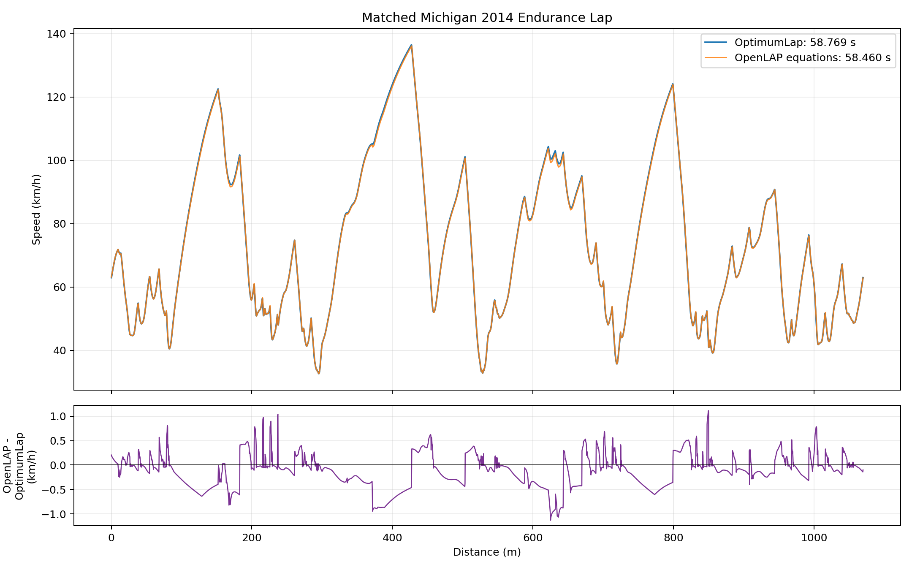

# Lapsims

This is the isolated workspace for the LHRe OptimumLap/OpenLAP comparison.
Every file created or modified for this work is contained under `Lapsims`.
Vehicle, tire, track, and OptimumLap files outside this directory are read
only.

## Baseline result

The matched Michigan 2014 endurance lap produces:

| Result | OptimumLap | OpenLAP equations | OpenLAP - OptimumLap |
|---|---:|---:|---:|
| Reported lap time | 58.769287 s | 58.459772 s | -0.309515 s (-0.5267%) |
| Minimum speed | 9.07220 m/s | 9.07475 m/s | +0.00255 m/s |
| Maximum speed | 37.90998 m/s | 37.80839 m/s | -0.10159 m/s |
| Maximum lateral acceleration | 20.44759 m/s² | 20.32755 m/s² | -0.12004 m/s² |
| Maximum longitudinal acceleration | 8.31490 m/s² | 8.22292 m/s² | -0.09199 m/s² |
| Maximum longitudinal deceleration | -26.25369 m/s² | -26.28724 m/s² | -0.03355 m/s² |

The speed-profile correlation is 0.999936. Speed RMS error is 0.09828 m/s
and mean absolute error is 0.07544 m/s.

Most of the reported lap-time difference is a post-processing convention.
OpenLAP calculates a closed-track time as `sum(dx / speed)`. Applying that
same formula to both speed profiles gives:

| Same time formula | Time |
|---|---:|
| OptimumLap speed profile | 58.433141 s |
| OpenLAP speed profile | 58.459772 s |
| OpenLAP - OptimumLap | +0.026631 s (+0.0456%) |

This indicates that the recreated vehicle dynamics and velocity envelope are
very closely aligned. The larger raw reported-time difference should not be
interpreted as a vehicle-model discrepancy by itself.



## Matched inputs

The conversion uses the current repository vehicle and tire data, cross-checked
against the saved OptimumLap baseline:

| Parameter | Value |
|---|---:|
| Total mass | 261.07265114 kg |
| Rear static/driven fraction | 0.5165037111 |
| Tire radius | 0.2045 m |
| Maximum power | 80.0 kW |
| Top speed | 42.05399834 m/s |
| CL | 2.26 |
| CD | 1.26 |
| Reference area | 0.984 m² |
| Air density | 1.225 kg/m³ |
| Longitudinal mu at reference load | 1.617362964 |
| Lateral mu at reference load | 1.495816907 |

The BobSim YAML mass sum and center-of-gravity calculation reproduce both the
OptimumLap mass and its 51.6503711% rear static fraction. The power curve is
the same 220 N·m/80 kW curve stored in the OptimumLap vehicle, with its 3.31
final drive and 1.0 gear ratio.

`vehicles/current/tires/16x7p5_10_12psi.tir` is the tire source. The existing
0.6225437131 TTC-to-event-surface scale is applied to `PDX1`, `PDX2`, `PDY1`,
and `PDY2`. The OpenLAP load-sensitive model is:

`mu(Fz) = mu_reference + sensitivity_per_N * (Fz_reference - Fz)`

The converted OpenLAP curve matches the OptimumLap curve within floating-point
precision across 250-1600 N per tire. It is not a constant-mu model: lateral
mu falls from 1.62743 at 250 N to 1.18324 at 1600 N, and longitudinal mu falls
from 1.85444 to 1.05431 over the same range.

The Michigan track is converted directly from the native OptimumLap segment
mesh:

- 1069.968773 m total length
- 4280 segments
- 0.25 m nominal segment length
- exact signed segment curvature, position, elevation, and sector data
- zero distance-mesh error between the two runs

Both CSV inputs and native OpenLAP `.mat` files are generated. The `.mat`
files can be passed to upstream `OpenLAP.m` if MATLAB is installed later.

## OpenLAP execution

The upstream repository is cloned unchanged at
`vendor/OpenLAP-Lap-Time-Simulator`, pinned to commit
`882116a47b5c3c57d5806924b600cb7ffbb264e1`.

MATLAB is not installed on this machine. `src/openlap_solver.py` is therefore
a contained, GPL-licensed execution port of the point-mass, aero,
load-sensitive tire, friction-ellipse, and power-limit equations in
`OpenLAP.m` and `OpenVEHICLE.m`. It uses a closed-track forward/backward
velocity-envelope iteration and OpenLAP's own `sum(dx / speed)` lap-time
formula. The upstream MATLAB source remains untouched and is the reference
implementation.

No battery, SOC, voltage, thermal, or SOC-dependent torque behavior has been
added in this baseline.

## Reproduce

From this directory:

```powershell
powershell -NoProfile -ExecutionPolicy Bypass -File .\run_baseline.ps1
```

The runner:

1. reads the native OptimumLap vehicle and Michigan track,
2. runs the native OptimumLap 1.5.5 solver,
3. builds matched OpenLAP CSV, JSON, and MAT inputs,
4. runs the OpenLAP-equation port,
5. creates comparison tables and the speed plot, and
6. runs the regression tests.

The current test suite has five passing checks covering mass parity, exact
track conversion, readable MAT structures, exact tire load-sensitivity
mapping, solver convergence, and comparison tolerances.

## Important files

- `inputs/openlap_vehicle.json` — documented vehicle model used by the port
- `inputs/michigan_openlap_track.csv` — converted track mesh
- `inputs/OpenVEHICLE_LHRe_Matched_Baseline.mat` — native OpenLAP vehicle file
- `inputs/OpenTRACK_FSAE_Michigan_Endurance_2014.mat` — native OpenLAP track
- `outputs/comparison_summary.json` — complete numerical comparison
- `outputs/input_equivalence.csv` — parameter-by-parameter parity table
- `outputs/tire_load_sensitivity_validation.csv` — tire curve validation
- `outputs/optimumlap_vs_openlap_speed.png` — speed trace comparison
- `src/openlap_solver.py` — OpenLAP-equation execution port
- `tools/export_optimumlap_baseline.ps1` — native OptimumLap reader/runner

The parent `lhre-simulation` checkout was at commit
`a8f78f76db505e3310cc0e0767aaa63ce35086be` for this comparison.

## Current limitations

- Both solvers remain point-mass models; there is no transient yaw, pitch,
  roll, load transfer, or individual-wheel combined-slip model.
- Aero balance is assigned to the rear in the same fraction as static rear
  weight for OpenLAP's RWD traction calculation.
- Rolling resistance is zero because the matched OptimumLap baseline stores
  zero.
- The OpenLAP number is from the equation port, not a native MATLAB execution.
  The generated MAT files make a later native cross-check straightforward.
- Battery and SOC behavior are intentionally deferred.
