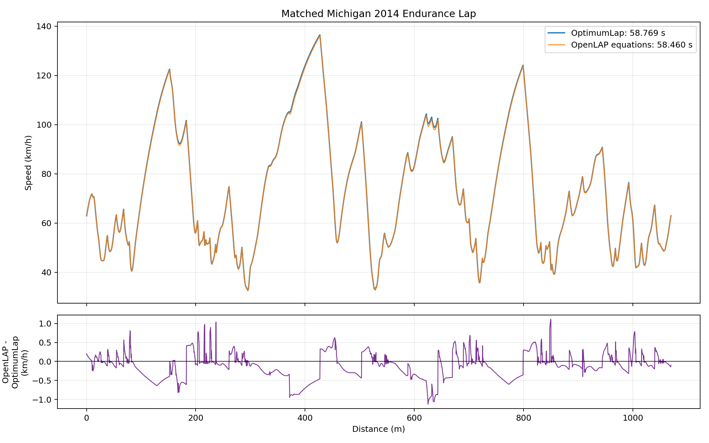
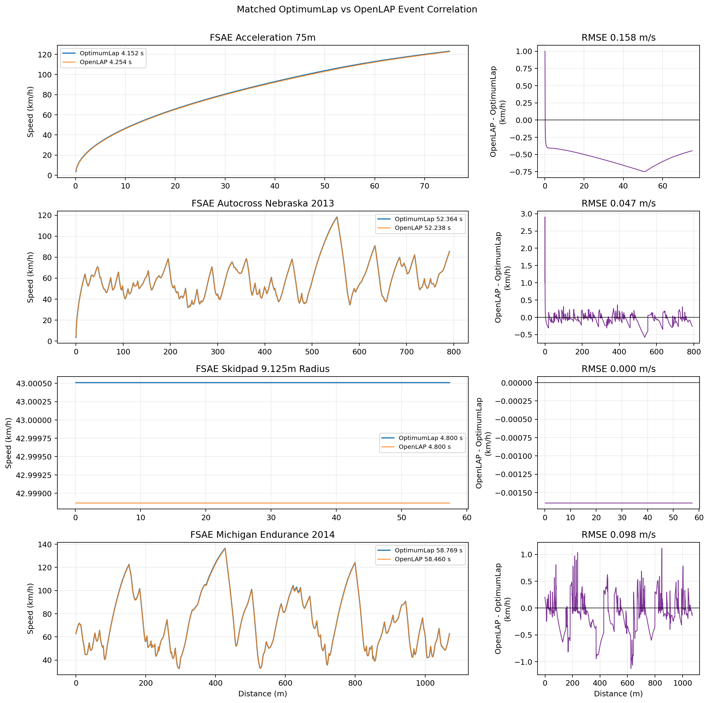

# Lapsims

This is the isolated workspace for the LHRe OptimumLap/OpenLAP comparison.
Every file created or modified for this work is contained under `Lapsims`.
Vehicle, tire, track, and OptimumLap files outside this directory are read
only.

## Baseline result

The matched Michigan 2014 endurance lap produces:

| Result | OptimumLap | OpenLAP equations | OpenLAP - OptimumLap |
|---|---:|---:|---:|
| Reported lap time | 58.769287 s | 58.459772 s | -0.309515 s (-0.5267%) |
| Minimum speed | 9.07220 m/s | 9.07475 m/s | +0.00255 m/s |
| Maximum speed | 37.90998 m/s | 37.80839 m/s | -0.10159 m/s |
| Maximum lateral acceleration | 20.44759 m/s² | 20.32755 m/s² | -0.12004 m/s² |
| Maximum longitudinal acceleration | 8.31490 m/s² | 8.22292 m/s² | -0.09199 m/s² |
| Maximum longitudinal deceleration | -26.25369 m/s² | -26.28724 m/s² | -0.03355 m/s² |

The speed-profile correlation is 0.999936. Speed RMS error is 0.09828 m/s
and mean absolute error is 0.07544 m/s.

Most of the reported lap-time difference is a post-processing convention.
OpenLAP calculates a closed-track time as `sum(dx / speed)`. Applying that
same formula to both speed profiles gives:

| Same time formula | Time |
|---|---:|
| OptimumLap speed profile | 58.433141 s |
| OpenLAP speed profile | 58.459772 s |
| OpenLAP - OptimumLap | +0.026631 s (+0.0456%) |

This indicates that the recreated vehicle dynamics and velocity envelope are
very closely aligned. The larger raw reported-time difference should not be
interpreted as a vehicle-model discrepancy by itself.



## Dynamic-event correlation

The same vehicle was also run on the exact acceleration, autocross, and
skidpad tracks used by the prior OptimumLap study. Each conversion preserves
the native OptimumLap segment endpoints and signed curvature with zero
distance-mesh error.

| Event | OptimumLap reported | OpenLAP reported | Raw difference | Difference using the same OpenLAP time formula | Speed RMSE |
|---|---:|---:|---:|---:|---:|
| Acceleration, 75 m | 4.152145 s | 4.253775 s | +2.4476% | -0.0304% | 0.15790 m/s |
| Autocross, Nebraska 2013 | 52.364208 s | 52.238324 s | -0.2404% | -0.1562% | 0.04743 m/s |
| Skidpad, 9.125 m radius | 4.800000 s | 4.800188 s | +0.0039% | +0.0038% | 0.00046 m/s |
| Endurance, Michigan 2014 | 58.769287 s | 58.459772 s | -0.5267% | +0.0456% | 0.09828 m/s |

Acceleration has the largest raw-time difference because the two programs
report the standing-start interval differently. The OptimumLap acceleration
speed trace evaluates to 4.255071 s when OpenLAP's standing-start formula is
applied, versus 4.253775 s for OpenLAP. The common-formula comparison is
therefore the useful model-correlation result. Its speed-profile correlation
is 0.999995; autocross and Michigan are 0.999969 and 0.999936 respectively.
Skidpad is constant speed, so its direct speed difference of 0.0038% is used
instead of a Pearson coefficient.

All four events pass the committed checks: same-formula time within 0.5%,
speed RMSE below 0.30 m/s, varying-profile correlation above 0.99, constant
speed within 0.5%, and raw reported time within 3%.



## Matched inputs

The conversion uses the current repository vehicle and tire data, cross-checked
against the saved OptimumLap baseline:

| Parameter | Value |
|---|---:|
| Total mass | 261.07265114 kg |
| Rear static/driven fraction | 0.5165037111 |
| Tire radius | 0.2045 m |
| Maximum power | 80.0 kW |
| Top speed | 42.05399834 m/s |
| CL | 2.26 |
| CD | 1.26 |
| Reference area | 0.984 m² |
| Air density | 1.225 kg/m³ |
| Longitudinal mu at reference load | 1.617362964 |
| Lateral mu at reference load | 1.495816907 |

The BobSim YAML mass sum and center-of-gravity calculation reproduce both the
OptimumLap mass and its 51.6503711% rear static fraction. The power curve is
the same 220 N·m/80 kW curve stored in the OptimumLap vehicle, with its 3.31
final drive and 1.0 gear ratio.

`vehicles/current/tires/16x7p5_10_12psi.tir` is the tire source. The existing
0.6225437131 TTC-to-event-surface scale is applied to `PDX1`, `PDX2`, `PDY1`,
and `PDY2`. The OpenLAP load-sensitive model is:

`mu(Fz) = mu_reference + sensitivity_per_N * (Fz_reference - Fz)`

The converted OpenLAP curve matches the OptimumLap curve within floating-point
precision across 250-1600 N per tire. It is not a constant-mu model: lateral
mu falls from 1.62743 at 250 N to 1.18324 at 1600 N, and longitudinal mu falls
from 1.85444 to 1.05431 over the same range.

The Michigan track is converted directly from the native OptimumLap segment
mesh:

- 1069.968773 m total length
- 4280 segments
- 0.25 m nominal segment length
- exact signed segment curvature, position, elevation, and sector data
- zero distance-mesh error between the two runs

Both CSV inputs and native OpenLAP `.mat` files are generated. The `.mat`
files can be passed to upstream `OpenLAP.m` if MATLAB is installed later.

## OpenLAP execution

The upstream repository is cloned unchanged at
`vendor/OpenLAP-Lap-Time-Simulator`, pinned to commit
`882116a47b5c3c57d5806924b600cb7ffbb264e1`.

MATLAB is not installed on this machine. `src/openlap_solver.py` is therefore
a contained, GPL-licensed execution port of the point-mass, aero,
load-sensitive tire, friction-ellipse, and power-limit equations in
`OpenLAP.m` and `OpenVEHICLE.m`. It uses forward/backward velocity-envelope
iterations for both open and closed courses. Closed tracks use OpenLAP's
`sum(dx / speed)` time formula. Open tracks include the synthetic zero-speed
start point used by OpenLAP and its doubled-first-segment standing-start
integration. The upstream MATLAB source remains untouched and is the
reference implementation.

The correlated baseline remains unchanged and has no battery state. A separate,
opt-in endurance runner now adds chronological SOC/SOE, voltage sag, motor
voltage/current limits, losses, and an accumulator-terminal 80 kW limit without
changing the legacy solver or its regression outputs.

## Battery-aware endurance

Run the default 21-lap, standing-start Michigan endurance sweep (4p through
7p):

```powershell
powershell -NoProfile -ExecutionPolicy Bypass -File .\run_endurance.ps1
```

Run pack-size and mass sensitivity cases:

```powershell
powershell -NoProfile -ExecutionPolicy Bypass -File .\run_endurance.ps1 `
  --parallel-counts 4 5 6 7
```

Each parallel-count case changes pack capacity, resistance, current capability,
and vehicle mass. The mass delta includes cell mass times the configured pack
mass multiplier; the existing 5p car mass remains the zero-delta baseline.

`src/powertrain_model.py` solves maximum feasible torque against phase current,
motor speed/power, field-weakening voltage demand, pack voltage sag, minimum
terminal voltage, bus current, and the 80 kW accumulator-terminal rule limit
simultaneously. `src/endurance_solver.py` first builds the lateral/mechanical
braking envelope, then traverses all laps once in chronological order. Battery
energy is consumed only during that chronological pass, never during envelope
convergence.

The trace logs SOC, SOE, OCV, terminal voltage/current/power, motor
requested/available/used torque, phase current, losses, and the active limiter
at every segment. Summary checks assert the 80 kW limit, monotonic SOC, pack
energy balance, and terminal-to-shaft loss balance. Regen-enabled runs replace
the monotonic-SOC assertion with signed coulomb-counting and SOC-bound checks.
Each case also writes the speed-by-SOC maximum-torque surface used by the
endurance solver.

The committed `130s5p P30B` input is explicitly provisional. EMRAX 228 HV
limits and electrical constants come from the manufacturer v1.6 datasheet:
220 N-m, 124 kW, 6500 RPM, 0.94 N-m/Arms, 235 Arms, 15.48 mOhm phase
resistance, 225.5 uH phase inductance, 0.07348 Vrms/RPM induced voltage, and
10 pole pairs. Because the sheet publishes only one phase inductance, the
surface-PMSM model provisionally sets `Lq = Ld`. The general-purpose input
retains its earlier effective resistance so old sweep outputs remain
reproducible. The cell trade study below instead constructs every pack from
the sourced cell record and uses P30B's conservative 30 A continuous rating,
17 mOhm typical DCIR, 3.0 Ah capacity, and 47 g mass.

## Battery cell trade study

Run the complete 22 km battery-cell/topology analysis:

```powershell
python .\tools\run_battery_trade_study.py `
  --output-root .\outputs\battery_trade_study_20260725_final
```

After the final native-mesh refinements, build and render the eight cell
workbooks with a Node environment that provides `@oai/artifact-tool`:

```powershell
node .\tools\build_battery_trade_workbooks.mjs
```

The runner reads `inputs/battery_trade_study/cells.json` and evaluates a
declared study grid: series counts from 110s through 140s in five-cell
increments, and parallel counts from the first topology providing 9 Ah
through 6p. It then admits configurations that meet all of these
pre-simulation screens:

- maximum charged voltage strictly below 600 V,
- modeled usable chemical energy no greater than 8.0 kWh,
- at least 9 Ah pack capacity, and
- cylindrical cell envelope no larger than the current 130s5p P30B pack.

Every accepted topology runs the complete 22 km Michigan endurance distance.
The accumulator-terminal power ceiling is tuned, never above 80 kW, to finish
with 0.500 kWh usable chemical energy remaining. Packs that still have extra
reserve at 80 kW are retained and labeled as power-cap-saturated rather than
being given an artificial higher power limit.

The screening sweep uses a reduced track mesh and two torque-interpolation
feasibility corrections. The best result for every cell, the baseline, and
leading Pareto cases are rerun on the native 0.25 m track mesh with the full
feasibility correction. Exact-distance aggregation solves the partial final
segment in time, so reported metrics end at 22,000.000 m rather than at the
end of the repeated lap.

Reported metrics include total/equivalent-lap time, fastest and slowest
completed laps, average/peak motor and battery power, peak/RMS cell current,
gross discharge, recovered and net terminal energy, chemical and shaft energy,
total/regen I2R heat, battery and powertrain efficiency, reserve, and an
adiabatic cell-temperature-rise estimate. The thermal estimate uses
1000 J/kg-K for all cells and is an upper-bound comparison, not a
cooling-system prediction.

For cells that publish ACIR but not DCIR, the input estimates room-temperature
DCIR as 2.047 times ACIR. That factor is the mean of the published P30B and
P50B DCIR/ACIR ratios. Those resistance results are intentionally marked
provisional pending same-fixture pulse testing. The shortlist entry
`Tenpower 18650 4000mAh` is excluded because it does not identify an exact
cell model or datasheet.

## Endurance-only regeneration study

The consolidated decision report, including methodology, validation, pack
rankings, dynamic-event scores, and reproduction commands, is
[Battery Regen Pack Analysis](reports/battery_regen_pack_analysis_20260725.md).

The telemetry utility repairs the known six-heading/eight-data-column car-1001
CSV export, checks the energy counters, and calculates time-weighted
regenerative power:

```powershell
python .\tools\analyze_regen_telemetry.py `
  C:\Users\Abishek\Downloads\car-1001-joined-endurance.csv `
  --active-threshold-kw 1.0
```

`inputs/battery_trade_study/endurance_regen_telemetry_policy.json` records the
source hash, sign convention, selector, measured 8.574267 kW active RMS,
3.121302 kW whole-event-equivalent RMS, and 22.23 kW peak.
`endurance_regen_simulation_calibration.json` maps that RMS to one fixed
10.059 kW terminal command on the native Michigan P30B reference. The command,
not a separately retuned result, is then held constant across pack candidates;
physical braking-source, motor/inverter, tire, terminal-voltage, current, and
SOC-headroom limits may reduce achieved RMS.

Run the versioned full pack rerun:

```powershell
python .\tools\run_battery_trade_study.py `
  --regen-policy `
    .\inputs\battery_trade_study\endurance_regen_telemetry_policy.json `
  --regen-command-power-kw 10.059 `
  --output-root `
    .\outputs\battery_trade_study_regen_endurance_only_20260725
```

Regeneration is opt-in and is called only by chronological endurance. The
acceleration, skidpad, and autocross solvers remain unchanged. Negative
terminal current raises SOC; pack heating remains positive `I^2 R` in both
directions. Mechanical brakes supply any remainder, so the braking-speed
envelope remains achievable.

## Reproduce

From this directory:

```powershell
powershell -NoProfile -ExecutionPolicy Bypass -File .\run_baseline.ps1
```

For the complete four-event correlation suite:

```powershell
powershell -NoProfile -ExecutionPolicy Bypass -File .\run_event_suite.ps1
```

The event runner:

1. reads the native OptimumLap vehicle and all four source tracks,
2. runs the native OptimumLap 1.5.5 solver on every event,
3. builds matched OpenLAP CSV, JSON, and MAT inputs,
4. runs the OpenLAP-equation port with open/closed-course handling,
5. creates per-event results, comparison tables, and plots, and
6. runs the regression tests.

The current test suite has ten passing checks covering mass parity, exact
track conversion, readable native MAT structures, exact tire load-sensitivity
mapping, open/closed solver convergence, skidpad calibration, and all
correlation tolerances.

## Important files

- `inputs/openlap_vehicle.json` — documented vehicle model used by the port
- `inputs/events/` — converted event CSV/MAT tracks and source manifests
- `inputs/OpenVEHICLE_LHRe_Matched_Baseline.mat` — native OpenLAP vehicle file
- `outputs/events/event_correlation_summary.json` — all checks and metrics
- `outputs/events/event_correlation_summary.csv` — compact comparison table
- `outputs/events/optimumlap_vs_openlap_all_events.png` — event speed plots
- `outputs/input_equivalence.csv` — parameter-by-parameter parity table
- `outputs/tire_load_sensitivity_validation.csv` — tire curve validation
- `src/openlap_solver.py` — OpenLAP-equation execution port
- `src/powertrain_model.py` — coupled accumulator/inverter/EMRAX model
- `src/endurance_solver.py` — chronological multi-lap battery-state runner
- `src/run_endurance.py` — CLI and pack-size/mass sweep
- `inputs/powertrain_130s5p_p30b_provisional.json` — replaceable model inputs
- `inputs/battery_trade_study/cells.json` — sourced cell shortlist and assumptions
- `src/battery_trade_study.py` — topology policy and exact-distance metrics
- `tools/run_battery_trade_study.py` — full constrained cell trade study
- `tools/refine_battery_trade_categories.py` — native-mesh recommendation audit
- `tools/validate_battery_trade_study.py` — result and constraint validator
- `tools/build_battery_trade_workbooks.mjs` — eight four-sheet Excel deliverables
- `tools/export_optimumlap_event_suite.ps1` — native event reader/runner

Exact source paths and SHA-256 hashes for the OptimumLap vehicle and event
tracks are stored in the input manifests.

## Current limitations

- Both solvers remain point-mass models; there is no transient yaw, pitch,
  roll, load transfer, or individual-wheel combined-slip model.
- Aero balance is assigned to the rear in the same fraction as static rear
  weight for OpenLAP's RWD traction calculation.
- Rolling resistance is zero because the matched OptimumLap baseline stores
  zero.
- The OpenLAP number is from the equation port, not a native MATLAB execution.
  The generated MAT files make a later native cross-check straightforward.
- Battery OCV/resistance, inverter loss, and temperature inputs are provisional
  until replaced by the validated Battery architecture model.
- Endurance regeneration is modeled, but candidate cell records do not yet
  contain cell-specific charge-current limits. The measured terminal command,
  inverter current, maximum cell voltage, and SOC headroom provide the active
  charge constraints.
- Thermal state evolution/derating and the driver-change stop are not yet
  modeled.
- Zero-command motor iron and inverter parasitic losses are included during
  coasting, but there is no accessory low-voltage load model.
