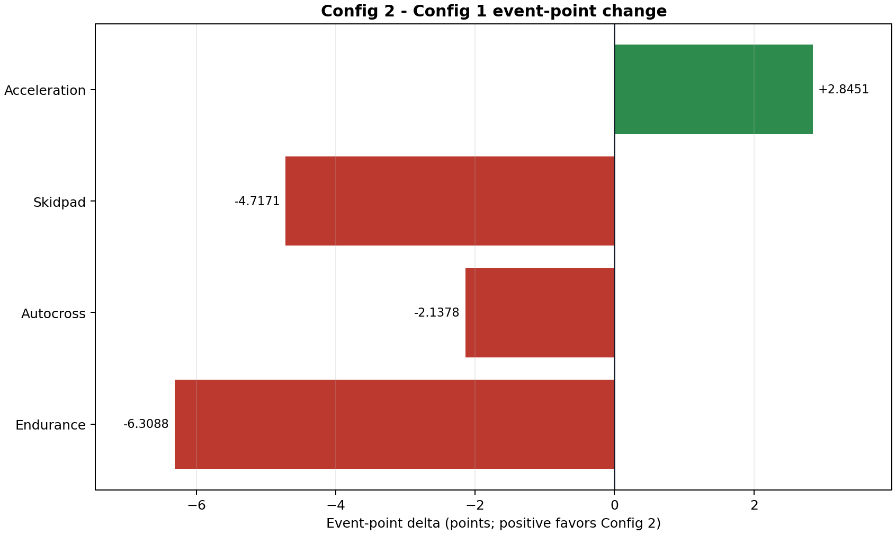
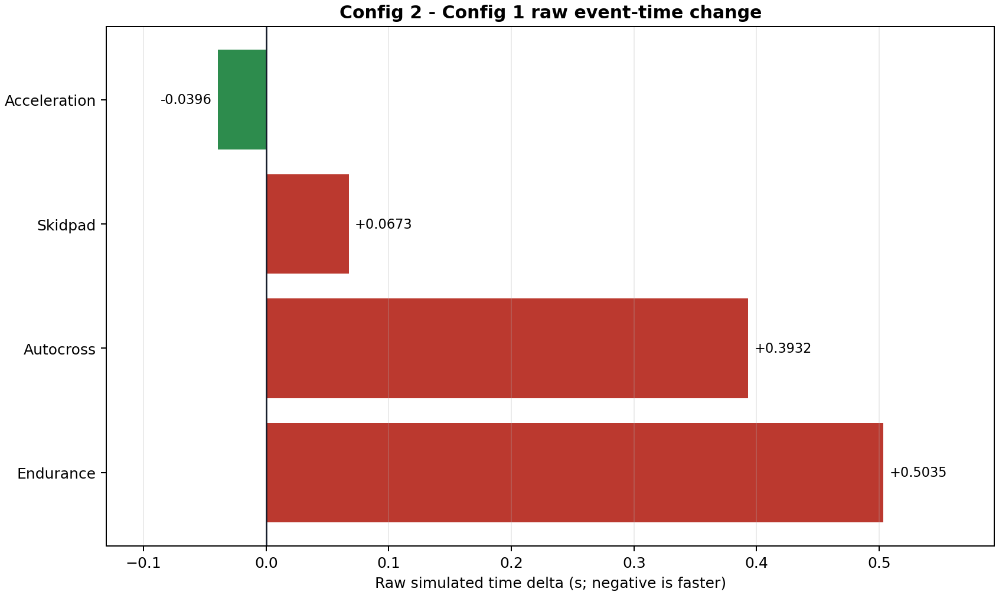

# Two-configuration mixed-power comparison

## Result

The best observed configuration is **Config 1: nominal 54% rear** at
**465.321 / 575 timed-event points**. Acceleration,
skidpad, and autocross use the fresh 80 kW root; Michigan endurance uses the
fresh 32 kW root. Both configurations were rescored together once against the
same 2026 Michigan EV reference field.

| Configuration | Total points | Delta vs Config 1 | Rank |
| --- | --- | --- | --- |
| Config 1: nominal 54% rear | 465.321 | +0.000 | 1 |
| Config 2: +0.25 in / 56.5% rear | 455.002 | -10.319 | 2 |

## Per-event comparison

Negative raw-time delta means Config 2 is faster. Positive point delta favors
Config 2.

| Event | Config 1 raw s | Config 2 raw s | C2-C1 raw s | Config 1 pts | Config 2 pts | C2-C1 pts |
| --- | --- | --- | --- | --- | --- | --- |
| Acceleration | 3.858210 | 3.818635 | -0.039575 | 88.029 | 90.874 | +2.845 |
| Skidpad | 5.027786 | 5.095116 | +0.067331 | 56.056 | 51.339 | -4.717 |
| Autocross | 55.355805 | 55.749054 | +0.393249 | 46.235 | 44.098 | -2.138 |
| Endurance | 63.781141 | 64.284597 | +0.503456 | 275.000 | 268.691 | -6.309 |

## Tuning and validity

| Configuration | CG height in | Rear wt % | Front ARB frac | Front brake frac | Mass kg | 80 kW outside TIR | 32 kW outside TIR |
| --- | --- | --- | --- | --- | --- | --- | --- |
| Config 1: nominal 54% rear | 11.500 | 54.000 | 0.651528 | 0.699627 | 261.073 | False | False |
| Config 2: +0.25 in / 56.5% rear | 11.750 | 56.500 | 0.594851 | 0.688124 | 261.073 | False | False |

The source roots must contain exactly the two named configurations, all eight
event solves must converge without touching a GGV speed cap, each event must
match its root-local GGV hash, and power-independent controlled metadata must
match between the 80 and 32 kW roots.

## Common scoring field

Only a simulated time exactly equal to the real-or-simulated Tmin receives the
event maximum. Efficiency points are excluded.

| Event | Real fastest s | Sim fastest s | Common Tmin s | Tmin source |
| --- | --- | --- | --- | --- |
| Acceleration | 3.697000 | 3.818635 | 3.697000 | 2026_real_field |
| Skidpad | 4.782000 | 5.027786 | 4.782000 | 2026_real_field |
| Autocross | 43.937000 | 55.355805 | 43.937000 | 2026_real_field |
| Endurance | 1312.281000 | 1311.426217 | 1311.426217 | simulation:config_nominal_54 |

## Provenance

- 80 kW sprint root: `C:\Users\Abishek\Documents\LHR VMOD Stuff\References\lhre-simulation\Lapsims\outputs\ggv_configuration_nominal54_vs_plus0p25_56p5_dyn_py_6dof_scaled_mu_80kw`
- 32 kW endurance root: `C:\Users\Abishek\Documents\LHR VMOD Stuff\References\lhre-simulation\Lapsims\outputs\ggv_configuration_nominal54_vs_plus0p25_56p5_dyn_py_6dof_scaled_mu_32kw`
- Complete hashes and row mapping: `two_config_provenance.json`
- Machine-readable acceptance checks: `validation_summary.json`
