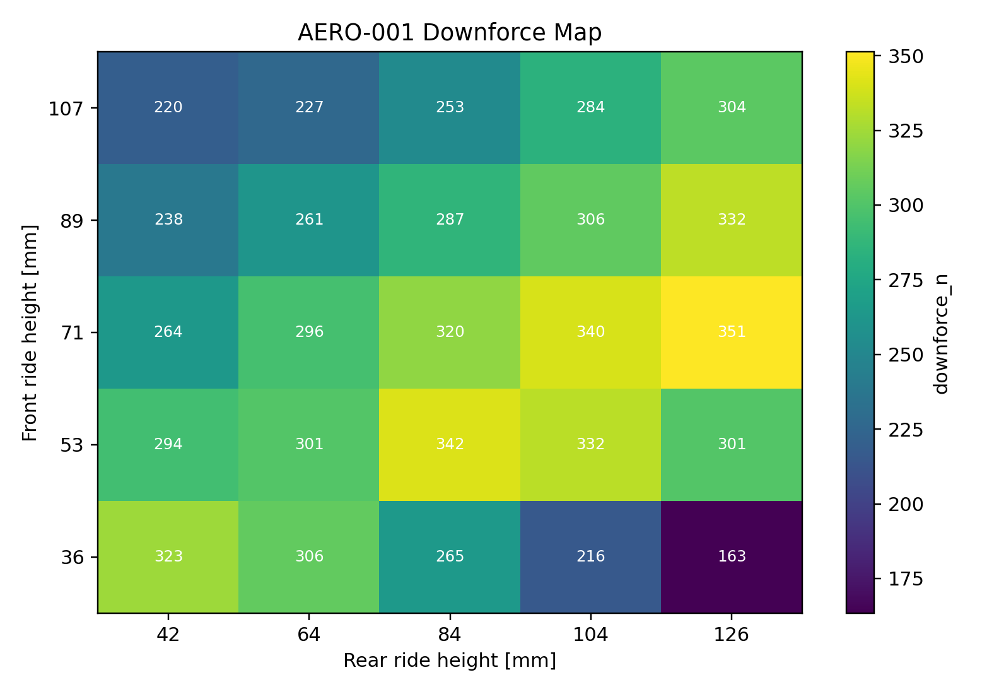
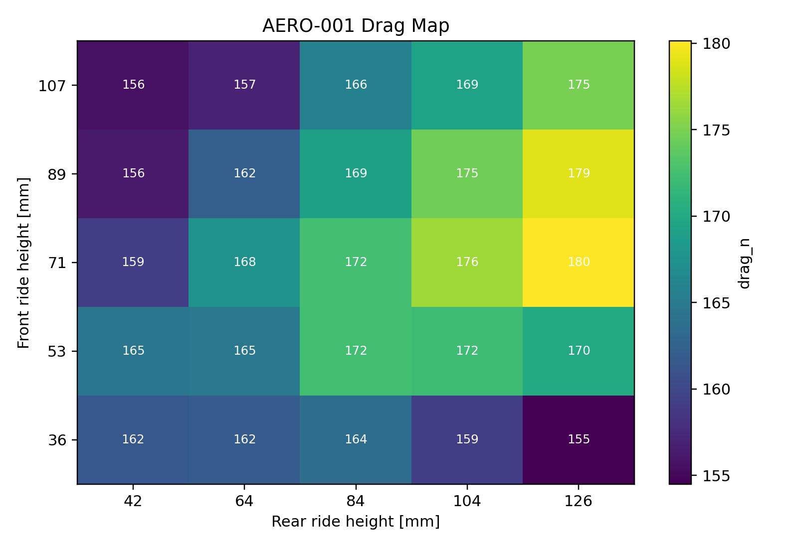

# 2026 Aero Design Report

## Purpose

Justify the aero package as a vehicle-level system: force, drag, balance,
platform sensitivity, packaging consequence, and validation.

## Claims To Prove

| Claim | Required Study |
| --- | --- |
| The aero map is referenced to defensible vehicle geometry and sign conventions. | `AERO-001-map-and-reference-audit` - complete |
| Ride height and rake materially affect downforce, drag, and balance. | `AERO-002-platform-sensitivity` - complete |
| Aero choices improve the vehicle once drag, energy, cooling, and suspension platform consequences are included. | `AERO-003-vehicle-integration` - complete |

## Findings

### Map And Reference Audit

`AERO-001-map-and-reference-audit` passed. The aero map is internally coherent
enough to proceed to platform sensitivity studies.

Audit findings:

- Front/rear ride-height grids are monotonic.
- Downforce, drag, and moment tables match the ride-height grid dimensions.
- Front aero reference matches the front lower-inboard hardpoint average to
  numerical precision.
- Rear aero reference matches the rear lower-inboard hardpoint average to
  numerical precision.
- Baseline front/rear ride height: `0.03556 m` / `0.04191 m`
- Baseline downforce/drag at 15 m/s: `323.5 N` / `161.6 N`
- Baseline ClA/CdA: `2.347 m^2` / `1.173 m^2`
- Map downforce range: `163.4` to `351.3 N`
- Map drag range: `154.5` to `180.1 N`

Design implication: aero performance studies may now cite the map, but final
aero balance claims still require converting pitch moment into front/rear load
split and correlating with coastdown, aero-on/off, and ride-height-vs-speed
data.

### Platform Sensitivity

`AERO-002-platform-sensitivity` passed.

- Downforce span across the map: `187.8 N`
- Drag span across the map: `25.6 N`
- Rake range in the map: `-64.8` to `90.2 mm`
- Equivalent vertical-load x range: `-3.395` to `-1.553 m`

Design implication: aero cannot be defended as a single force number. It must
be discussed with suspension platform control, rake, and ride-height targets.

### Vehicle Integration

`AERO-003-vehicle-integration` passed.

- Baseline downforce at 15 m/s: `323.5 N`
- Baseline drag at 15 m/s: `161.6 N`
- Drag power at 15 m/s: `2.42 kW`
- Baseline 15 m/s lateral envelope context: `1.773 g`

Design implication: aero claims should be presented with force, drag power,
vehicle envelope, ride-height control, and validation channels together.

## Open Questions

- Are front/rear ride-height probes tied to the right chassis-side hardpoints?
- How should CFD pitch moment be converted into front/rear aero load split?
- What coastdown and aero-on/off tests will validate drag and downforce?
- What suspension-platform limits must aero respect?

## Next Work

The aero report is complete for pre-test analysis. The next work is coastdown,
aero-on/off comparison, ride-height-vs-speed logging, and pitch-moment
conversion into front/rear load split.
