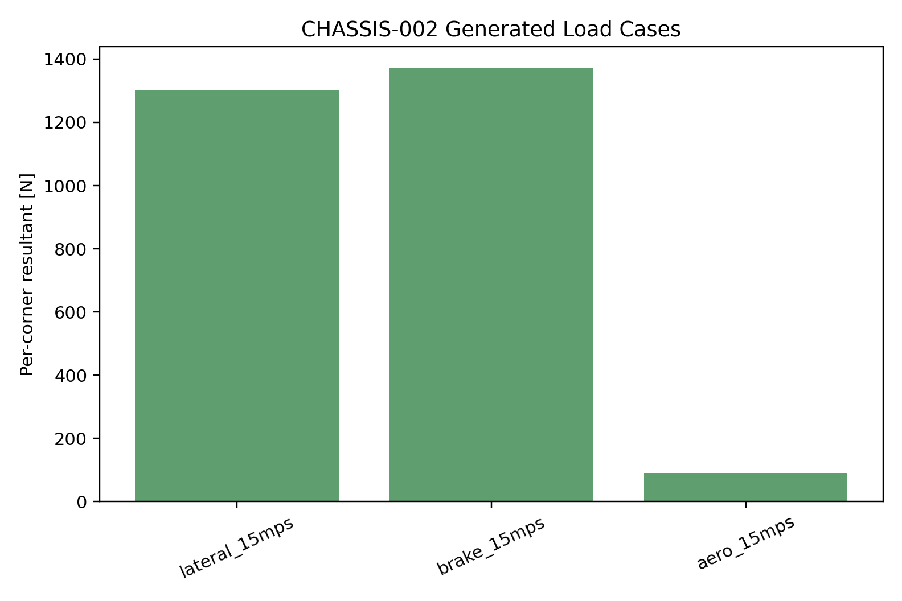
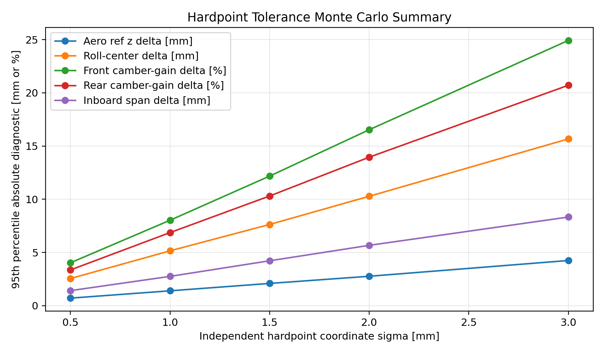

# 2026 Chassis Design Report

## Purpose

Justify the chassis as the structure that preserves modeled contact-patch
behavior through geometry, load paths, stiffness, compliance, manufacturing,
and validation.

## Claims To Prove

| Claim | Required Study |
| --- | --- |
| Chassis hardpoints, mass properties, and references come from one audited source of truth. | `CHASSIS-001-source-and-hardpoint-audit` - complete |
| Tire, brake, and aero load cases are derived from vehicle behavior and mapped into structural requirements. | `CHASSIS-002-load-case-generation` - complete |
| Chassis stiffness and compliance are sufficient for setup changes to remain meaningful at the contact patch. | `CHASSIS-003-stiffness-and-validation` - complete |
| Frame-side suspension hardpoint tolerance is justified by geometry and aero-reference preservation. | `VDYN-017-hardpoint-monte-carlo-tolerance` - complete |
| Frame-side hardpoint response risk is gated by compiled StandardSim calibration. | `VDYN-018-standardsim-hardpoint-calibration` - active |

## Findings

### Source And Hardpoint Audit

`CHASSIS-001-source-and-hardpoint-audit` passed.

- Required suspension hardpoint entries checked: `16`
- Missing required entries: `0`
- Body torsional stiffness input: `300000 N*m/rad`

Design implication: chassis load and stiffness studies may reference the
vehicle YAML directly, with `VDYN-001` providing the mass-property audit.

### Load Case Generation

`CHASSIS-002-load-case-generation` passed.

- Lateral 15 m/s per-corner resultant: `1303.1 N`
- Brake 15 m/s per-corner resultant: `1370.5 N`
- Aero 15 m/s per-corner equivalent resultant: `90.4 N`
- Largest generated case: `brake_15mps` at `1370.5 N`
- FOS 2.0 resultant for largest case: `2741.0 N`

Design implication: first-pass structural cases now trace to admitted vehicle
behavior studies rather than isolated factors alone.

### Stiffness And Validation

`CHASSIS-003-stiffness-and-validation` passed.

- Body torsional stiffness input: `300000 N*m/rad`
- Front/rear elastic roll stiffness: `67846` / `62559 N*m/rad`
- Front LLTD: `52.06 %`
- Roll toe gain: `0.00128 rad/rad`

Design implication: chassis stiffness and compliance claims must close with
torsional stiffness testing, high-load tab inspection, and setup-correlation
evidence.

### Manufacturing Tolerance

`VDYN-017-hardpoint-monte-carlo-tolerance` links frame-side inboard suspension
hardpoint variation to geometry and aero-reference risk. It does not claim
StandardSim response movement because no StandardSim variants are compiled in
this study.

- Inboard hardpoint combined coordinate sigma levels swept: `0.5` to `3.0 mm`
- Engine: `study_geometry_monte_carlo`
- Compiled models: `0`
- Simulated geometry cases: `25000`
- Runtime: `16.06 s`
- Largest passing tolerance by geometry thresholds: `1.0 mm`
  combined machined-plus-welded coordinate sigma
- Practical build target: approximately `+/-2.0 mm` at about two sigma per
  coordinate
- At `1.0 mm` sigma, p95 aero ride-height reference z delta: `1.40 mm`
- At `1.0 mm` sigma, p95 roll-center delta: `5.15 mm`
- At `1.0 mm` sigma, p95 front/rear camber-gain delta: `8.03 %` / `6.87 %`
- At `1.0 mm` sigma, p95 inboard span delta: `2.75 mm`

Design implication: `1.0 mm` sigma is the practical combined
machined-plus-welded build target accepted by the geometry thresholds. The
built frame still requires measurement and model update before VDYN/aero
correlation claims are closed.

`VDYN-018-standardsim-hardpoint-calibration` is the response-risk gate: a
25-case compiled StandardSim subset is planned before any 25000-case hardpoint
response Monte Carlo is claimed. The current smoke run compiled `1` VehicleSim
variant in `223.03 s` and completed `1` TransientEval case in `27.39 s`.

## Open Questions

- Which simulation load cases define frame tab, control arm, upright, steering,
  and aero mount requirements?
- What torsional stiffness target is required by the setup-sensitivity story?
- How will fixture tests and post-test inspection close structural claims?
- Do measured frame hardpoints meet the `1.0 mm` combined coordinate sigma
  target, or do the vehicle model and aero references need to be updated to
  measured geometry?

## Next Work

The chassis report is complete for pre-test analysis. The next work is final
FEA/fixture substantiation, physical torsional stiffness measurement,
built-frame hardpoint measurement, and post-test inspection evidence.
