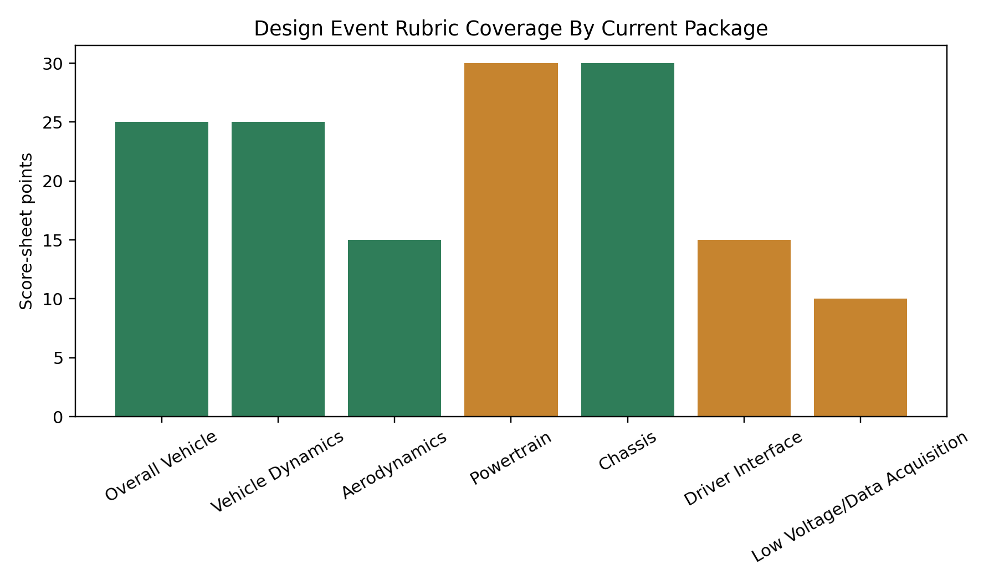
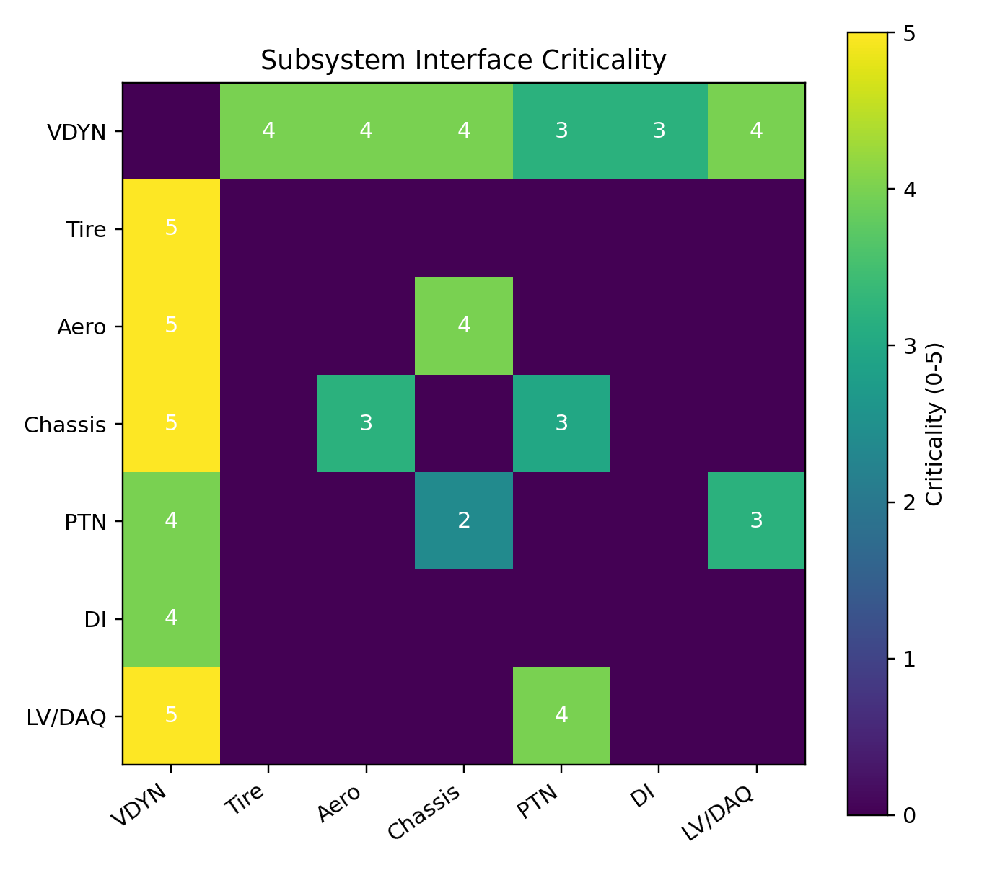
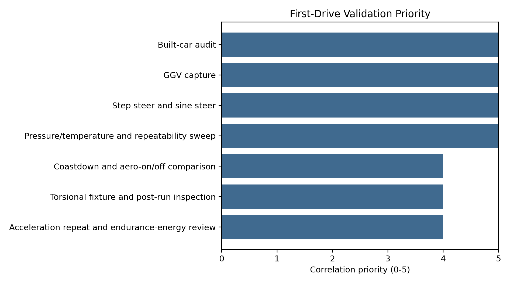

# 2026 Design Report Index

This is the executive map for the 2026 LHRE design-report package. The
technical detail is intentionally split into three report lanes:

- [Vehicle Dynamics](2026-vdyn-design-report.md): source vehicle, contact
  patch, tires, handling balance, setup authority, braking/drive limits, and
  dynamic correlation.
- [Aerodynamics](2026-aero-design-report.md): aero map, ride-height/platform
  sensitivity, drag, balance, vehicle integration, and aero correlation.
- [Chassis](2026-chassis-design-report.md): hardpoints, mass properties,
  structural loads, stiffness, compliance, and validation.
- [Judge Question Bank](2026-judge-question-bank.md): uploaded judge-question
  coverage mapped to answer stances, evidence, and closure actions.

The top-level story is:

**The 2026 car is justified because the team can trace its goals into a source
vehicle model, a credible dynamic envelope, a platform-aware aero package,
chassis load paths that preserve contact-patch behavior, and a first-drive
correlation plan.**

## Design Event Rubric

The 2026 EV Design score sheet totals `150` points across seven categories:

| Category | Points | Current Package Coverage |
| --- | ---: | --- |
| Overall Vehicle | 25 | Strong direct coverage |
| Vehicle Dynamics | 25 | Strong direct coverage |
| Aerodynamics | 15 | Strong direct coverage |
| Powertrain | 30 | Interface coverage |
| Chassis | 30 | Strong direct coverage |
| Driver Interface | 15 | Interface coverage |
| Low Voltage/Data Acquisition | 10 | Interface coverage |

`DE-001-rubric-crosswalk` maps every category to a story, evidence source, and
next validation action. `DE-002` through `DE-005` then turn that crosswalk into
requirements traceability, interface control, validation planning, and risk
priority. `DE-006` maps the uploaded judge-question set into direct answer
stances and closure actions.

Current coverage:

- Strong direct coverage: `95` points
- Interface coverage needing owner artifacts: `55` points
- Unmapped categories: `0`

This does not mean the team should claim 95 points are guaranteed. It means the
current simulation package has direct evidence for those score-sheet areas and
clear handoffs for the rest.

## Design Process

The score sheet emphasizes four modes of judging: design, build,
validation/refinement, and understanding. This package should be presented in
that structure.

| Process Mode | What We Show | Current Evidence |
| --- | --- | --- |
| Design | Goals become vehicle requirements and subsystem claims. | Report claims tables and study contracts |
| Build | Source geometry, hardpoints, tire files, aero maps, and stiffness assumptions are traceable. | `VDYN-001`, `AERO-001`, `CHASSIS-001` |
| Validation/Refinement | Every model claim has a first-drive or fixture-test closure path. | Correlation sections in all reports |
| Understanding | The team can explain what is proven, what is assumed, and what would change the model. | Open questions and next-work sections |

## Requirements Traceability

`DE-002-requirements-traceability` turns the vehicle story into an explicit
requirements cascade.

| Requirement Theme | Evidence | Validation Closure |
| --- | --- | --- |
| Source vehicle traceability | `VDYN-001`, `AERO-001`, `CHASSIS-001` | Built-car audit |
| Dynamic envelope | `VDYN-002`, `VDYN-011` | GGV capture |
| Driver confidence and balance | `VDYN-003`, `VDYN-005`, `VDYN-014` | Step/sine steer and driver feedback |
| Tire operating window | `VDYN-006` through `VDYN-010` | Pressure/temp and slip-response testing |
| Aero platform | `AERO-001` through `AERO-003`, `VDYN-012` | Coastdown, aero-on/off, ride-height-vs-speed |
| Chassis preservation | `CHASSIS-001` through `CHASSIS-003`, `VDYN-013` | Torsional fixture and load-path inspection |
| Powertrain delivery | `VDYN-002`, `VDYN-011`, `AERO-003` | Torque, pack power, thermal, endurance logs |
| DAQ closure | `DE-004` and report correlation plans | Channel-rate audit and run review workflow |

## Interface Control

`DE-003-interface-control-matrix` identifies the measurable exchange variables
that make this more than three separate reports.

The controlled interfaces are tire-to-VDYN, aero-to-VDYN, chassis-to-VDYN,
powertrain-to-VDYN, driver-interface-to-VDYN, LV/DAQ-to-VDYN, aero-to-chassis,
chassis-to-powertrain, and LV/DAQ-to-powertrain. The highest criticality
interfaces are tire force, aero platform, chassis stiffness/hardpoints, and the
DAQ channel spine.

## Validation And Correlation

`DE-004-validation-correlation-plan` converts report claims into tests,
required channels, pass/fail logic, and model update actions.

The first-drive validation order is:

1. Built-car audit to confirm the source model.
2. GGV capture to validate envelope shape.
3. Step/sine steer to validate cornering stiffness, relaxation, and balance.
4. Pressure/temperature sweep to validate the tire operating window.
5. Coastdown and aero-on/off to validate drag/downforce scale.
6. Torsional fixture and inspections to validate chassis stiffness/load paths.
7. Acceleration and endurance-energy review to validate powertrain delivery.

## Risk And Correlation Priority

`DE-005-risk-correlation-priority` ranks assumptions by severity, uncertainty,
and detectability.

The current highest-priority cluster is tire peak/load sensitivity, aero
scale/platform sensitivity, DAQ availability, cornering stiffness, and
relaxation response. These are the variables most likely to move a design
conclusion if the model and the car disagree.

## Judge Question Bank

`DE-006-judge-question-bank` maps the uploaded question set to a prepared
answer stance, evidence reference, and closure action.

Use [2026 Judge Question Bank](2026-judge-question-bank.md) as the preparation
appendix for design judging. It does not pretend every answer is complete; it
separates model-backed answers from test gaps and subsystem-owner artifacts.

## End-To-End Argument

1. Team strategy favors early running, endurance reliability, and useful
   driver confidence over unnecessary architectural complexity.
2. `VDYN-001` proves the modeled vehicle is traceable: `261.073 kg`, CG
   `[-0.8003, 0.0000, 0.2796] m`, `1.5494 m` wheelbase, `1.2122 m` track,
   and coherent tire/aero references.
3. `VDYN-002`, `VDYN-011`, `VDYN-012`, and `VDYN-015` form the preliminary
   EnvelopeSim design gate: the baseline has enough envelope to tune, and the
   highest-leverage capability interactions are identified before moving to a
   higher-fidelity model.
4. `VDYN-003`, `VDYN-005`, `VDYN-013`, and `VDYN-014` form the current
   StandardSim characterization layer. `VDYN-016` is a baseline-anchored
   surrogate that identifies driver-facing setup priorities before spending
   compute on compiled variant runs.
5. `VDYN-004` through `VDYN-010` make tire behavior the first-drive priority:
   load sensitivity, pure-slip shape, cornering stiffness, relaxation response,
   combined slip, pressure, and temperature.
6. `VDYN-011` through `VDYN-018` turn sensitivities into correlation
   priorities: tire peak, drive force, CG height, aero scale, torsional
   stiffness, static alignment, paired EnvelopeSim interactions, and
   StandardSim response priorities, surrogate response-surface priorities,
   hardpoint geometry tolerance, and compiled hardpoint calibration.
7. `AERO-001` proves the aero map can be cited; `AERO-002` proves platform
   sensitivity matters; `AERO-003` ties force to drag power and vehicle
   envelope.
8. `CHASSIS-001` traces hardpoints; `CHASSIS-002` generates tire/brake/aero
   structural cases from admitted vehicle behavior; `CHASSIS-003` connects
   stiffness to setup validity and validation.
9. `DE-001` through `DE-006` map all of this back to the judging rubric and
   provide the systems-engineering layer: requirements, interfaces,
   validation, risk priority, and judge-question coverage.

## Judge Presentation Flow

| Section | Purpose | Evidence |
| --- | --- | --- |
| 1. Team Goal | Establish the context judges should use to evaluate choices. | Design strategy and score-sheet categories |
| 2. Source Vehicle | Prove the model is the car we intend to build. | `VDYN-001`, `CHASSIS-001`, `AERO-001` |
| 3. Preliminary Design | Show EnvelopeSim establishes a reasonable vehicle and ranks capability interactions. | `VDYN-002`, `VDYN-011`, `VDYN-012`, `VDYN-015` |
| 4. Tire Foundation | Make tire force the integration point across subsystems. | `VDYN-004`, `VDYN-006` through `VDYN-010` |
| 5. Advanced Characterization | Show StandardSim converts the admitted envelope into response/setup evidence, then rank compiled-run priorities. | `VDYN-003`, `VDYN-005`, `VDYN-013`, `VDYN-014`, `VDYN-016` |
| 6. Manufacturing Tolerance | Show frame hardpoint tolerance preserves geometry and aero references before correlation. | `VDYN-017`, `VDYN-018` |
| 7. Aero Platform | Show aero is coupled to ride height, drag, and vehicle behavior. | `AERO-001/002/003` |
| 8. Chassis Preservation | Show structure preserves modeled contact-patch behavior. | `CHASSIS-001/002/003`, `VDYN-017` |
| 9. Rubric Handoff | Name what this package supports and what other subsystem owners must close. | `DE-001` |
| 10. Requirements And Interfaces | Show that every study has a purpose and every subsystem handoff is measurable. | `DE-002`, `DE-003` |
| 11. Validation Plan | Show exactly how first-drive data will change the model. | `DE-004` |
| 12. Risk Priority | Show which assumptions can move the conclusion and how they will be closed. | `DE-005` |
| 13. Judge Question Prep | Show direct coverage of likely design questions and honest gaps. | `DE-006` |

## Rubric Handoffs

Powertrain:
This package defines vehicle-level interfaces: `80 kW` drive power assumption,
`3735 N` force cap, baseline acceleration envelope, drag power, and regen/brake
correlation hooks. Powertrain still needs owner evidence for pack energy,
current, temperatures, torque delivery, dyno/HIL, cooling, safety, and endurance
energy.

Driver Interface:
This package defines driver-confidence metrics: steering/yaw/ay response,
overshoot, braking envelope, and run-linked comments. Driver interface still
needs owner evidence for ergonomics, controls, pedal feel, visibility, egress,
cockpit safety, and brake hardware.

LV/DAQ:
This package defines the channels needed to validate claims: speed, wheel
speeds, steering, yaw, ay, ax, brake input/pressure, torque request, pack power,
ride heights, tire pressure/temperature, setup state, and driver comments.
LV/DAQ still needs owner evidence for channel rates, filtering, wiring,
telemetry, dashboards, and post-run review workflow.

## Correlation Closure

Before the reports become post-test claims, run:

1. Built-car audit: total mass, corner weights, ride heights, wheelbase, track,
   alignment.
2. GGV capture: ax, ay, speed, wheel speeds, steering, brake, torque request.
3. Step/sine steer: steering, yaw, ay, speed, tire state, setup state.
4. Steady-state balance: understeer, roll, tire temperatures, driver comments.
5. Tire operating-window test: pressure growth, temperature spread, camber,
   relaxation/response.
6. Aero validation: coastdown, aero-on/off, ride-height-vs-speed, weather.
7. Chassis validation: torsional stiffness fixture, high-load tab inspection,
   link/upright/aero-mount checks.
8. Powertrain handoff validation: energy per run/lap, pack current/temp,
   inverter/motor temps, delivered acceleration.

## Judge Q&A

| Question | Answer Direction |
| --- | --- |
| Why this architecture? | It is buildable, traceable, tunable, and has enough modeled envelope for the team's goals. |
| What is actually proven? | Source model coherence, baseline envelope, StandardSim response, aero map interpretation, platform sensitivity, and first-pass chassis load cases. |
| What is not proven yet? | Track correlation, final tire operating window, final aero balance, physical stiffness validation, and owner subsystem artifacts for PTN/DI/LV. |
| What would change the model? | Built-car mass/CG errors, tire pressure/temp mismatch, overshoot mismatch, aero coastdown mismatch, or stiffness/load-path validation failures. |
| How does this help future teams? | It leaves a study contract, repeatable runners, admitted report claims, and a correlation plan instead of disconnected plots. |

## Rule

A report claim is not final until it references a completed study. Unsupported
claims belong in open questions or handoffs, not findings.
