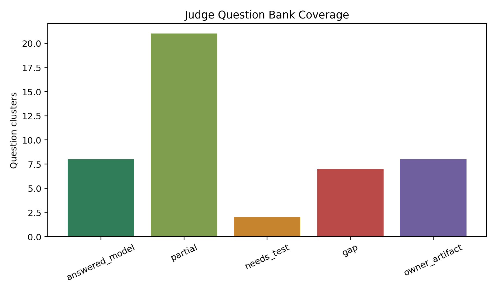

# 2026 Judge Question Bank

This report maps the uploaded judge-question set to the current analysis package. It is intentionally candid: model-backed answers are separated from track-test gaps and subsystem-owner handoffs.

## Coverage Summary

- Question clusters mapped: `46`
- Model-backed answers: `8`
- Partial/model-backed but needing test or owner detail: `21`
- Needs track test data: `2`
- Current analysis gap: `7`
- Subsystem-owner artifact required: `8`

## How To Use This

For design judging, do not memorize this as a script. Use it as a map: state the principle, cite the current evidence, then name the exact data that would close the answer.

## Aero

### Downforce, drag, platform, high/low speed differences.

**Answer stance:** Current aero evidence: baseline 15 m/s downforce/drag 323.5/161.6 N; ClA/CdA 2.347/1.173; platform sensitivity and aero scaling studies show downforce/drag/balance must be separated. Verification is coastdown, aero-on/off, ride-height-vs-speed.

**Evidence:** AERO-001/002/003, VDYN-012, VDYN-015

**Closure:** Track aero validation.

**Status:** `answered_model`

## Brakes

### Sizing rotors, pistons, pads, master cylinders, front/rear split.

**Answer stance:** Current VDYN defines brake force cap and braking envelope; it does not size hydraulic components. Need pedal ratio, master cylinder bores, caliper pistons, rotor effective radius, pad mu, tire radius, compliance, thermal capacity, and balance target.

**Evidence:** VDYN-002, CHASSIS-002 load cases

**Closure:** Brake owner to provide hydraulic/thermal sizing sheet and measured line pressure vs pedal force.

**Status:** `owner_artifact`

### Pedal adjustability, make-vs-buy, rigidity, compliance, pedal force to wheel torque, improvements.

**Answer stance:** Not currently answered. The analysis should calculate ideal torque from pedal force and compare measured torque/pressure after compliance. Pedal adjustability and make-vs-buy require design/manufacturing owner evidence.

**Evidence:** Driver Interface handoff, DE-001

**Closure:** Brake/DI owner to provide CAD, compliance test, pedal box stiffness, and driver fit evidence.

**Status:** `owner_artifact`

### Pad mu vs temperature, brake operating temperature, thermal characteristics, warmup laps, front/rear heat balance.

**Answer stance:** Not currently answered. Need pad data, rotor mass/material, heat input from braking events, cooling, thermocouples/IR paint, and front/rear pressure/temperature traces.

**Evidence:** VDYN-002 braking envelope, CHASSIS-002 brake load case

**Closure:** Run brake thermal test and energy model across autocross/endurance stops.

**Status:** `owner_artifact`

## DAQ

### Overview of sensors and which are most critical.

**Answer stance:** Critical channels for current claims are speed, wheel speeds, steering angle, yaw rate, ax, ay, brake pressure/input, torque request/delivery, pack power, ride heights/damper pots, tire pressure/temperature, setup state, and driver comments. The most critical spine is speed + IMU + steering + wheel speeds + brake/torque because it validates GGV, understeer, transient response, and driver feedback.

**Evidence:** DE-003, DE-004, reports/2026-design-report-index.md

**Closure:** DAQ owner must provide final sensor list, sample rates, calibration procedure, filtering, and channel health checks.

**Status:** `partial`

### Examples of DAQ improving design/setup and drivers.

**Answer stance:** Current package defines how DAQ should improve setup: GGV capture tunes tire/drive/brake/aero scale, step/sine steer tunes cornering stiffness/relaxation/damping/LLTD, tire temperature tunes pressure/camber/toe, and driver comments are tied to runs. Actual examples require track data after first drive.

**Evidence:** DE-004, VDYN-003, VDYN-008, VDYN-009, VDYN-016

**Closure:** Create run-review template: objective plot, driver comment, setup change, predicted direction, observed direction.

**Status:** `needs_test`

### Confirming driver feedback: channels/math channels to compare to comments.

**Answer stance:** Use steering angle, yaw rate, ay, sideslip estimate, understeer gradient, yaw/ay gain, overshoot, brake pressure, wheel-speed slip, tire temperature, and setup state. Driver says lazy turn-in -> check steering-to-yaw/ay lag and rise time; driver says loose exit -> check yaw rate, wheel-speed slip, torque request, and rear tire temps.

**Evidence:** VDYN-003, VDYN-016, DE-004

**Closure:** Link driver feedback form to run ID and automatically generate overlay plots for before/after setup changes.

**Status:** `partial`

### Sensors/math/procedures for drag/rolling resistance, torque output, downforce, roll/pitch gradient, understeer, tire load, slip ratio.

**Answer stance:** Drag/rolling resistance: coastdown with speed, ax, wind/weather, mass. Torque: torque request/delivery, current/voltage, wheel speed. Downforce: aero-on/off, ride height vs speed, coastdown residual. Roll/pitch gradient: IMU + ride heights/damper pots vs ay/ax. Understeer: steering angle, speed, yaw rate/ay, radius. Tire loads: load-transfer model using mass/CG/ay/ax/aero plus damper/ride-height. Slip ratio: wheel speeds vs vehicle speed.

**Evidence:** DE-004, AERO-003, VDYN-002, VDYN-003

**Closure:** DAQ owner to implement math channels and calibration; aero owner to define coastdown/aero-on-off procedure.

**Status:** `partial`

### Another way to estimate oversteer/understeer from sensors.

**Answer stance:** Compare measured yaw rate to reference yaw rate from speed and steering/curvature; yaw-rate deficit/excess and steer-gradient versus ay are practical understeer indicators. A second method is sideslip/yaw phase and driver steering correction during constant-radius or step-steer tests.

**Evidence:** VDYN-003 steady-state metrics: understeer 0.382 deg/g, sideslip gradient 0.466 deg/g

**Closure:** Validate with constant-radius sweep and steering/yaw/ay math channels.

**Status:** `answered_model`

### Can slip angle at each wheel be calculated with accelerometers and gyro; why not in practice?

**Answer stance:** In theory, integrate IMU yaw rate and accelerations to estimate body velocity/sideslip, then transform body velocity to each wheel center and subtract wheel heading. In practice, integration drift, GPS/velocity error, road bank, sensor bias, compliance, tire deformation, steering compliance, and unknown local contact-patch velocity make per-wheel slip angle too noisy without strong filtering and additional measurements.

**Evidence:** DE-004, VDYN-008, VDYN-009

**Closure:** Use it as an estimator with GPS/INS + wheel speed + steering + model observer; validate only trends, not absolute slip angle.

**Status:** `partial`

## Design Process

### Main goals, tools, blank-slate sequence, verification and testing use.

**Answer stance:** Current story: early reliable running, traceable model, credible envelope, tunable response, chassis preserving contact patch. Tools: CAD/YAML source, EnvelopeSim preliminary design, StandardSim characterization, tire MF5.2, aero maps, chassis load/stiffness studies, DAQ correlation. Verification uses source audit, GGV, step/sine, tire temp/pressure, coastdown, torsion fixture, hardpoint audit.

**Evidence:** Design index, DE-002 through DE-006

**Closure:** Add team-specific schedule/resources and owner names.

**Status:** `answered_model`

## Differential

### Differential choice; spool/open/Salisbury/Torsen mechanics and handling.

**Answer stance:** Not answered by current package. General answer: spool locks wheel speeds and can add power-on understeer/scrub; open diff sends torque limited by lower-traction wheel; Salisbury clutch LSD biases torque through ramps/preload; Torsen biases torque through gear friction but needs load on both wheels.

**Evidence:** Powertrain interface only

**Closure:** Powertrain owner to provide diff architecture, TBR/preload/ramp, torque delivery and handling rationale.

**Status:** `owner_artifact`

### TBR, inside wheel unloading, one-wheel-lift thrust, adjustment, one diff brake vs two wheel brakes.

**Answer stance:** Not currently answered. Need differential type, TBR/preload, axle loads from GGV/load-transfer, and brake architecture. With an open/Torsen and one wheel lifted, available thrust can collapse unless there is preload/brake intervention.

**Evidence:** VDYN-002 tire loads can support future calculation

**Closure:** Add diff traction study using inside rear load versus ay/ax and power demand.

**Status:** `owner_artifact`

## Elastic System

### Ride frequencies, roll/pitch frequencies, damping in ride/roll/pitch, MOI.

**Answer stance:** Current package has roll gradient, roll stiffness, motion ratios, spring/ARB contributions, and vehicle mass/inertia source values. It does not yet calculate ride/pitch natural frequencies or modal damping coefficients as named outputs.

**Evidence:** VDYN-003, VDYN-005, VDYN-013, vehicle.yml

**Closure:** Add elastic-modal study that computes ride/roll/pitch frequencies and damping from spring, tire, motion ratio, mass, inertia, and damper curves.

**Status:** `gap`

### Why ride frequency; what does it represent; natural frequency with damping.

**Answer stance:** Ride frequency is a compact vertical stiffness benchmark for a sprung-mass mode, useful for comparing platforms and ensuring the car is not too soft/stiff vertically. It is not the whole racing problem; roll/pitch/aero platform, tire load variation, damping, and contact-patch response matter too. Damped natural frequency is omega_d = omega_n * sqrt(1 - zeta^2).

**Evidence:** Report framing plus VDYN-005 setup authority

**Closure:** Add elastic-modal study and explain ride/roll/pitch trade in report.

**Status:** `partial`

### How ARB adjustments change handling balance; LLTD/Magic Number and adjustment range.

**Answer stance:** ARB changes roll stiffness distribution. More front roll stiffness increases front load transfer share and generally adds understeer; more rear roll stiffness generally adds rotation/oversteer. Current model front LLTD is 52.06%; ARB roll stiffness contributions are 46328 front and 49753 rear N*m/rad.

**Evidence:** VDYN-005, FourPost metrics

**Closure:** Add explicit ARB blade/rate adjustment sweep if hardware has adjustable positions.

**Status:** `answered_model`

### Ride frequencies without aero and mechanical grip change.

**Answer stance:** Not currently quantified. Expected direction: without aero, platform can usually be softer because downforce no longer compresses the car at speed; softer springs can increase mechanical grip on rough/low-speed surfaces but may reduce response and platform control.

**Evidence:** VDYN-012 aero scaling, AERO-002 platform sensitivity

**Closure:** Run no-aero spring/ARB sweep in StandardSim or EnvelopeSim with tire-load variation metric.

**Status:** `gap`

### Front/rear roll stiffness, ARB contribution, adjustment range.

**Answer stance:** Current values: front/rear elastic roll stiffness 67846/62559 N*m/rad; ARB contribution 46328/49753 N*m/rad; spring contribution 21518/12806 N*m/rad. Hardware adjustment range is not yet modeled beyond current rates.

**Evidence:** VDYN-005, FourPost metrics

**Closure:** Add hardware ARB adjustment cases from blade/arm settings.

**Status:** `answered_model`

### Electronic ARB dynamic control and sensors/calculations.

**Answer stance:** Current package assumes no dynamic ARB control claim. If implemented, use steering, speed, ay, yaw rate, brake pressure, torque request, ride heights, and estimated phase of corner to command target LLTD/roll stiffness; response should be rate limited and fail safe.

**Evidence:** VDYN-005, DE-004

**Closure:** Controls owner to define actuator, safety state, control law, and validation.

**Status:** `owner_artifact`

### Motion ratio and why; shock travel/shaft velocity.

**Answer stance:** FourPost average motion ratios are 1.002 front and 1.255 rear. The design should use enough shock travel to preserve damper resolution and avoid bump stops; higher shaft velocity improves damper force resolution and makes clicker changes meaningful, but packaging and cavitation limits matter.

**Evidence:** VDYN-003, VDYN-005

**Closure:** Add damper travel/velocity report from damper potentiometers or FourPost outputs.

**Status:** `partial`

### Damper velocities in roll/pitch/bumps, bump stops, travel at max cornering, bump stop rates and LLTD shift.

**Answer stance:** Not currently proven. The package has damper model references and transient response, but not damper velocity/travel histograms or bump stop engagement. Bump stop engagement would add nonlinear wheel rate at the axle that hits first and can sharply change LLTD.

**Evidence:** vehicle.yml damper tables, VDYN-003

**Closure:** Run damper travel/velocity and bump-stop clearance study; instrument damper pots.

**Status:** `gap`

### Purpose of dampers; damping curves; tuning changes; launch compression effect; MSD simulation; turn-in grip adjustment.

**Answer stance:** Dampers control transient energy, platform motion, tire load variation, oscillation, pitch/roll rates, and driver confidence. More compression stiffness in launch generally slows suspension compression/weight-transfer motion, not final geometric load transfer. More front rebound or less front compression may improve turn-in depending on whether the issue is platform delay or tire-load spike.

**Evidence:** VDYN-003 transient response, VDYN-016 response surface

**Closure:** Add damper DOE and testing log: problem, change, driver feedback, response metrics, lap time.

**Status:** `partial`

## Kinematics

### RC heights, pitch axis, camber change, caster, KPI, bump steer.

**Answer stance:** Current FourPost metrics include camber gain heave 0.4609 rad/m, camber gain roll 0.7245 rad/rad, toe gain heave -0.00284 rad/m, toe gain roll 0.00128 rad/rad, caster/KPI gains, jacking coefficients. Static RC/pitch axis and bump steer plots are not yet in the report.

**Evidence:** FourPost metrics, VDYN-017 diagnostics

**Closure:** Add kinematics report with RC migration, pitch axis, bump steer, camber/caster/KPI curves.

**Status:** `partial`

### RC migration significance; raising front RC 1 inch; kinematic vs force-based RC; elastic vs geometric transfer.

**Answer stance:** Higher front RC generally increases geometric/inelastic front load transfer and jacking, can sharpen response, increase tire scrub/heat, and shift balance toward understeer depending on tire load sensitivity. Kinematic RC theory assumes rigid links, no compliance, simplified force paths; force-based methods better represent real load transfer. Current package has jacking coefficients but not an RC sweep.

**Evidence:** VDYN-006, FourPost jacking coefficients

**Closure:** Run RC perturbation DOE through StandardSim/EnvelopeSim.

**Status:** `partial`

### Corner phase where RC matters most; jacking forces and ride-height rise.

**Answer stance:** RC/jacking effects are most visible in transient entry and high lateral-load steady state where lateral force path and platform height matter. Current model reports lateral jacking coefficients front/rear around 0.000143/0.000155 but not absolute jacking force plots.

**Evidence:** FourPost metrics

**Closure:** Add jacking force vs ay and ride-height change calculation.

**Status:** `partial`

### Dynamic camber factors, target camber in cornering/braking/accel/combined, balancing factors, IR temp verification.

**Answer stance:** Dynamic camber comes from static camber, camber gain in heave/roll, caster/KPI steer camber, compliance, tire deflection, aero platform, and road. Target is tire-temperature/contact-patch driven, not yet proven. Use IR/temp spread: too hot inside low speed but not high enough high speed implies speed/aero/roll platform split, requiring camber/pressure/roll stiffness testing.

**Evidence:** VDYN-014, FourPost camber gains, tire studies

**Closure:** Tire temp matrix by corner phase, speed, pressure, camber, and setup.

**Status:** `partial`

### Caster/KPI effects on camber, ride height, corner weight.

**Answer stance:** Caster adds camber with steer and creates jacking through trail/kingpin geometry; KPI adds camber and jacking with steer. Both can change ride height/corner weight during steering due to geometric lift/lower effects.

**Evidence:** FourPost caster/KPI gains

**Closure:** Add steering kinematics plot: camber/ride height/corner weight vs steer.

**Status:** `partial`

## Powertrain

### Torque output, energy, thermal, regen/brake handoff.

**Answer stance:** Current package defines vehicle-level interfaces: drive force/power cap, drag power, acceleration envelope, and torque logging needs. It does not replace powertrain owner evidence for pack, inverter, motor, cooling, dyno/HIL, and endurance energy.

**Evidence:** VDYN-002, VDYN-011, AERO-003, DE-001

**Closure:** Powertrain owner artifact required.

**Status:** `owner_artifact`

## Steering

### Minimum steering angle for skidpad at very low speed.

**Answer stance:** Approximate Ackermann/kinematic requirement is delta = atan(L/R). With wheelbase 1.5494 m and skidpad centerline radius around 9.125 m, roadwheel angle is about 9.6 deg at very low speed before tire slip and steering geometry details.

**Evidence:** VDYN-001 wheelbase

**Closure:** Use actual skidpad radius and steering ratio/geometry to compute handwheel angle.

**Status:** `partial`

### Steer angle, slip angles, and vehicle sideslip during skidpad.

**Answer stance:** Current StandardSim at 15 m/s gives roadwheel angle gradient 4.238 deg/g, handwheel gradient 17.403 deg/g, sideslip gradient 0.466 deg/g, and understeer 0.382 deg/g. Actual skidpad slip angles need measured steering, yaw rate, ay, speed, and tire model/observer.

**Evidence:** SteadyStateEval metrics, VDYN-003

**Closure:** Run skidpad-specific StandardSim/track test at actual velocity and radius.

**Status:** `partial`

### Steering effort goals and sources of steering force.

**Answer stance:** Current model reports handwheel torque range from -17.45 to -1.87 N*m in SteadyStateEval. Steering forces come from tire aligning moment Mz, pneumatic/mechanical trail, scrub radius, caster/KPI jacking, kingpin friction, steering ratio, and compliance/friction in the column/rack/tie rods/uprights.

**Evidence:** SteadyStateEval metrics, FourPost kinematic gains

**Closure:** Define target effort band with driver testing; add steering compliance/effort measurement.

**Status:** `partial`

### Why tire produces Mz; Mz vs slip angle graph and peak/crossing.

**Answer stance:** Mz comes from lateral force acting behind/ahead of the wheel center through pneumatic trail plus mechanical trail. It rises near small slip angle, peaks before lateral force peak, then decays as the contact patch saturates and pneumatic trail collapses; it can cross zero at high slip angle.

**Evidence:** Tire model section VDYN-007/008

**Closure:** Add tire Mz extraction if MF coefficients include aligning moment; otherwise cite TTC data.

**Status:** `partial`

### Kinematic/physical ways to change steering force; compliance perception; measured compliance; Ackermann and compliance effects.

**Answer stance:** Steering force can be changed by steering ratio, caster, KPI, scrub radius, mechanical trail, tire choice/pressure/camber, rack friction, and compliance. Excess compliance feels delayed, vague, and nonlinear. Ackermann target and steering compliance are not currently quantified in this package.

**Evidence:** FourPost gains, SteadyStateEval handwheel torque

**Closure:** Add steering geometry/compliance study: deg tire per ft*lbf handwheel, part contribution, Ackermann static and compliant.

**Status:** `gap`

## Structural

### Curb impact fuse, highest loaded suspension link, load cases and lap proportions.

**Answer stance:** Current package has vehicle-derived lateral, brake, and aero per-corner load cases; largest generated case is brake_15mps at 1370.5 N per corner, FOS2 resultant 2741 N. It does not yet identify the first-break fuse or link-by-link max loads.

**Evidence:** CHASSIS-002

**Closure:** FEA/link load extraction and sacrificial failure strategy required.

**Status:** `partial`

### Carbon A-arm trade, manufacturing time, maintenance, axles, bearings, filler rod, HAZ/weld sizing.

**Answer stance:** Not answered by current simulation package. These are chassis/manufacturing owner artifacts.

**Evidence:** CHASSIS report open questions

**Closure:** Add material trade study, bearing life calc, weld sizing/HAZ notes, jigging and maintenance evidence.

**Status:** `owner_artifact`

### Camber/toe/vertical compliance targets, toe compliance handling sensitivity, total compliance, part contributions.

**Answer stance:** The current package defines hardpoint tolerance and torsional stiffness, but not elastic compliance targets or part-by-part compliance. Toe compliance can steer the front/rear axle under load; rear toe-out compliance is destabilizing, rear toe-in compliance stabilizing; front compliance changes steering response/feel.

**Evidence:** VDYN-017, CHASSIS-003

**Closure:** Add compliance FEA/K&C target table and sensitivity in StandardSim.

**Status:** `gap`

### How suspension mounts are located; achieved tolerance; measured result; A-arm/upright jigging.

**Answer stance:** Current package defines the geometry/aero-reference tolerance target: practical combined hardpoint sigma 1.0 mm in VDYN-017, and VDYN-018 adds the compiled StandardSim calibration gate. The current smoke run compiled 1 VehicleSim variant; the full 25-case truth set and measured built-frame hardpoints are still open.

**Evidence:** VDYN-017, VDYN-018

**Closure:** CMM/fixture audit, jig documentation, and full 25-case StandardSim calibration using measured/perturbed hardpoints.

**Status:** `partial`

## Tires

### Tire temperatures, warmup rate, heat generation, and setup changes to increase/decrease tire heat.

**Answer stance:** Not yet proven by the current simulation package. The current answer is a test plan: log inner/middle/outer tire temperature, hot/cold pressure, ambient/track temperature, run time, speed, steering, ay, and setup state; then correlate pressure/camber/toe/LLTD changes to warmup and temperature spread.

**Evidence:** VDYN-004, VDYN-006 through VDYN-010, DE-004

**Closure:** Run tire operating-window test at known ambient and track temperature; update tire model pressure/temp scale and setup recommendations.

**Status:** `needs_test`

### Tire choice, size/compound, Goodyear comparison, cold/hot grip, wear, heat cycles, pressure, camber, slip-angle operating range.

**Answer stance:** Current package supports the model side: selected tire is represented by the 16x7.5-10 12 psi MF5.2 file, with load sensitivity, pure-slip curves, cornering stiffness, relaxation, and combined-slip studies. It does not yet prove wear, heat-cycle degradation, or warmup behavior.

**Evidence:** VDYN-004, VDYN-006, VDYN-007, VDYN-008, VDYN-009, VDYN-010

**Closure:** Add tire test log comparing candidate tires/pressures, heat cycles, subjective driver comments, and post-run temperature spread.

**Status:** `partial`

## Vehicle Dynamics Setup

### Process for setting up a brand new car.

**Answer stance:** Recommended sequence: source audit, safety/mechanical checks, static alignment/corner weights/ride heights, sensor validation, low-speed shakedown, brake/torque checks, GGV capture, step/sine steer, tire pressure/temp sweep, ARB/damper brackets, aero coastdown/on-off, endurance repeatability.

**Evidence:** DE-004, VDYN report next work

**Closure:** Convert to track test checklist with run order and decision gates.

**Status:** `answered_model`

### Inside wheel lift lateral G and calculation.

**Answer stance:** Not directly output. Calculation needs track, CG height, mass distribution, roll stiffness distribution, tire vertical loads, aero load, and jacking. EnvelopeSim tire load range data can support it.

**Evidence:** VDYN-002 tire load range, FourPost jacking coefficients

**Closure:** Add inside-wheel-load-vs-ay plot from EnvelopeSim.

**Status:** `gap`

### Maximum predicted lateral and longitudinal accelerations and verification.

**Answer stance:** At 15 m/s baseline: max lateral 1.773 g, acceleration 1.395 g, braking 1.893 g. Verification requires GGV capture from speed/ax/ay/wheel speed/steering/brake/torque.

**Evidence:** VDYN-002, DE-004

**Closure:** Track GGV capture.

**Status:** `answered_model`

### Quarter-car model force inputs to sprung/unsprung mass.

**Answer stance:** Sprung mass inputs come from spring/damper/ARB/aero/body inertia through suspension; unsprung mass inputs come from road displacement, tire vertical stiffness/damping, brake/drive forces, and contact patch forces. Calculate from road profile, tire model, wheel rate, damper curve, and vehicle acceleration.

**Evidence:** vehicle.yml spring/tire/damper data

**Closure:** Add ride model diagram and modal study.

**Status:** `partial`

### Top 3 low/medium-speed steady-state balance adjustments.

**Answer stance:** Best current order: tire pressure/camber/toe operating window, ARB/LLTD adjustment, and static alignment. Damping can affect entry/transient feel but steady-state balance is mainly tire/load transfer/alignment.

**Evidence:** VDYN-005, VDYN-014, VDYN-016

**Closure:** Track setup bracket to validate direction and magnitude.

**Status:** `answered_model`

### Yaw moment capacity, MMM plots, stability/control derivative, low/high speed MMM differences.

**Answer stance:** Not currently produced. Need Moment Method/MMM or YMD output showing steer lines, beta lines, stability derivative, control derivative, peak Ay, trimmed peak Ay, and speed/aero effects.

**Evidence:** Current StandardSim has understeer and transient response but not MMM

**Closure:** Add VDYN MMM/YMD study.

**Status:** `gap`

### Rain setup reasoning.

**Answer stance:** General setup: reduce peak-load sensitivity and harshness, warm tires, add compliance/forgiveness, reduce aero platform aggression if ride heights change, soften bars/springs as needed, bias toward stability, smoother throttle/brake maps, and adjust tire pressures for wet warmup.

**Evidence:** VDYN-006 load sensitivity, VDYN-016 response priorities

**Closure:** Create wet setup sheet after wet tire/track data.

**Status:** `partial`

