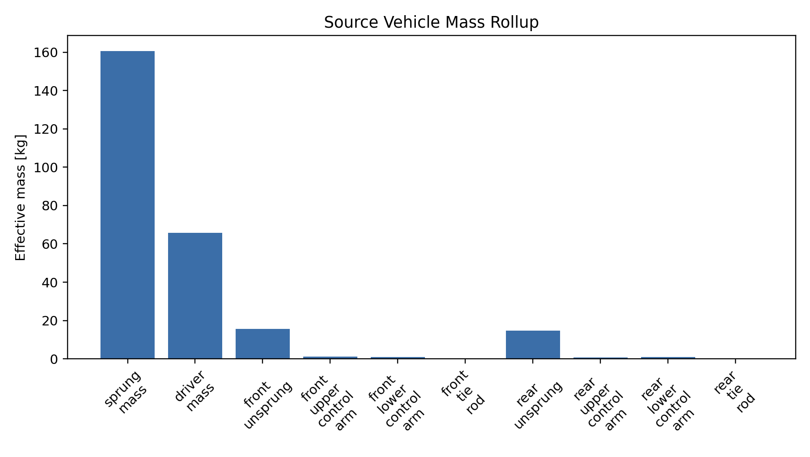
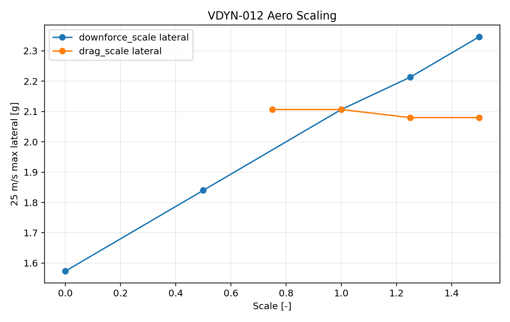
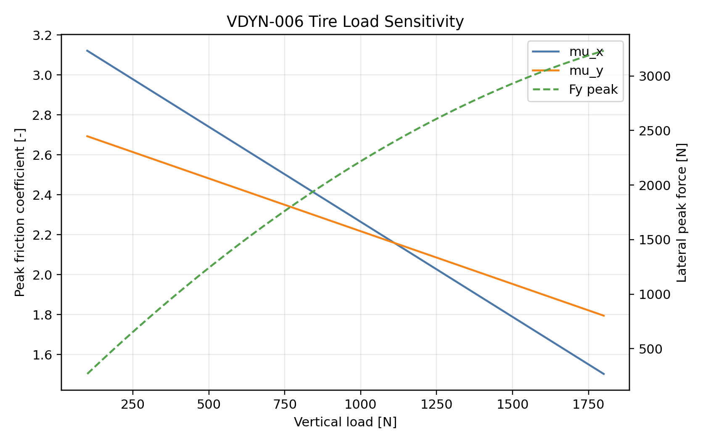
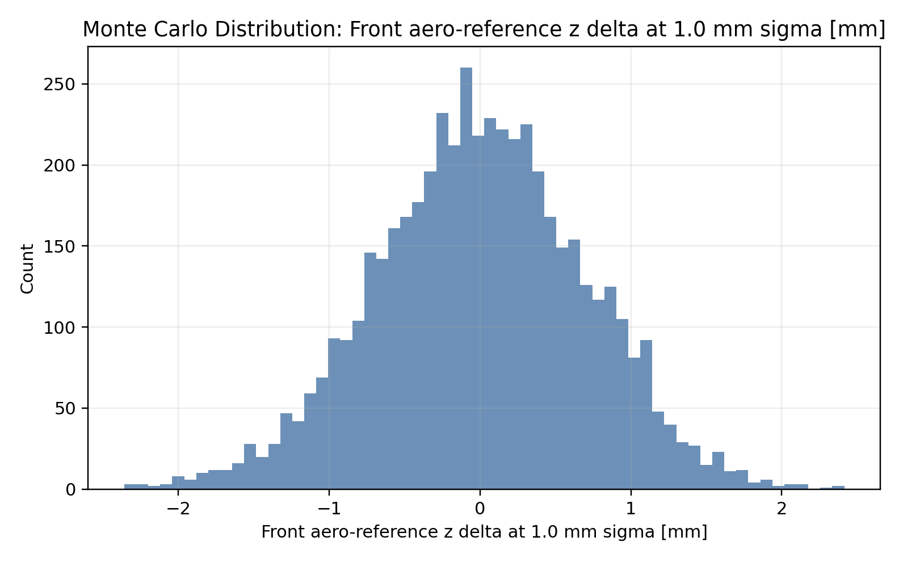
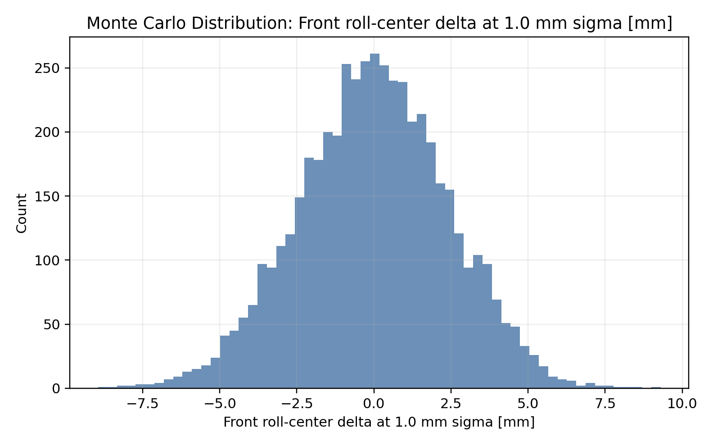
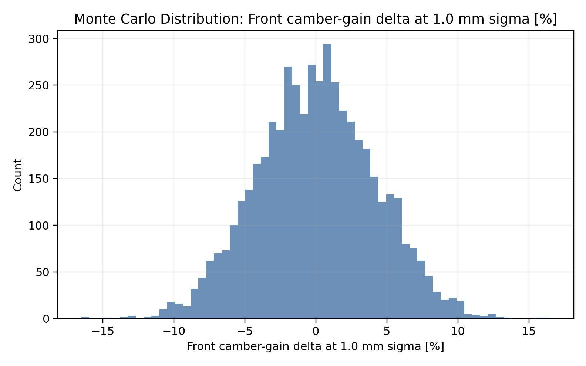

# 2026 Vehicle Dynamics Design Report

## Purpose

Justify the dynamic behavior of the 2026 vehicle from model inputs to
first-drive correlation. This report should answer:

**Why does this vehicle have the right contact-patch behavior for the team's
goals, and what evidence proves it?**

## Claims To Prove

| Claim | Required Study |
| --- | --- |
| The source vehicle model matches design intent. | `VDYN-001-source-vehicle-audit` - complete |
| The baseline architecture has enough lateral, acceleration, and braking envelope. | `VDYN-002-baseline-envelope` - complete |
| The full vehicle model is mild, quick, and tunable rather than architecture-limited. | `VDYN-003-standardsim-baseline` - complete |
| Tire behavior is the dominant uncertainty and must drive the first test plan. | `VDYN-004-tire-operating-window` - complete |
| ARB, damping, alignment, and tire interactions provide usable setup authority. | `VDYN-005-setup-authority` - complete |
| Tire load sensitivity, pure-slip shape, cornering stiffness, relaxation length, and combined-slip budget are understood well enough to define test priorities. | `VDYN-006` through `VDYN-010` - complete |
| Vehicle-level DOE identifies the highest-leverage variables and the remaining correlation priorities. | `VDYN-011` through `VDYN-016` - complete |
| Frame manufacturing tolerance is linked to geometry and aero-reference risk. | `VDYN-017-hardpoint-monte-carlo-tolerance` - complete |
| Hardpoint response Monte Carlo is only claimed after compiled StandardSim calibration. | `VDYN-018-standardsim-hardpoint-calibration` - active |

## Development Flow

This report is split by model fidelity and design maturity:

1. Source vehicle definition: prove the model inputs are coherent before
   claiming performance.
2. Preliminary design with EnvelopeSim: use fast GGV/envelope studies to decide
   whether the architecture has enough capability and which variables matter.
3. Tire model foundation: quantify the tire behavior that explains why the
   EnvelopeSim results move and what StandardSim must characterize next.
4. Advanced characterization with StandardSim: once the envelope is reasonable,
   use full-model metrics to study response, setup authority, and driver-facing
   behavior.
5. Manufacturing tolerance bridge: statistically perturb chassis hardpoints and
   quantify geometry and aero-reference variation before physical correlation.
6. StandardSim calibration subset: compile a sparse truth set before extending
   hardpoint tolerance claims to large response Monte Carlo.
7. Correlation priority: turn the DOE results into the first physical test
   plan.

## Source Vehicle Definition

### Source Vehicle Audit

`VDYN-001-source-vehicle-audit` passed. Later dynamics studies may use
`vehicles/current/vehicle.yml` and `vehicles/current/tires/16x7p5_10_12psi.tir`
as their source inputs.

Key audited values:

- Total modeled mass: `261.073 kg`
- Audited CG: `[-0.8003, 0.0000, 0.2796] m`
- Wheelbase: `1.5494 m`
- Front/rear track: `1.2122 m` / `1.2122 m`
- Static load split: `48.35 %` front / `51.65 %` rear
- Tire nominal vertical load: `650 N`
- Tire vertical load range: `100` to `1800 N`
- Lateral relaxation coefficients: `PTY1 = 3.330134`, `PTY2 = 3.587160`
- Front/rear aero ride-height references match lower-inboard hardpoint
  averages to numerical precision.

Design implication: the model source is coherent enough to begin baseline
envelope work. This does not yet justify performance; it only establishes the
vehicle that performance studies are allowed to claim.

## Preliminary Design With EnvelopeSim

EnvelopeSim is the preliminary design tool in this package. It is used first
because it answers the architecture-level question quickly: does this vehicle
have enough lateral, acceleration, and braking capability to justify deeper
full-vehicle simulation?

### Baseline Envelope

`VDYN-002-baseline-envelope` passed. The audited baseline vehicle has enough
first-principles GGV capability to justify response and setup studies rather
than reopening the architecture question.

Representative 15 m/s metrics:

- Max lateral: `1.773 g`
- Max acceleration: `1.395 g`
- Max braking: `1.893 g`

Baseline model inputs for this study:

- Aero map point: front ride height `0.03556 m`, rear ride height `0.04191 m`
- Downforce/drag at 15 m/s: `323.5 N` / `161.6 N`
- Front LLTD assumption: `48.96 %`
- Front aero balance assumption: `50.0 %`
- Drive power / force cap: `80.0 kW` / `3735 N`
- Brake force cap: `14000 N`

The tire range check passed for all representative zero-ay acceleration,
zero-ay braking, and max-lateral load cases across `5`, `10`, `15`, `20`, and
`25 m/s`: `15/15` cases stayed inside the tire file vertical-load range.

Design implication: the next vehicle-dynamics question is not whether the
architecture has any usable envelope. It is which tire operating-window and
setup choices make that envelope accessible, repeatable, and confidence
inspiring.

### Tire Operating Window

`VDYN-004-tire-operating-window` passed as a tire-source screening study.

- Tire nominal load: `650 N`
- Tire vertical load range: `100` to `1800 N`
- Lateral peak coefficients: `PDY1 = -2.402750`, `PDY2 = 0.343535`
- Lateral stiffness coefficients: `PKY1 = -53.2421`, `PKY2 = 2.3821`
- Lateral relaxation coefficients: `PTY1 = 3.330134`, `PTY2 = 3.587160`
- Nominal relaxation scale from `PTY1 * R0`: `0.677 m`
- Baseline ay overshoot needing tire/setup correlation: `21.6 %`

Design implication: tire behavior is the first test-plan priority. The model
can screen choices, but first-drive confidence requires hot pressure, tire
temperature spread, steering, yaw, ay, speed, and driver comments.

### EnvelopeSim One-Factor DOE

`VDYN-011-envelope-doe-importance` passed. It runs one-factor EnvelopeSim
screening around the admitted baseline.

- Lateral envelope top span: `tire_peak_mu` at `+0.213 g`
- Acceleration envelope top span: `drive_force` at `+0.579 g`
- Braking envelope top span: `cg_height_m` at `-0.224 g`

Design implication: validation time should follow sensitivity. Tire peak force,
drive-force delivery, and CG height deserve the highest scrutiny before final
setup decisions.

### EnvelopeSim Interaction DOE

`VDYN-015-envelopesim-interaction-doe` passed. This expands EnvelopeSim from
one-factor screening into paired interaction surfaces.

- DOE cases evaluated: see
  `studies/vdyn/VDYN-015-envelopesim-interaction-doe/outputs/interaction_doe.csv`
- Paired surfaces: tire peak x downforce, drive force x drag, brake force x CG
  height, front LLTD x front aero balance
- Largest paired span: drive force x drag on acceleration at `0.865 g`
- Tire peak x downforce lateral span: `0.853 g`
- Brake force x CG-height braking span: `0.305 g`
- Front LLTD x front aero-balance lateral span: `0.284 g`

Design implication: the envelope should be correlated as paired mechanisms.
Tire force and aero load, drive force and drag, brake capacity and CG height,
and LLTD and aero balance are coupled enough that scalar validation can miss
the real reason a result moved.

### Aero Scaling In The Envelope

`VDYN-012-aero-scaling-doe` passed.

- 25 m/s downforce-scale lateral span: `1.573` to `2.347 g`
- 25 m/s drag-scale acceleration span: `0.980` to `1.111 g`

Design implication: downforce, drag, and aero balance must be correlated
separately. Aero is not one knob.

### Preliminary Design Gate

EnvelopeSim supports moving into StandardSim because the baseline vehicle has
usable capability, the tire loads stay inside the tire-file range, and the DOE
has identified which variables can move the vehicle-level conclusion. The next
question is therefore not "does this architecture work at all?" but "how does
the full vehicle respond, and which setup/correlation knobs should be tested
first?"

## Tire Model Foundation

The tire is now treated as its own design topic, not a single friction
coefficient. The tire story has five layers: load sensitivity, pure-slip curve
shape, cornering stiffness, relaxation response, and combined-slip budget.
This section is placed between EnvelopeSim and StandardSim because the
preliminary envelope says the vehicle is worth deeper study, while the tire
model explains which contact-patch mechanisms StandardSim must characterize.

### Load Sensitivity

`VDYN-006-tire-load-sensitivity` passed.

- Valid vertical-load range: `100` to `1800 N`
- Nominal-load mu_x/mu_y near `659 N`: `2.589` / `2.398`
- High-load mu_x/mu_y at `1800 N`: `1.503` / `1.795`
- High-load lateral peak force: `3231 N` per tire

Design implication: more normal load increases peak force, but it does not
preserve the same coefficient of friction. LLTD, aero, mass, and setup changes
must be interpreted through load sensitivity.

### Pure-Slip Curves

`VDYN-007-tire-pure-slip-curves` passed.

Representative loads were `350 N`, `650 N`, `1000 N`, and `1400 N`.

Design implication: the tire should be discussed as curve shape and stiffness,
not only as peak force. Driver response happens before the tire reaches peak.

### Cornering Stiffness

`VDYN-008-tire-cornering-stiffness` passed. This is one of the most important
driver-facing tire studies because it connects tire data to steering response,
yaw gain, and lateral acceleration gain.

- Representative tire-load range from `VDYN-002`: `278.4` to `1370.9 N`
- Nominal-load cornering stiffness: `24512 N/rad`
- Low/high observed-load cornering stiffness: `11772` / `34354 N/rad`
- StandardSim baseline ay/yaw DC gain: `33.73 (m/s^2)/rad` /
  `2.228 (rad/s)/rad`
- StandardSim baseline ay overshoot: `21.6 %`

Design implication: cornering stiffness is a correlation target. First-drive
data should connect pressure and temperature to steering response, yaw gain,
ay gain, and overshoot.

### Relaxation Length

`VDYN-009-tire-relaxation-response` passed. This study turns the fitted
relaxation coefficients into a response scale for transient correlation.

- PTY1 / PTY2: `3.330134` / `3.587160`
- Model-form nominal relaxation scale `PTY1 * R0`: `0.677 m`
- 15 m/s relaxation time constant from that scale: `0.045 s`
- 15 m/s approximate 95% force-build time from that scale: `0.135 s`
- StandardSim ay/yaw rise time for comparison: `0.075` / `0.059 s`

Design implication: relaxation length is the bridge between tire data and
transient driver confidence. It should be correlated with step steer and sine
steer phase, lag, and overshoot. The coefficient scale above is not yet a
track-validated final relaxation value.

### Combined-Slip Budget

`VDYN-010-tire-combined-slip-budget` passed.

- At `90 %` of peak lateral demand, available acceleration is `22 %` of
  zero-ay acceleration.
- At `90 %` of peak lateral demand, available braking is `19 %` of zero-ay
  braking.

Design implication: power, brake, and cornering claims share the same tire
budget. The contact patch is the common currency between vehicle dynamics,
powertrain, brakes, driver interface, and DAQ.

## Advanced Characterization With StandardSim

StandardSim is used after the preliminary EnvelopeSim gate. Its job is not to
re-prove that the architecture has an envelope; its job is to characterize the
full-vehicle response that drivers and setup engineers will actually feel:
understeer, roll, yaw response, lateral acceleration response, overshoot,
settling, motion ratios, LLTD, and stiffness authority.

### StandardSim Baseline

`VDYN-003-standardsim-baseline` passed by ingesting current BobSim
SteadyStateEval, TransientEval, and FourPostEval metric artifacts.

- Understeer gradient: `0.382 deg/g`
- Roll gradient: `1.441 deg/g`
- Ay rise time: `0.075 s`
- Yaw rise time: `0.059 s`
- Ay overshoot: `21.6 %`
- Yaw overshoot: `18.6 %`
- Front LLTD: `52.06 %`
- Front/rear motion ratio: `1.002` / `1.255`
- Roll toe gain: `0.00128 rad/rad`

Design implication: the full model points to setup and correlation work, not
an architecture reset.

### Setup Authority

`VDYN-005-setup-authority` passed.

- Front/rear elastic roll stiffness: `67846` / `62559 N*m/rad`
- Front/rear ARB roll stiffness contribution: `46328` / `49753 N*m/rad`
- Front LLTD: `52.06 %`
- Ay/yaw overshoot: `21.6 %` / `18.6 %`
- Settling time: `1.302 s`

Design implication: the car has useful knobs. The first-drive task is proving
that damping, ARB mapping, tire operating window, and alignment changes move
the car in the predicted direction.

### Torsional Stiffness

`VDYN-013-torsional-stiffness-authority` passed.

- Suspension elastic roll stiffness total: `130405 N*m/rad`
- Vehicle YAML body torsional stiffness: `300000 N*m/rad` (`5236 Nm/deg`)
- The plotted sweep is converted to `Nm/deg`; the source input remains
  `N*m/rad`.
- Current effective roll authority: `69.7 %` of suspension-only roll stiffness
- At `1500 Nm/deg`, effective roll authority would be `39.7 %`

Design implication: torsional stiffness is a vehicle dynamics variable because
it controls how much spring and ARB authority reaches the contact patches.
Fixture testing is required before treating setup authority as validated.

### Static Alignment

`VDYN-014-static-alignment-screening` passed.

- Cornering stiffness at `0 deg` camber: `24703 N/rad`
- Cornering stiffness at `4 deg` camber magnitude: `22349 N/rad`
- Peak mu_y at `0 deg` / `4 deg` camber: `2.403` / `2.357`
- Approximate front-pair lateral preload for `2 deg` total toe: `862 N`

Design implication: static alignment must be treated as a tire-response and
temperature-correlation problem. A full StandardSim alignment DOE remains a
required follow-up before final toe/camber recommendations.

### StandardSim-Baseline Surrogate Response-Surface DOE

`VDYN-016-standardsim-response-surface-doe` passed. It takes the current
StandardSim baseline metrics and expands them into a full-factorial surrogate
response surface. This is not a StandardSim variant campaign; no changed
vehicle configurations are compiled or rerun in this study.

Run provenance:

- Engine: `standardsim_baseline_anchored_surrogate`
- Compiled StandardSim variants: `0`
- Surrogate cases evaluated: `729`

Swept factors:

- Cornering stiffness scale
- Relaxation scale
- Damping scale
- Front LLTD delta
- Torsional authority scale
- Front total toe

Response-surface results:

- Full-factorial cases: `729`
- Strongest ay-overshoot factor: cornering stiffness scale at `+5.5 %`
- Strongest understeer factor: front LLTD delta at `+0.448 deg/g`
- Strongest ay-rise factor: relaxation scale at `+15.1 %`
- Strongest roll-gradient factor: torsional authority scale at `-39.1 %`

Design implication: this surrogate identifies where a compiled StandardSim DOE
should spend builds first: cornering stiffness and relaxation for gain/timing,
damping for overshoot/settling, LLTD for balance, torsional authority for roll
response, and toe for response-versus-drag tradeoff.

## Manufacturing Tolerance Bridge

The chassis cannot be justified only by load capacity and torsional stiffness.
The suspension tabs also have to put the hardpoints where the VDYN model says
they are. `VDYN-017-hardpoint-monte-carlo-tolerance` therefore varies the
inboard upper and lower control-arm hardpoints and checks the resulting
geometry and aero-reference spread. It does not claim StandardSim response
movement because no StandardSim variants are compiled in this study.

### Hardpoint Monte Carlo Tolerance

`VDYN-017-hardpoint-monte-carlo-tolerance` passed.

This is the study's own geometry Monte Carlo. Outboard joints and wheel
centers are held fixed so the study isolates frame-side manufacturing
variation. The swept sigma is treated as combined machined-plus-welded
coordinate process variation.

Run provenance:

- Engine: `study_geometry_monte_carlo`
- Compiled models: `0`
- Simulated geometry cases: `25000`
- Runtime: `16.06 s`

- Samples per tolerance level: `5000`
- Tolerance levels swept: `0.5`, `1.0`, `1.5`, `2.0`, `3.0 mm` combined
  machined-plus-welded coordinate sigma
- Largest passing tolerance by geometry thresholds: `1.0 mm`
  coordinate sigma
- Practical interpretation: approximately `+/-2.0 mm` at about two sigma per
  coordinate
- At `1.0 mm` sigma, p95 aero reference z delta: `1.40 mm`
- At `1.0 mm` sigma, p95 roll-center delta: `5.15 mm`
- At `1.0 mm` sigma, p95 front/rear camber-gain delta: `8.03 %` / `6.87 %`
- At `1.0 mm` sigma, p95 inboard span delta: `2.75 mm`

Design implication: `1.0 mm` combined coordinate sigma is a practical
pre-correlation build target for preserving the modeled geometry and aero
reference points. Dynamic response is intentionally not claimed here: measured
hardpoints must be fed back into `vehicle.yml`, then rerun through EnvelopeSim
or compiled StandardSim variants before final response claims.

### StandardSim Hardpoint Calibration

`VDYN-018-standardsim-hardpoint-calibration` defines that compiled-variant
gate. The intended truth set is `25` hardpoint-perturbed StandardSim vehicle
configurations at `1.0 mm` coordinate sigma, compiled and run with up to `4`
parallel workers. A smoke run has already proven the automation path:

- Requested vehicle configurations in smoke run: `1`
- Compiled StandardSim models: `1`
- Successful TransientEval cases: `1`
- VehicleSim compile runtime: `223.03 s`
- TransientEval runtime: `27.39 s`
- Total smoke-study runtime: `250.76 s`

Design implication: the large `25000`-case hardpoint response Monte Carlo
should not be reported as a StandardSim response result until the 25 compiled
truth cases have calibrated the simplified mapping. If the mapping is weak,
`VDYN-017` still supports geometry/aero-reference tolerance, but not
driver-facing StandardSim response risk.

## Correlation Priority Ranking

The current VDYN evidence says the first physical validation effort should
prioritize:

1. Tire peak force and operating condition: pressure, temperature, camber,
   surface, and warmup.
2. Drive-force delivery: torque request, wheel speeds, pack power, acceleration.
3. CG height and mass properties: built-car audit and corner weights.
4. Cornering stiffness and relaxation: steering/yaw/ay gain, phase, lag, and
   overshoot.
5. Paired EnvelopeSim mechanisms: tire-aero load, drive-drag, brake-CG, and
   LLTD-aero-balance interaction surfaces.
6. Aero scaling: coastdown, aero-on/off, ride-height-vs-speed.
7. Torsional stiffness: fixture twist test and setup response direction.
8. Static alignment: tire temperatures, yaw/ay response, scrub/drag, driver
   comments.
9. Hardpoint tolerance: built-frame CMM/fixture audit of inboard suspension
   points before final StandardSim correlation.

## Open Questions

- Which tire operating-window assumptions are measured versus proxy-scaled?
- Does transient tire relaxation materially change the step/sine response?
- Do BobLib physical ARB rates match the team LLTD calculator closely enough
  for setup decisions?
- Which logged channels are mandatory for first-drive correlation?
- What is the physically measured torsional stiffness, and how much setup
  authority does it preserve?
- Do compiled StandardSim variant reruns confirm the response-surface DOE
  rankings for alignment, damping, LLTD, and relaxation?
- Do aero-on/off and coastdown tests support the current downforce/drag scaling
  assumptions?
- Does built-frame hardpoint measurement satisfy the `1.0 mm` combined
  coordinate sigma geometry target, and do measured points require vehicle/aero
  reference updates?

## Next Work

The vehicle-dynamics report is complete for pre-test analysis. The next work is
correlation: first-drive source audit, GG capture, step/sine steer, steady-state
balance, tire operating-window logging, and setup brackets.
