# DS-007 Tire Selection Decision

Generated: 2026-05-24

## Executive Decision

Selected tire family: **Hoosier 43075 16x7.5-10 R20**.

Primary simulated setup: **7 in rim, 8 psi**.

Validation setups:

- **8 in rim, 8 psi** if the wider wheel package is acceptable.
- **7 in rim, 10 psi** as the first pressure/rotation trim with direct transient-temperature coverage.

The selected tire is not being chosen because it is common. In the corrected DS-006 run, the **Hoosier 43075 7 in / 8 psi** is the integrated leader across all scoreable candidates, while also preserving the current zero-radius-delta vehicle package.

| Evidence | Value |
| --- | ---: |
| Integrated rank | 1 |
| EnvelopeSim rank | 2 |
| StandardSim stable-window rank | 3 |
| Integrated score | 0.895 |
| EnvelopeSim score | 0.868 |
| StandardSim score | 0.947 |
| Mean EnvelopeSim lateral capability | 1.919 g |
| Understeer gradient | 0.390 deg/g |
| Roll gradient | 0.934 deg/g |
| Radius delta vs reference | 0.0 mm |
| Initial/final 12 psi lateral peak-mu change | +1.6% |
| Initial/final 12 psi cornering-stiffness change | +1.3% |

The short decision is: **select Hoosier 43075 16x7.5-10 R20 on the 7 in rim at 8 psi as the baseline, then validate 8 psi thermal behavior and the 8 in rim response trade.**

## Source Evidence

All vehicle-response evidence comes from DS-006 and is generated by EnvelopeSim or StandardSim. Raw tire-data evidence, such as temperature and initial/final degradation, is used only as a test-condition and fit-confidence cross-check.

| Evidence | Source |
| --- | --- |
| Integrated study report | `reports/DS-006-integrated-tire-design.md` |
| Integrated ranking | `studies/DS-006-integrated-tire-design/outputs/integrated_results.csv` |
| EnvelopeSim metrics | `studies/DS-006-integrated-tire-design/outputs/envelope_metrics.csv` |
| StandardSim metrics | `studies/DS-006-integrated-tire-design/outputs/standardsim_metrics.csv` |
| Transient temperature summary | `studies/DS-006-integrated-tire-design/outputs/transient_temperature_summary.csv` |
| Initial/final degradation summary | `studies/DS-006-integrated-tire-design/outputs/degradation_summary.csv` |

DS-006 coverage:

| Item | Count |
| --- | ---: |
| Round 9 candidates | 56 |
| Reference tires | 1 |
| EnvelopeSim cases | 57 |
| StandardSim successful cases | 57 |
| StandardSim error cases | 0 |
| StandardSim QA-pass cases | 51 |
| StandardSim QA-fail metric rows | 6 |

StandardSim is intentionally scored in a stable `8.0 m/s^2` ramp-steer window. EnvelopeSim carries the limit/capability comparison; StandardSim carries balance, stability, and steering effort. The exported StandardSim `ay_max` column is retained only as a measured-ramp diagnostic and is not used for tire selection.

## Tire Definition Check

The Round 9 tires are full `USE_MODE = 14` PAC2002-style `.tir` records. The DS-006 run rendered every candidate into a StandardSim vehicle record, and every candidate produced StandardSim metrics in the stable sweep. The remaining tire-fit caveats are provenance and fit quality, not missing TIR fields.

Important tire-fit provenance:

| Provenance item | Count | Meaning |
| --- | ---: | --- |
| Direct longitudinal/combined fit | 39 | Highest confidence longitudinal/combined evidence. |
| Scaled 18 in Hoosier longitudinal/combined fit | 16 | Applies to the 16 in Hoosiers, including the selected 43075. |
| Pressure-extrapolated lateral/direct drive-brake hybrid | 1 | Use only as a lower-confidence comparison row. |

The selected 43075 uses scaled 18 in Hoosier longitudinal/combined terms. That is acceptable for vehicle-level screening, but longitudinal/braking sign-off still needs validation.

## Architecture Rule

Tire OD is a vehicle architecture input, not a free tire-file swap.

DS-006 applies this in both simulation paths:

| Model | Architecture correction |
| --- | --- |
| EnvelopeSim | Candidate CG height is increased by `candidate UNLOADED_RADIUS - reference UNLOADED_RADIUS`. |
| StandardSim | Tire radius, rim geometry, vertical stiffness/damping, and chassis-layout z coordinates are updated by the tire-radius delta. |

The current reference radius is `0.2032 m`.

| Tire size | Radius delta | Corrected CG height | CG-height change |
| --- | ---: | ---: | ---: |
| 16x6.0-10 | 0.0 mm | 0.280 m | 0.0% |
| 16x7.5-10 | 0.0 mm | 0.280 m | 0.0% |
| 18.0x6.0-10 / 18.0x6.5-10 | +25.4 mm | 0.305 m | +9.1% |
| 20.0x7.0-13 | +50.8 mm | 0.330 m | +18.2% |
| 20.5x7.0-13 | +57.2 mm | 0.337 m | +20.4% |

This does not disqualify larger tires. It means they are vehicle-architecture studies, not tire-only substitutions.

## Decision Lenses

| Decision lens | Winner | Integrated | Radius delta | Interpretation |
| --- | --- | ---: | ---: | --- |
| Integrated all-tire leader | Hoosier 43075 16x7.5-10 7 in / 8 psi | 0.895 | 0.0 mm | Selected tire and setup. |
| EnvelopeSim capability leader | Goodyear D2704 20.0x7.0-13 7 in / 8 psi | 0.877 integrated | +50.8 mm | Best raw envelope, but requires a 13 in architecture path. |
| Best 18 in OD package | Hoosier 43100 18.0x6.0-10 7 in / 8 psi | 0.836 | +25.4 mm | Strong architecture-study alternate. |
| Best zero-radius-delta alternate | Hoosier 43075 16x7.5-10 8 in / 8 psi | 0.849 | 0.0 mm | Wider-rim response option. |
| Best 43075 relaxation case | Hoosier 43075 16x7.5-10 8 in / 14 psi | 0.692 | 0.0 mm | Fastest fitted response, lower capability. |

The 43075 wins the unconstrained integrated score and the current-architecture score. That is the clean selection argument.

## Figure Evidence

These figures are generated by DS-006 from the same EnvelopeSim, StandardSim, tire-fit, and transient-temperature outputs used in this decision.

### Integrated Ranking

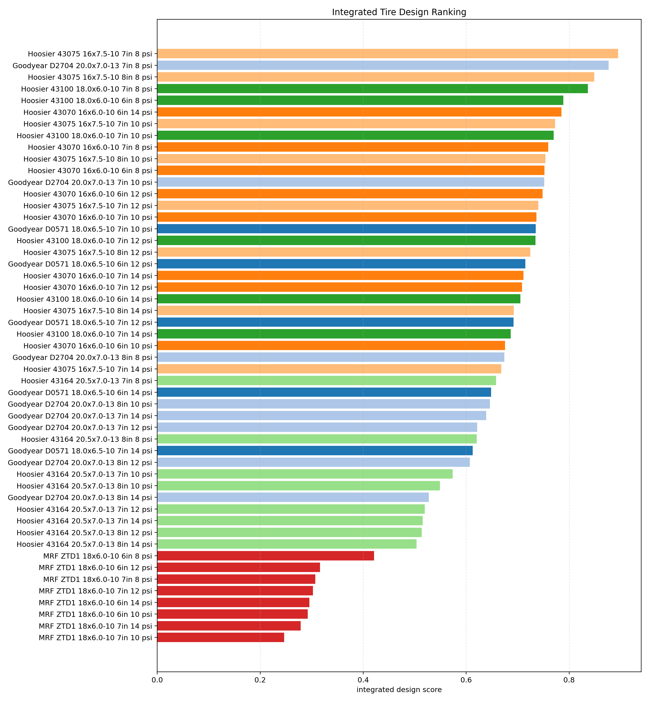

### Current-Package Ranking

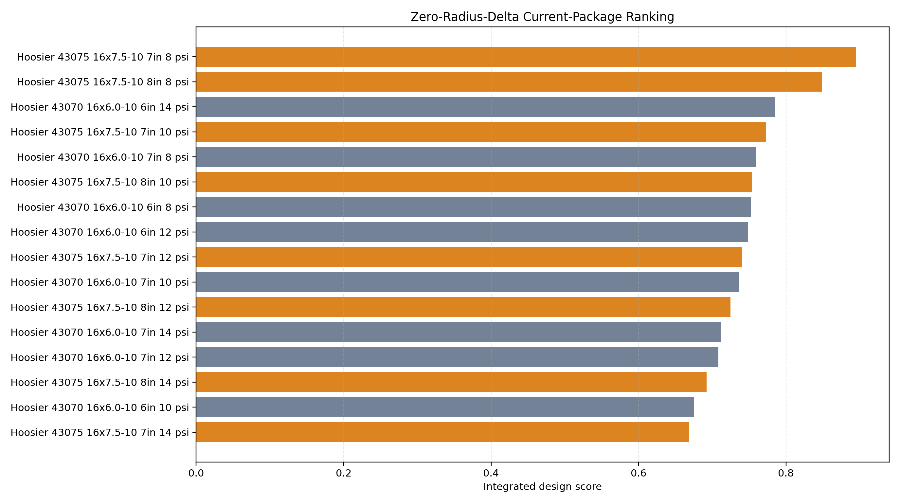

### Family-Level Score Comparison

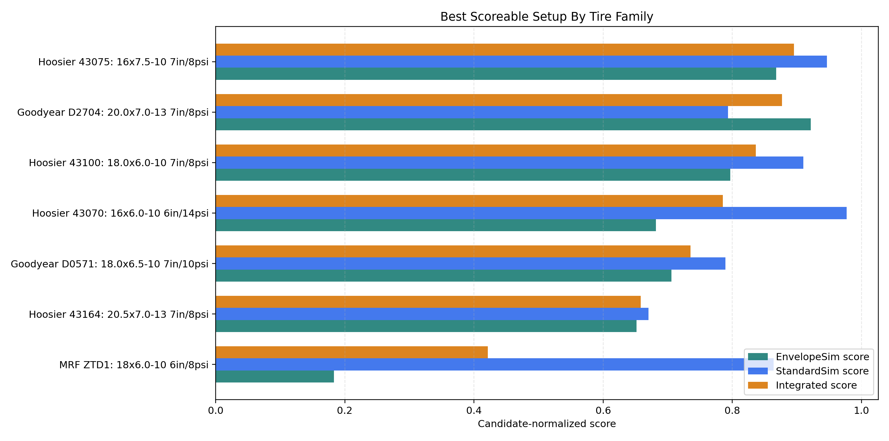

### Tire-Fit Peak Mu Versus Cornering Stiffness

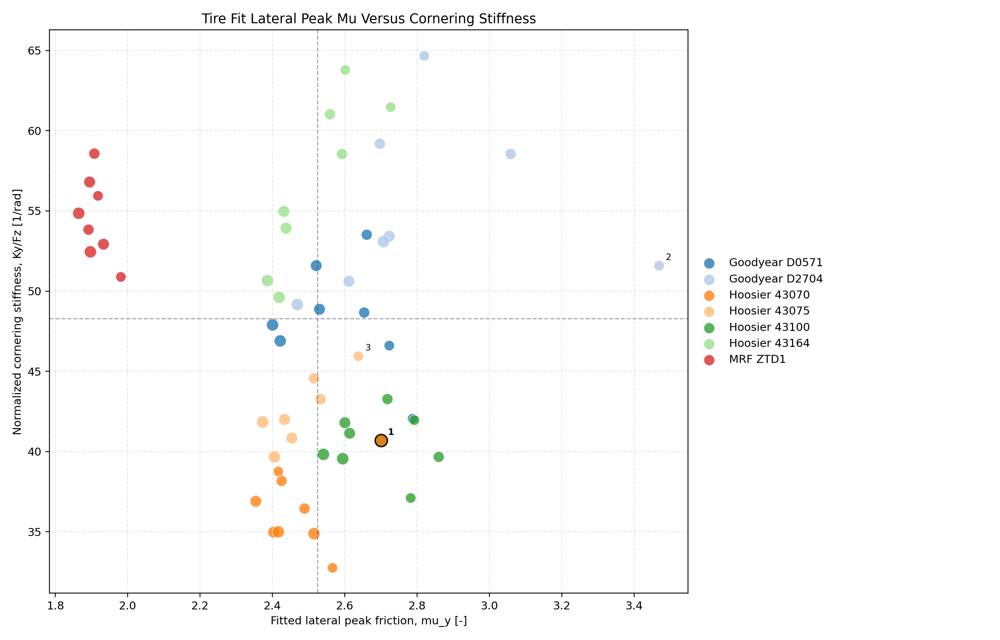

### Tire-Fit Property Ranking

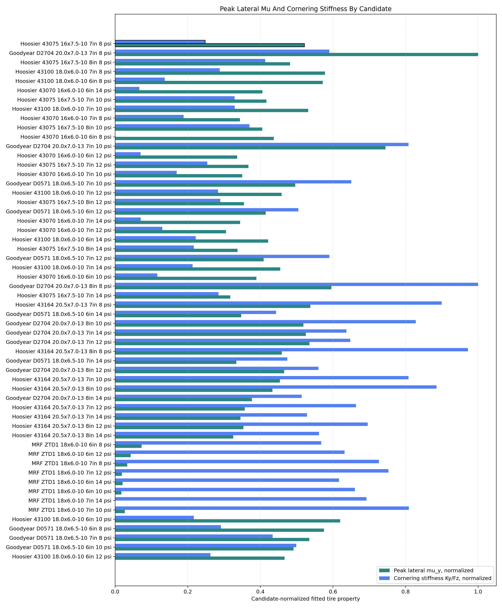

### EnvelopeSim Capability Ranking

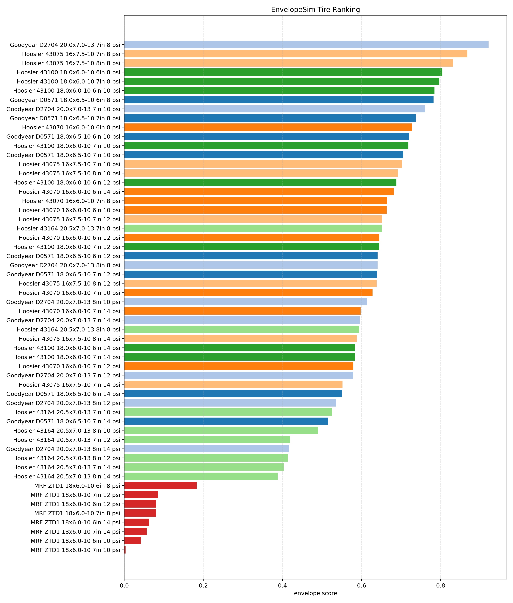

### StandardSim Stable-Window Ranking

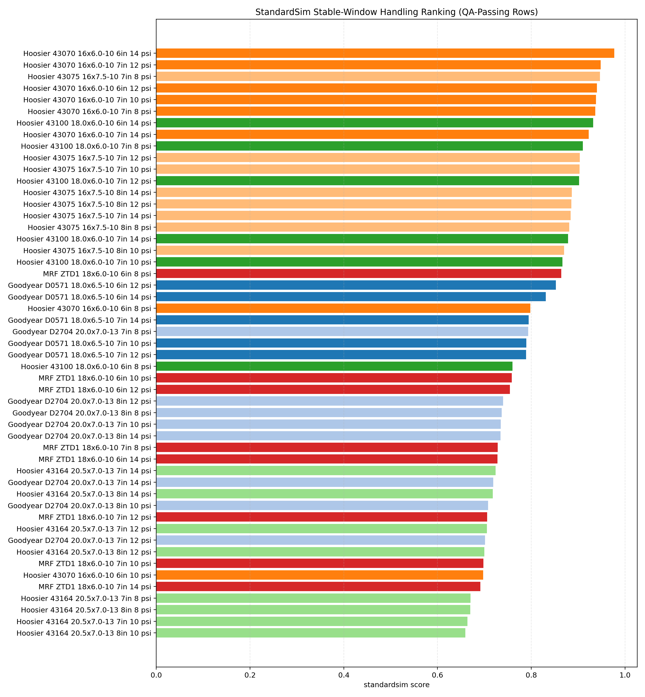

### Integrated Trade Space

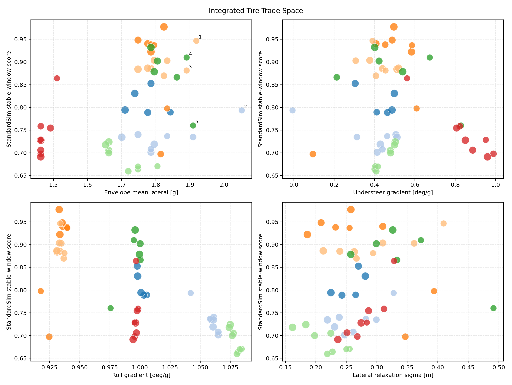

### Pressure Trends

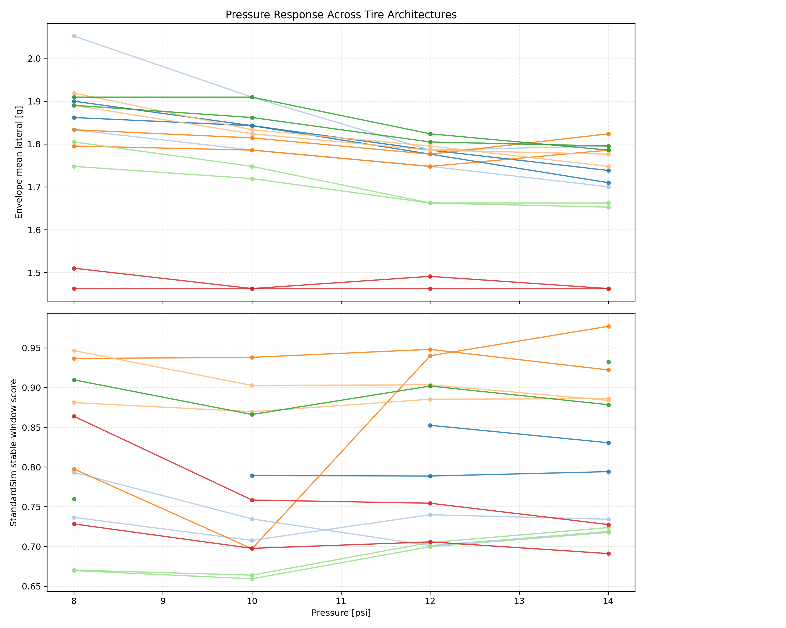

### Relaxation Ranking

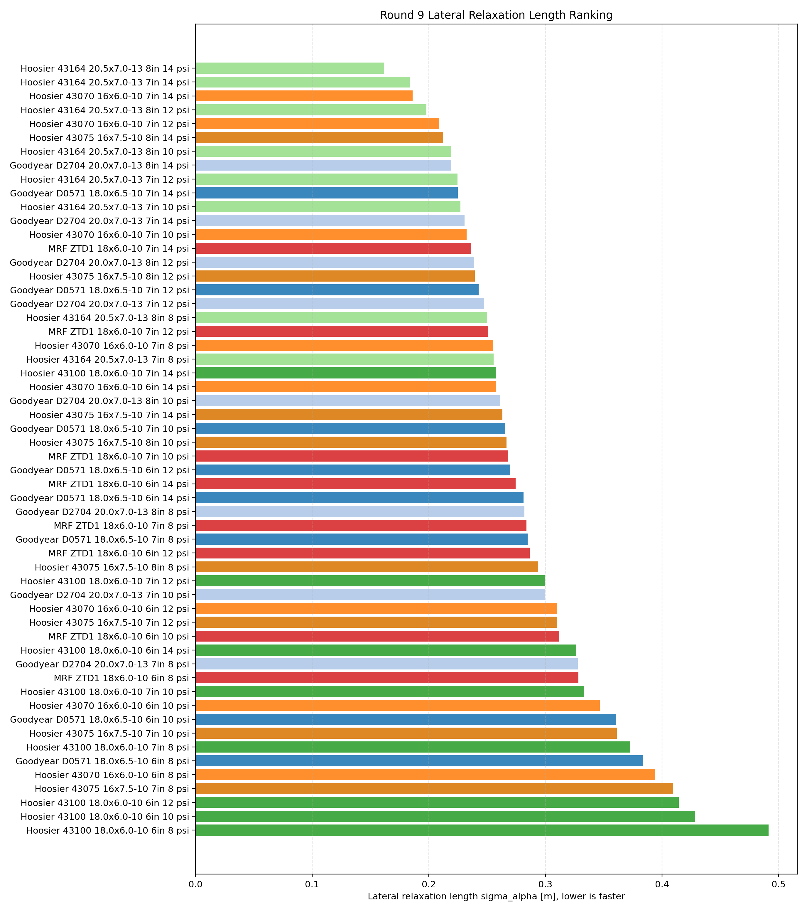

### Relaxation Trade Space

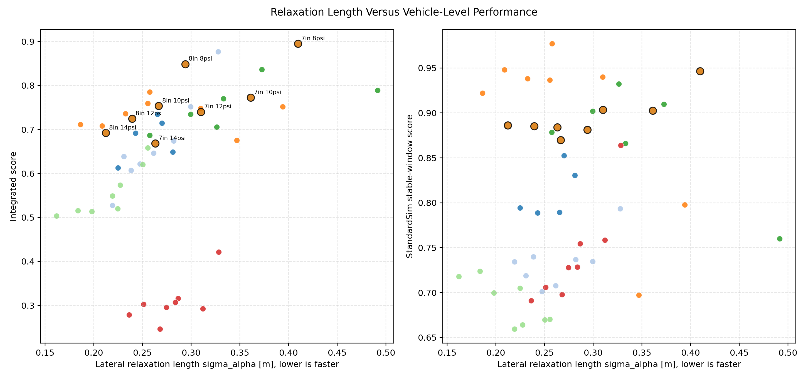

### Transient Temperature Evidence

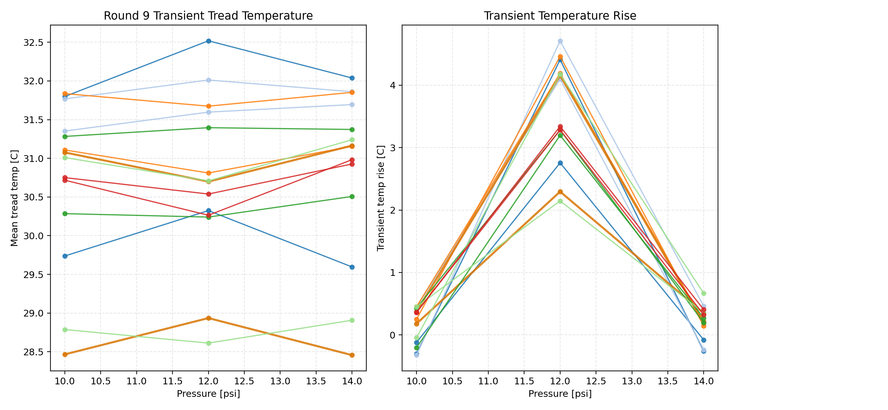

### Cornering Degradation Evidence

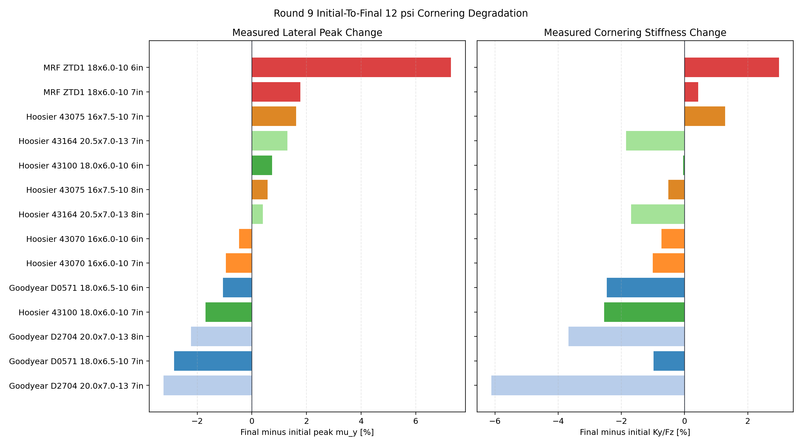

### Drive/Brake Degradation Evidence

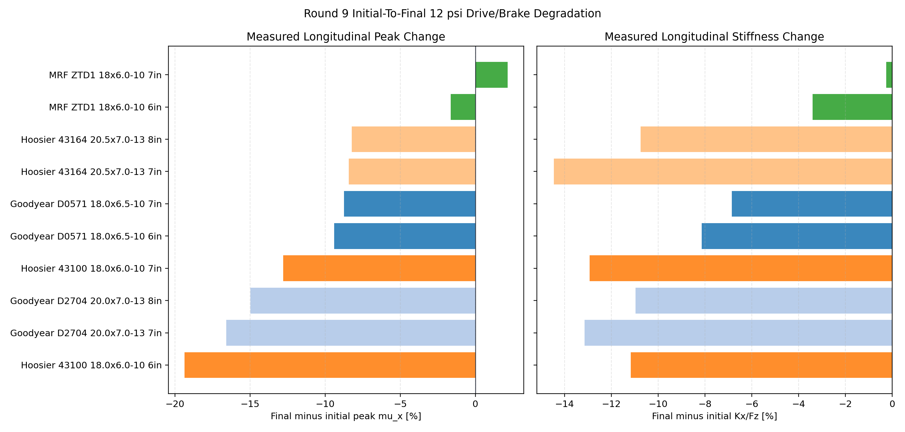

## Family-Level Comparison

| Family | Best setup | Int | Env | Std | Mean lat | dR | Read |
| --- | --- | ---: | ---: | ---: | ---: | ---: | --- |
| Goodyear D0571 | 18.0x6.5-10, 7 in, 10 psi | 0.735 | 0.706 | 0.789 | 1.843 g | +25.4 mm | Decent direct-fit 18 in option, but not enough envelope after QA gating. |
| Goodyear D2704 | 20.0x7.0-13, 7 in, 8 psi | 0.877 | 0.922 | 0.793 | 2.052 g | +50.8 mm | Envelope leader; should become an architecture study, not the current tire-only selection. |
| Hoosier 43070 | 16x6.0-10, 6 in, 14 psi | 0.785 | 0.682 | 0.977 | 1.824 g | 0.0 mm | Excellent StandardSim balance, but gives up too much tire envelope. |
| Hoosier 43075 | 16x7.5-10, 7 in, 8 psi | 0.895 | 0.868 | 0.947 | 1.919 g | 0.0 mm | Best combined answer: high envelope, clean balance, no package penalty. |
| Hoosier 43100 | 18.0x6.0-10, 7 in, 8 psi | 0.836 | 0.797 | 0.910 | 1.891 g | +25.4 mm | Strong 18 in OD alternate if the vehicle package moves up. |
| Hoosier 43164 | 20.5x7.0-13, 7 in, 8 psi | 0.658 | 0.651 | 0.670 | 1.805 g | +57.2 mm | Fast relaxation/direct-fit pedigree does not overcome the large package penalty. |
| MRF ZTD1 | 18x6.0-10, 6 in, 8 psi | 0.421 | 0.183 | 0.864 | 1.511 g | +25.4 mm | Clean enough balance, but far too little EnvelopeSim capability. |

## Current Package Ranking

Top zero-radius-delta candidates:

| Rank | Candidate | Integrated | Envelope | StandardSim | Mean lat | Std ay diag | US grad | Sigma alpha |
| ---: | --- | ---: | ---: | ---: | ---: | ---: | ---: | ---: |
| 1 | Hoosier 43075 16x7.5-10 7 in / 8 psi | 0.895 | 0.868 | 0.947 | 1.919 g | 1.658 g | 0.390 deg/g | 0.410 m |
| 2 | Hoosier 43075 16x7.5-10 8 in / 8 psi | 0.849 | 0.831 | 0.881 | 1.891 g | 1.651 g | 0.454 deg/g | 0.294 m |
| 3 | Hoosier 43070 16x6.0-10 6 in / 14 psi | 0.785 | 0.682 | 0.977 | 1.748 g | 1.495 g | 0.496 deg/g | 0.258 m |
| 4 | Hoosier 43075 16x7.5-10 7 in / 10 psi | 0.773 | 0.702 | 0.903 | 1.833 g | 1.617 g | 0.307 deg/g | 0.361 m |
| 5 | Hoosier 43070 16x6.0-10 7 in / 8 psi | 0.760 | 0.664 | 0.937 | 1.805 g | 1.577 g | 0.586 deg/g | 0.255 m |
| 6 | Hoosier 43075 16x7.5-10 8 in / 10 psi | 0.754 | 0.691 | 0.870 | 1.824 g | 1.609 g | 0.407 deg/g | 0.267 m |

The 43075 owns four of the top six current-package rows and the top two overall.

## 43075 Setup Choice

| Setup | Integrated | Envelope | StandardSim | Mean lat | Std ay diag | US grad | Roll grad | Sigma alpha | Use |
| --- | ---: | ---: | ---: | ---: | ---: | ---: | ---: | ---: | --- |
| 7 in / 8 psi | 0.895 | 0.868 | 0.947 | 1.919 g | 1.658 g | 0.390 | 0.934 | 0.410 m | Baseline selection. |
| 8 in / 8 psi | 0.849 | 0.831 | 0.881 | 1.891 g | 1.651 g | 0.454 | 0.937 | 0.294 m | Wider-rim response alternate. |
| 7 in / 10 psi | 0.773 | 0.702 | 0.903 | 1.833 g | 1.617 g | 0.307 | 0.935 | 0.361 m | First pressure validation setup. |
| 8 in / 10 psi | 0.754 | 0.691 | 0.870 | 1.824 g | 1.609 g | 0.407 | 0.937 | 0.267 m | Response-biased alternate. |
| 7 in / 12 psi | 0.740 | 0.652 | 0.904 | 1.795 g | 1.583 g | 0.376 | 0.933 | 0.310 m | Higher-pressure reference point. |
| 8 in / 14 psi | 0.692 | 0.588 | 0.886 | 1.777 g | 1.532 g | 0.519 | 0.931 | 0.212 m | Fastest 43075 relaxation, lower score. |

Setup interpretation:

- **7 in / 8 psi** has the best simulated vehicle score and best 43075 EnvelopeSim capability.
- **8 in / 8 psi** gives up `5.2%` integrated score but cuts fitted relaxation length by about `28%`.
- **7 in / 10 psi** is a lower-capability but still clean pressure trim with direct transient-temperature coverage.

## Against Current Reference

The current reference is the existing hybrid 16x7.5-10, 7 in / 12 psi tire.

| Metric | Current reference | 43075 7 in / 8 psi | Delta |
| --- | ---: | ---: | ---: |
| Envelope mean lateral capability | 1.795 g | 1.919 g | +6.9% |
| Envelope mean GGV area | 8.198 g^2 | 8.297 g^2 | +1.2% |
| Understeer gradient | 0.449 deg/g | 0.390 deg/g | -13.1% |
| Sideslip gradient | 0.459 deg/g | 0.046 deg/g | -90.1% |
| Roll gradient | 0.890 deg/g | 0.934 deg/g | +5.0% |
| Peak handwheel torque | 18.143 Nm | 16.010 Nm | -11.8% |

This is a clean improvement: more envelope, slightly less understeer, lower steering effort, and no architecture penalty.

## Temperature Evidence

Transient temperature data is available for the 10, 12, and 14 psi transient pressure windows. The selected 8 psi cases do not have direct transient temperature rows in DS-006, so 8 psi thermal behavior must be validated on track.

Available 43075 temperature rows:

| 43075 setup | Mean tread | Peak tread | Tread rise | Inner minus outer |
| --- | ---: | ---: | ---: | ---: |
| 7 in / 10 psi | 28.47 C | 29.47 C | +0.18 C | -2.20 C |
| 7 in / 12 psi | 28.94 C | 30.48 C | +2.30 C | -3.42 C |
| 7 in / 14 psi | 28.46 C | 29.55 C | +0.35 C | -1.75 C |
| 8 in / 10 psi | 31.08 C | 32.21 C | +0.38 C | -2.05 C |
| 8 in / 12 psi | 30.70 C | 32.33 C | +4.15 C | -2.97 C |
| 8 in / 14 psi | 31.16 C | 32.18 C | +0.19 C | -1.46 C |

The measured temperature window is mild and does not show an obvious 43075 red flag. The missing 8 psi temperature row is the key validation gap.

## Degradation Evidence

The Round 9 RunGuide repeats the 12 psi sweep after the pressure sequence. DS-006 compares the initial and final 12 psi raw runs at the nominal 25 mph test-speed window. This is not part of the vehicle score; it is a tire-condition sanity check.

| Tire/rim setup | Peak mu_y change | Ky/Fz change | Tread delta | Read |
| --- | ---: | ---: | ---: | --- |
| Hoosier 43075 7 in | +1.6% | +1.3% | +0.7 C | Selected setup has no lateral degradation red flag. |
| Hoosier 43075 8 in | +0.6% | -0.5% | +0.0 C | Wider-rim validation setup is also stable. |

The direct-drive tires provide a useful contrast: several larger or alternate tires lose meaningful longitudinal peak force over the drive/brake initial-to-final repeat, including Goodyear D2704 at roughly `-15%` to `-17%`, Hoosier 43100 at roughly `-13%` to `-19%`, and Hoosier 43164 at roughly `-8%`.

The selected 16 in 43075 does not have direct drive/brake degradation evidence because its longitudinal/combined fit is scaled from the 18 in Hoosier donor. That remains the longitudinal validation gap, but the raw cornering repeat does support the 43075 as a laterally robust baseline.

## Why Not The Other Strong Tires

| Candidate | Why it is not selected for this car |
| --- | --- |
| Goodyear D2704 20.0x7.0-13 7 in / 8 psi | Best EnvelopeSim tire and second integrated overall, but requires `+50.8 mm` radius, `+18.2%` corrected CG height, 13 in wheel/brake/package work, and has near-neutral/slightly negative understeer in StandardSim. It is an architecture-study lead. |
| Hoosier 43100 18.0x6.0-10 7 in / 8 psi | Strong integrated result, but requires `+25.4 mm` radius and a non-current package. |
| Hoosier 43070 16x6.0-10 | Excellent StandardSim balance, but lower EnvelopeSim capability than the selected 43075. |
| Hoosier 43164 20.5x7.0-13 | Fast relaxation and direct fits, but the `+57.2 mm` radius/CG penalty makes it a poor tire-only selection. |
| MRF ZTD1 | Clean enough StandardSim behavior, but much lower EnvelopeSim capability and integrated score. |

## Final Selection

Select **Hoosier 43075 16x7.5-10 R20**.

Use **7 in / 8 psi** as the baseline simulated design point.

Validate **8 psi thermal behavior** early.

Keep **8 in / 8 psi** alive as the wider-rim response option.

Use **7 in / 10 psi** as the first pressure trim if 8 psi temperature or drivability is not acceptable.
