# DS-009 FSAE Vehicle Dynamics Design Notebook

Generated UTC: 2026-05-30T10:55:05+00:00

## Executive Summary

The current design package is defensible as a full vehicle-dynamics argument, not just a collection of plots. The baseline vehicle is a 261.1 kg projected mass car with 0.280 m projected CG height, 1.549 m wheelbase, 52.1% front LLTD, rear-only drive, and both-axle braking. The baseline reports predict 1.77 g reference cornering, 1.83 g reference acceleration, 2.44 g reference braking, 19.10 m/s^2 StandardSim lateral limit, near-neutral steady-state understeer gradient, and measurable transient phase/lag at 1 Hz.

The primary design conclusion is that the car should be protected around tire quality, low CG, low mass, aero load, and clean roll-platform control. Setup knobs such as camber, rear bar, aero/load state, and spring/bar package then become targeted tools for balance, driver feel, and robustness rather than ad hoc fixes.

## Purpose

This notebook is the top-level vehicle dynamics design story for the FSAE car. It is written to show the complete chain from design targets, to model assumptions, to baseline response, to sensitivity evidence, to final design consequences. The goal is not to claim that simulation replaces track testing. The goal is to prove that the car was designed from a controlled vehicle-level argument and that every major tuning knob has a measured role.

The design thesis is:

> The car should be treated as a tire-limited, aero-supported, low-CG rear-drive vehicle with a near-neutral steady-state baseline, front-biased but not extreme lateral load-transfer distribution, and enough setup authority to trim balance without changing the architecture.

## Design Argument Map

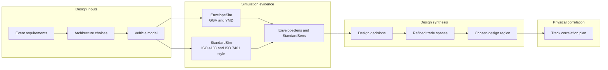

## Gold-Standard Criteria

| Review question | Evidence | Status |
| --- | --- | --- |
| Can every major vehicle-dynamics claim be traced to a file? | Evidence index plus generated CSV output tables. | yes |
| Are architecture and setup decisions separated? | EnvelopeSens handles architecture; StandardSens/refined surfaces handle setup response. | yes |
| Are assumptions and model limitations stated? | Assumption register and risk register. | yes |
| Are near-zero balance metrics interpreted carefully? | Notebook shows near-zero balance sensitivities in native units instead of foregrounding percent spans. | yes |
| Is there a physical validation plan? | Validation matrix and track correlation plan. | yes |
| Can the notebook be regenerated after new simulation results? | Generator script and regeneration commands. | yes |

## Evidence Pack

| Artifact | Status | Path | Role |
| --- | --- | --- | --- |
| GGV report | present | `BobSim/_2_EnvelopeSim/results/ggv_report.pdf` | Baseline acceleration envelope |
| GGV metrics CSV | present | `BobSim/_2_EnvelopeSim/results/ggv_report_metrics.csv` | Baseline envelope metrics |
| YMD report | present | `BobSim/_2_EnvelopeSim/results/ymd_report.pdf` | Yaw moment diagram and speed sweep |
| YMD metrics CSV | present | `BobSim/_2_EnvelopeSim/results/ymd_report_metrics.csv` | Yaw authority metrics |
| FourPost report | present | `BobSim/_3_StandardSim/results/four_post_eval_report.pdf` | Kinematics, motion ratios, LLTD, roll platform |
| FourPost metrics CSV | present | `BobSim/_3_StandardSim/results/four_post_eval_report_metrics.csv` | Roll stiffness and kinematic metrics |
| SteadyStateEval report | present | `BobSim/_3_StandardSim/results/steady_state_eval_report.pdf` | ISO 4138-style very slow ramp-steer response |
| SteadyStateEval metrics CSV | present | `BobSim/_3_StandardSim/results/steady_state_eval_report_metrics.csv` | ISO 4138-style steady-state response metrics |
| TransientEval report | present | `BobSim/_3_StandardSim/results/transient_eval_report.pdf` | ISO 7401-style handwheel step and FRF response |
| TransientEval metrics CSV | present | `BobSim/_3_StandardSim/results/transient_eval_report_metrics.csv` | ISO 7401-style transient response metrics |
| EnvelopeSens report | present | `BobSim/_4_OptSim/results/envelope_sensitivity_report.pdf` | Architecture-envelope tornadoes and Pearson table |
| EnvelopeSens results CSV | present | `BobSim/_4_OptSim/results/envelope_sensitivity_results.csv` | Envelope sensitivity data |
| StandardSens report | present | `BobSim/_4_OptSim/results/standard_sensitivity_report.pdf` | StandardSim tornadoes and Pearson table |
| StandardSens results CSV | present | `BobSim/_4_OptSim/results/standard_sensitivity_results.csv` | StandardSim sensitivity data |
| Refined response-surface report | missing | `BobSim/_4_OptSim/results/refined_response_surface_report.pdf` | Refined trade-space surfaces |
| Refined response-surface CSV | present | `BobSim/_4_OptSim/results/refined_response_surface_results.csv` | Refined response-surface data |


Missing artifacts are acceptable while a run is in progress. Regenerate the corresponding simulation and rerun this notebook generator to refresh the evidence index.

## Figure Set

| Figure | Path |
| --- | --- |
| Baseline capability summary | `studies/DS-009-fsae-design-notebook/plots/baseline_capability_summary.png` |
| Baseline platform summary | `studies/DS-009-fsae-design-notebook/plots/baseline_platform_summary.png` |
| Design lever map | `studies/DS-009-fsae-design-notebook/plots/design_lever_map.png` |
| Yaw authority and transient response | `studies/DS-009-fsae-design-notebook/plots/yaw_transient_summary.png` |
| Architecture design effects | `studies/DS-009-fsae-design-notebook/plots/architecture_design_effects.png` |
| Envelope sensitivity top drivers | `studies/DS-009-fsae-design-notebook/plots/envelope_sensitivity_top_drivers.png` |
| Standard sensitivity top drivers | `studies/DS-009-fsae-design-notebook/plots/standard_sensitivity_top_drivers.png` |
| Refined trade spaces | `studies/DS-009-fsae-design-notebook/plots/refined_trade_spaces.png` |
| Refined setup design region | `studies/DS-009-fsae-design-notebook/plots/refined_design_region.png` |

## Design Requirements

The design process starts with FSAE event reality, not an isolated simulation metric.

| Requirement | Design meaning | Simulation evidence used |
| --- | --- | --- |
| High lateral capability | The car must generate competitive skidpad/autocross/endurance cornering acceleration. | GGV cornering, GGV volume, StandardSim lateral limit, refined lateral-limit surfaces. |
| High combined acceleration | The car must accelerate, brake, and corner in combinations, not only win a pure lateral plot. | GGV volume, GGV area, reference accel/brake/cornering limits, track-profile performance indices. |
| Predictable balance | The driver must be able to approach the limit without surprise oversteer or vague response. | Understeer gradient, sideslip gradient, YMD trim line, YMD local derivatives, yaw/ay transient phase. |
| Usable driver interface | Steering angle and torque must be high-authority but not fatiguing or ambiguous. | Handwheel angle gradient, peak handwheel torque, transient yaw/ay response. |
| Tuneability | Trackside changes must have interpretable effects. | StandardSens tornadoes, Pearson table, refined response surfaces. |
| Correlation path | The design must be testable after build. | Each notebook claim maps to a report, CSV, and track-test validation method. |

## Requirements Traceability

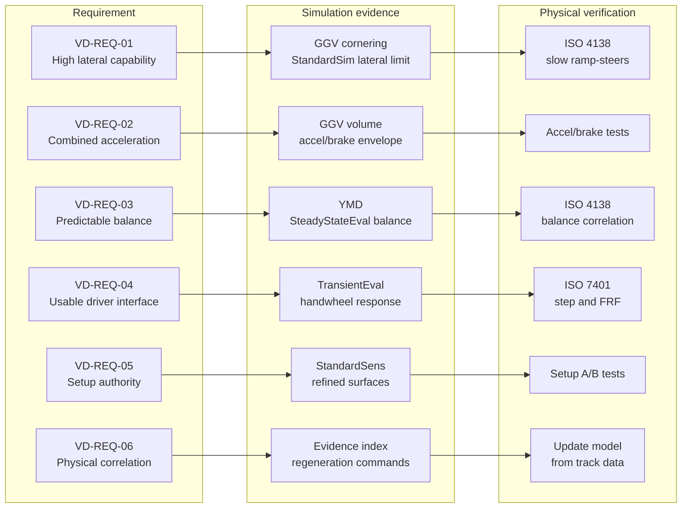

Detailed traceability table: `studies/DS-009-fsae-design-notebook/outputs/requirements_traceability.csv`.

## Assumption Register

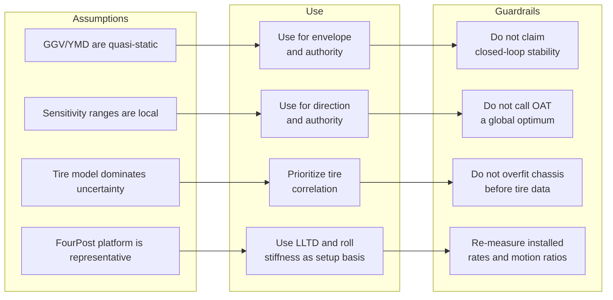

Detailed assumption register: `studies/DS-009-fsae-design-notebook/outputs/assumption_register.csv`.

## Model Stack

| Layer | What it answers | What it should not be used for |
| --- | --- | --- |
| Vehicle YAML | Baseline geometry, masses, tire package, spring/bar rates, steering, aero maps. | It is not evidence by itself; it is the configuration being tested. |
| EnvelopeSim GGV | First-order acceleration envelope: cornering, braking, drive, combined area, and speed trend. | It does not replace full-vehicle stability or transient response analysis. |
| EnvelopeSim YMD | Local yaw moment authority, trim behavior, and speed sweep of yaw/lateral authority. | It does not prove closed-loop dynamic stability by itself. |
| FourPostEval | Motion ratios, roll stiffness, LLTD, and kinematic platform behavior. | It does not directly rank lap time. |
| StandardSim SteadyStateEval | ISO 4138-style very slow ramp-steer response: steady-state balance, lateral limit, roll, sideslip, steering angle, and steering effort. | It should not be reduced to one metric without checking maneuver quality. |
| StandardSim TransientEval | ISO 7401-style handwheel-angle step response and handwheel-angle frequency response tied to driver feel. | It is not a substitute for driver feedback and track correlation. |
| EnvelopeSens | Which architecture-level parameters move the envelope. | It is local sensitivity, not a final optimizer. |
| StandardSens | Which full-vehicle setup/design knobs move StandardSim responses. | It should not be read without considering near-zero baseline metrics and failed/missing variants. |
| Refined response surfaces | Second-order trade spaces for the most influential paired inputs. | It should identify useful regions, not a single universal optimum. |


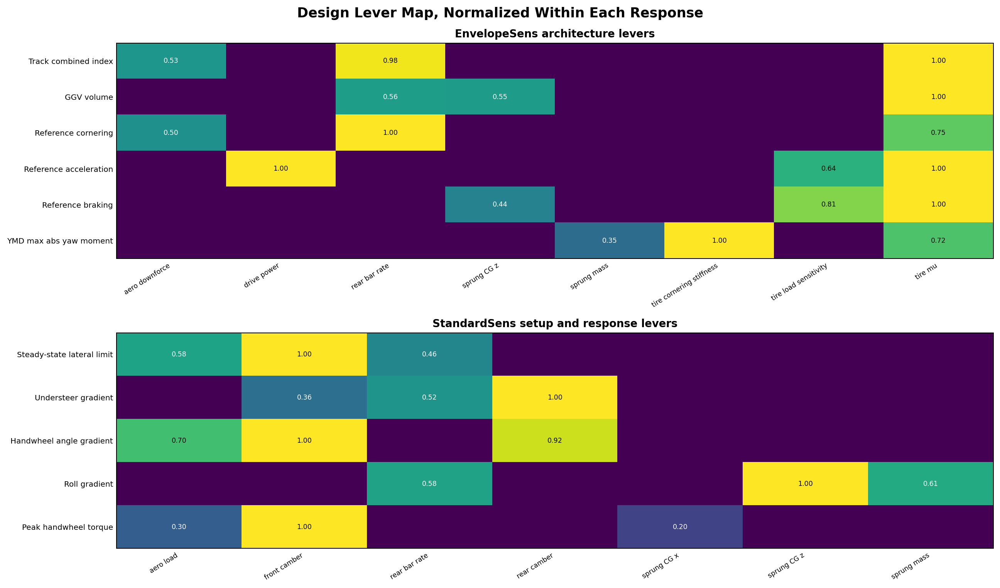

## Architecture Dependency Map

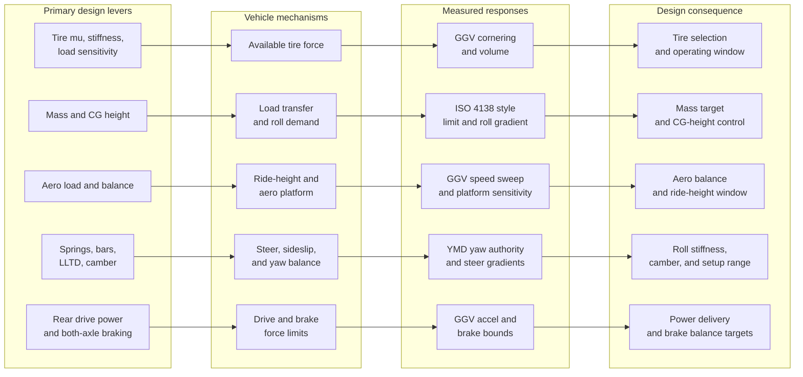

## Baseline Vehicle

| Item | Value | Units | Source |
| --- | --- | --- | --- |
| Vehicle | DWBCStabar_DWBCStabar |  | vehicle.yml |
| Architecture | front bellcrank_stabar, rear bellcrank_stabar |  | vehicle.yml |
| Projected vehicle mass | 261.0727 | kg | vehicle.yml mass rollup |
| Projected CG x | -0.80027 | m | vehicle.yml mass rollup |
| Projected CG z | 0.27962 | m | vehicle.yml mass rollup |
| Projected front static load | 0.48350 | fraction | vehicle.yml mass rollup |
| Sprung mass | 160.6400 | kg | vehicle.yml |
| Driver mass | 65.7709 | kg | vehicle.yml |
| Sprung CG x | -0.92000 | m | vehicle.yml |
| Sprung CG z | 0.25000 | m | vehicle.yml |
| Driver CG x | -0.54184 | m | vehicle.yml |
| Driver CG z | 0.39578 | m | vehicle.yml |
| Wheelbase | 1.54940 | m | vehicle.yml |
| Front track | 1.21222 | m | vehicle.yml |
| Rear track | 1.21222 | m | vehicle.yml |
| Tire template | 16x7p5_10_12psi |  | vehicle.yml |
| Front static toe | 0.00000 | deg | vehicle.yml |
| Rear static toe | 0.00000 | deg | vehicle.yml |
| Front static camber | 0.00000 | deg | vehicle.yml |
| Rear static camber | 0.00000 | deg | vehicle.yml |
| Front spring rate | 26,269.0252 | N/m | vehicle.yml |
| Rear spring rate | 43,781.7087 | N/m | vehicle.yml |
| Front anti-roll bar rate | 257.6248 | N*m/rad | vehicle.yml |
| Rear anti-roll bar rate | 535.4730 | N*m/rad | vehicle.yml |
| Body torsional stiffness | 300,000.0000 | N*m/rad | vehicle.yml |
| Rack travel per rev | 0.08890 | m/rev | vehicle.yml |


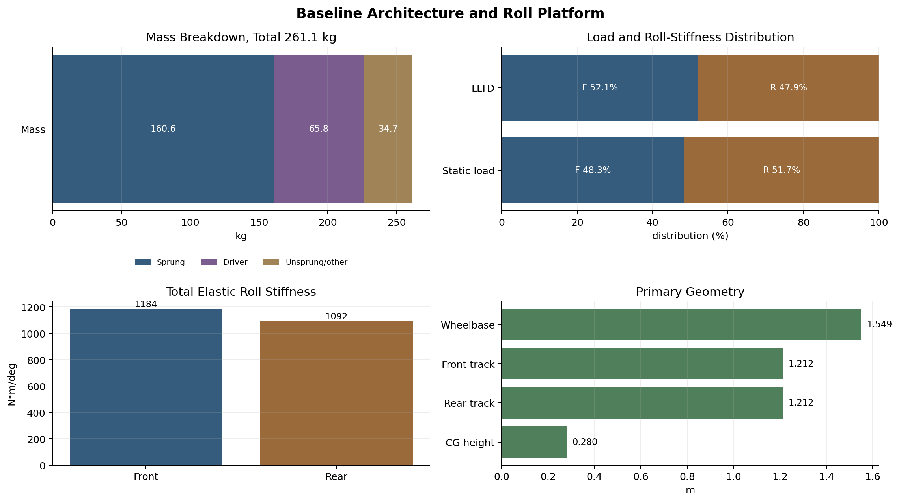

## Baseline Response

| Response | Value | Units | Design read | Source |
| --- | --- | --- | --- | --- |
| GGV volume | 188.8673 | g^2*m/s | Envelope area integrated over 5-25 m/s | GGV |
| Reference cornering | 1.77188 | g | Lateral limit at 15 m/s | GGV |
| Reference acceleration | 1.83400 | g | Straight-line acceleration at 15 m/s | GGV |
| Reference braking | 2.43600 | g | Straight-line braking at 15 m/s | GGV |
| Mean cornering | 1.78770 | g | Speed-averaged lateral limit | GGV |
| YMD peak abs yaw moment | 4,154.7831 | N*m | Maximum yaw authority in the local YMD map | YMD |
| YMD steer Mz gradient | 722.0473 | N*m/deg | Local Mz authority from steer near the origin | YMD |
| YMD beta Mz gradient | -37.7763 | N*m/deg | Local Mz restoring trend from sideslip near the origin | YMD |
| Steady-state lateral limit | 19.1043 | m/s^2 | Measured ramp lateral limit | SteadyStateEval |
| Steady-state understeer gradient | 0.02574 | deg/g | Linear steer-excess balance metric | SteadyStateEval |
| Steady-state handwheel gradient | 16.5239 | deg/g | Driver steering angle demand | SteadyStateEval |
| Steady-state roll gradient | 0.89192 | deg/g | Roll platform response | SteadyStateEval |
| Peak handwheel torque | -21.4650 | N*m | Signed peak steering effort | SteadyStateEval |
| Transient ay phase at 1 Hz | -5.66705 | deg | Lateral response phase lag at 1 Hz | TransientEval |
| Transient yaw phase at 1 Hz | -9.88858 | deg | Yaw response phase lag at 1 Hz | TransientEval |
| Transient ay lag at 1 Hz | 0.01574 | s | Equivalent lateral acceleration lag | TransientEval |
| Transient yaw lag at 1 Hz | 0.02747 | s | Equivalent yaw-rate lag | TransientEval |
| Front LLTD | 52.0569 | % | Roll-stiffness/load-transfer distribution | FourPostEval |
| Front total roll stiffness | 1,184.1374 | N*m/deg | Elastic spring plus ARB roll stiffness | FourPostEval |
| Rear total roll stiffness | 1,091.8671 | N*m/deg | Elastic spring plus ARB roll stiffness | FourPostEval |


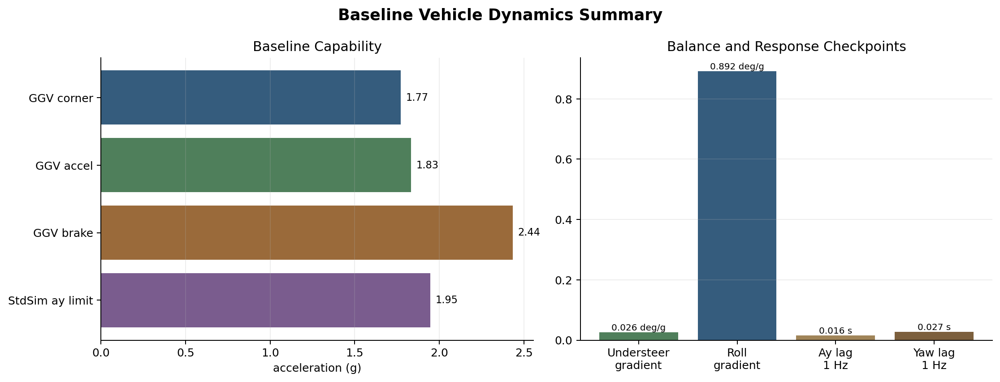

## Stage 1: Architecture Design

The architecture is set before setup. The evidence supports treating tire capability, CG height, mass, aero load, brake distribution, drive power, and lateral load-transfer distribution as first-order vehicle design variables. This is the key notebook discipline: the design does not begin by tuning toe, springs, or bars. Those are later tools.

The current GGV envelope shows a strong combined capability baseline: reference cornering is 1.7719 g, reference acceleration is 1.8340 g, and reference braking is 2.4360 g at 15 m/s. The braking number is larger than the drive number because the model has braking on both axles, while drive torque is rear-only.

EnvelopeSens then answers the design question: which architecture variables actually move that envelope?

| Response | Top input | Max response span | Baseline | Direction |
| --- | --- | --- | --- | --- |
| Track combined index | tire.mu_scale | +5.3% (0.05300 index) | 1.00000 index | increases with input |
| Track combined index | rear.stabar.rate_n_m_per_rad | +5.2% (0.05188 index) | 1.00000 index | decreases with input |
| Track combined index | aero.downforce_scale | +2.8% (0.02785 index) | 1.00000 index | increases with input |
| GGV volume | tire.mu_scale | +17.6% (33.1124 g^2*m/s) | 187.8784 g^2*m/s | increases with input |
| GGV volume | rear.stabar.rate_n_m_per_rad | +9.9% (18.5929 g^2*m/s) | 187.8784 g^2*m/s | decreases with input |
| GGV volume | sprung_mass.cg_m.z | +9.7% (18.2801 g^2*m/s) | 187.8784 g^2*m/s | decreases with input |
| Reference cornering | rear.stabar.rate_n_m_per_rad | +12.9% (0.22500 g) | 1.74375 g | decreases with input |
| Reference cornering | tire.mu_scale | +9.7% (0.16875 g) | 1.74375 g | increases with input |
| Reference cornering | aero.downforce_scale | +6.5% (0.11250 g) | 1.74375 g | increases with input |
| Reference acceleration | tire.mu_scale | +19.1% (0.35000 g) | 1.83400 g | increases with input |
| Reference acceleration | power.max_drive_power_kw | +19.1% (0.35000 g) | 1.83400 g | increases with input |
| Reference acceleration | tire.load_sensitivity_scale | +12.2% (0.22400 g) | 1.83400 g | decreases with input |
| Reference braking | tire.mu_scale | +17.8% (0.43200 g) | 2.43200 g | increases with input |
| Reference braking | tire.load_sensitivity_scale | +14.5% (0.35200 g) | 2.43200 g | decreases with input |
| Reference braking | sprung_mass.cg_m.z | +7.9% (0.19200 g) | 2.43200 g | decreases with input |
| YMD max abs yaw moment | tire.cornering_stiffness_scale | +11.9% (492.2690 N*m) | 4,146.7887 N*m | increases with input |
| YMD max abs yaw moment | tire.mu_scale | +8.5% (354.1735 N*m) | 4,146.7887 N*m | increases with input |
| YMD max abs yaw moment | sprung_mass.mass_kg | +4.2% (173.2515 N*m) | 4,146.7887 N*m | increases with input |

The architecture-effect plot below is the design read in native units: it shows which subsystem choices buy real cornering, drive, braking, and yaw authority rather than only ranking abstract sensitivity coefficients.


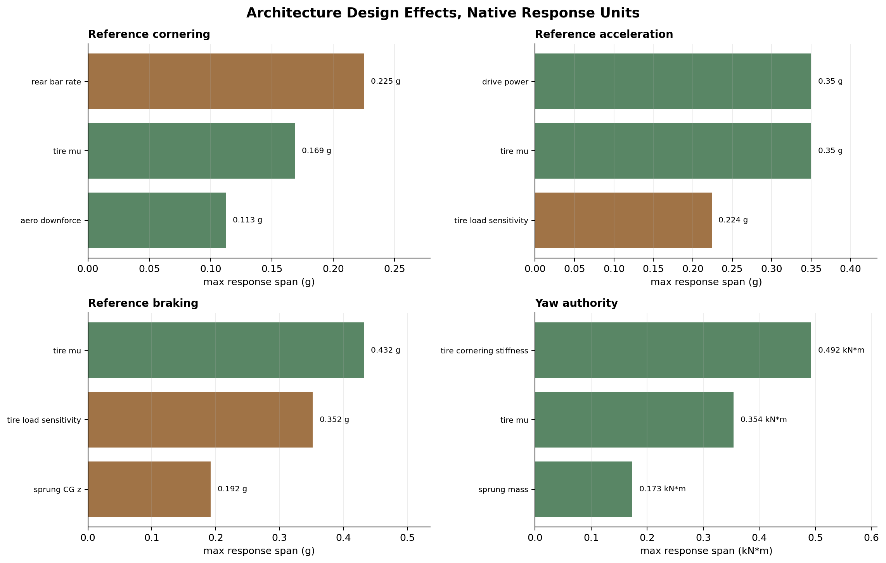


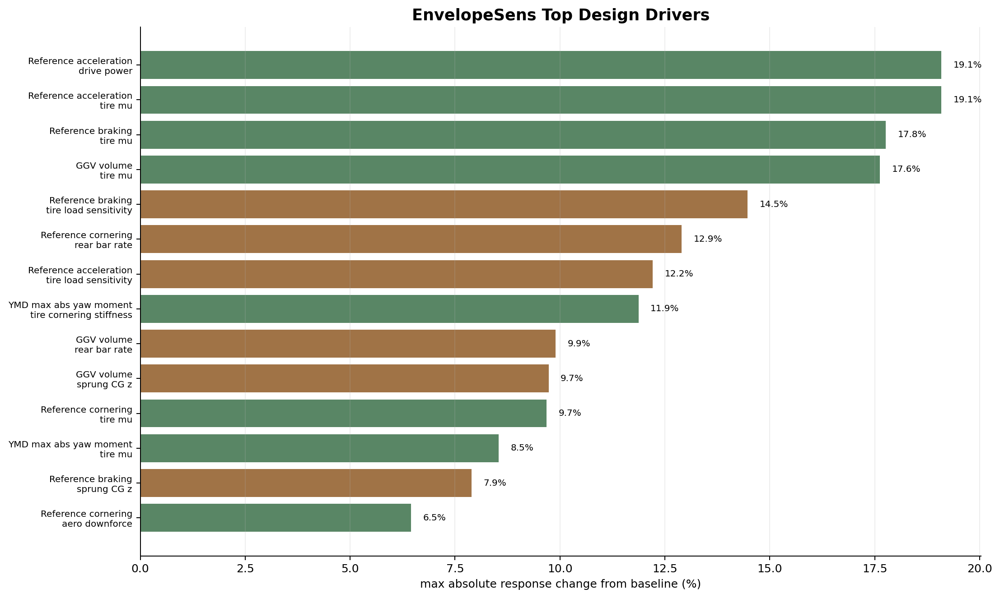

The read is direct:

- Tire mu and tire stiffness are design-critical because they move both raw envelope size and yaw authority.
- Downforce is a real performance variable, not decoration; it moves GGV volume and reference cornering.
- CG height and mass remain first-order because they affect load transfer, braking, acceleration, roll, and the refined response surfaces.
- Rear roll stiffness / LLTD is not just a setup afterthought; it is visible in GGV cornering and StandardSim balance.
- Longitudinal limits should be treated honestly: rear-drive acceleration cannot be interpreted like four-wheel braking.

## Stage 2: Yaw Authority and Stability Read

The YMD result gives a local authority map, not a full closed-loop dynamic proof. At 15 m/s the map has peak absolute yaw moment of 4,154.8 N*m. The local yaw moment sensitivity to steer is 722.0 N*m/deg, while the local yaw moment sensitivity to sideslip is -37.8 N*m/deg.

That means the vehicle has very strong steer authority relative to the local beta restoring trend. This is not automatically bad. It means the steering system can generate yaw moment strongly, and that the dynamic response must be checked with StandardSim transient response and track correlation rather than inferred from the YMD slope alone.


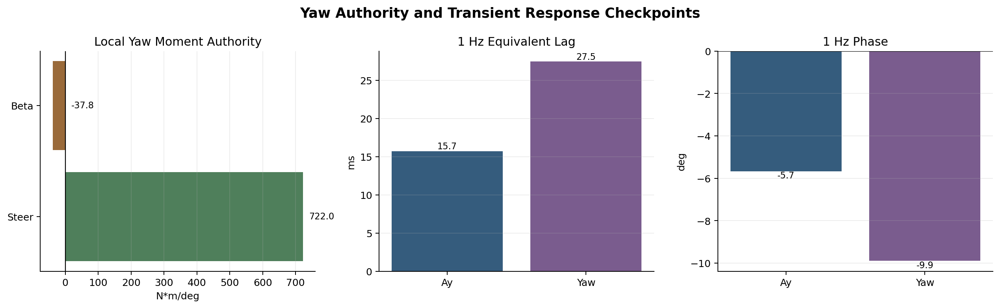

## Stage 3: Suspension Platform

FourPostEval places the baseline roll platform at 52.06% front LLTD. Total elastic roll stiffness is 1,184.1 N*m/deg front and 1,091.9 N*m/deg rear.

This supports a clear design stance: springs and anti-roll bars are platform and balance tools. They control roll, aero platform, tire load distribution, and stability feel. They should not be sold as the primary source of raw grip. The primary grip story is tire, load transfer, aero load, and mass properties.

## Stage 4: Steady-State Vehicle Response

`SteadyStateEval` is the simulation match for ISO 4138-style very slow ramp-steer testing. The StandardSim baseline is near neutral: understeer gradient is 0.02574 deg/g, handwheel angle gradient is 16.52 deg/g, and roll gradient is 0.8919 deg/g.

For near-zero metrics such as understeer gradient, percent changes can look huge because the denominator is small. The notebook therefore shows the StandardSens spans in native units and treats percent span as an internal ranking clue, not the engineering read.

| Response | Top input | Max response span | Baseline | Direction |
| --- | --- | --- | --- | --- |
| Steady-state lateral limit | front.wheel.camber_deg | 2.72699 m/s^2 | 19.1043 m/s^2 | increases with input |
| Steady-state lateral limit | aero.load_scale | 1.58714 m/s^2 | 19.1043 m/s^2 | increases with input |
| Steady-state lateral limit | rear.stabar.rate_n_m_per_rad | 1.25152 m/s^2 | 19.1043 m/s^2 | increases with input |
| Understeer gradient | rear.wheel.camber_deg | 0.25201 deg/g | 0.02574 deg/g | increases with input |
| Understeer gradient | rear.stabar.rate_n_m_per_rad | 0.13016 deg/g | 0.02574 deg/g | decreases with input |
| Understeer gradient | front.wheel.camber_deg | 0.09180 deg/g | 0.02574 deg/g | decreases with input |
| Handwheel angle gradient | front.wheel.camber_deg | 0.32081 deg/g | 16.5239 deg/g | decreases with input |
| Handwheel angle gradient | rear.wheel.camber_deg | 0.29647 deg/g | 16.5239 deg/g | increases with input |
| Handwheel angle gradient | aero.load_scale | 0.22361 deg/g | 16.5239 deg/g | increases with input |
| Roll gradient | sprung_mass.cg_m.z | 0.10233 deg/g | 0.89192 deg/g | increases with input |
| Roll gradient | sprung_mass.mass_kg | 0.06256 deg/g | 0.89192 deg/g | increases with input |
| Roll gradient | rear.stabar.rate_n_m_per_rad | 0.05904 deg/g | 0.89192 deg/g | decreases with input |
| Peak handwheel torque | front.wheel.camber_deg | 4.64028 N*m | -21.4650 N*m | decreases with input |
| Peak handwheel torque | aero.load_scale | 1.38232 N*m | -21.4650 N*m | decreases with input |
| Peak handwheel torque | sprung_mass.cg_m.x | 0.94718 N*m | -21.4650 N*m | decreases with input |


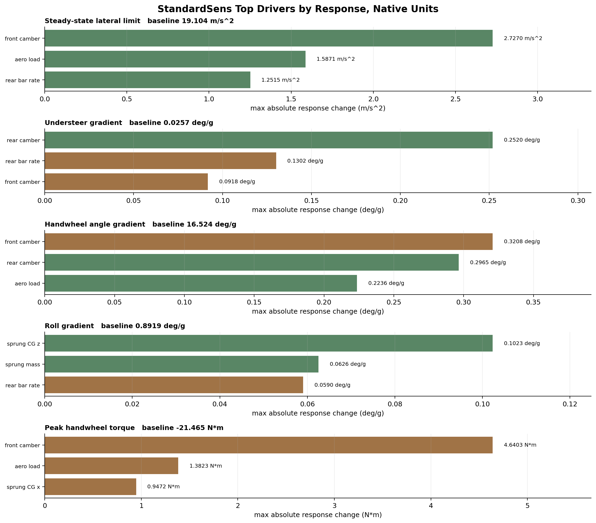

The steady-state read is:

- Camber and aero load have direct authority over lateral limit.
- Rear camber and rear bar are high-authority balance levers.
- CG height and mass strongly affect roll.
- Handwheel gradient is comparatively stable over these sweeps, while handwheel torque is more sensitive to tire/load/balance changes.
- Spring-rate and bar-rate decisions must be read together with ride height, motion ratio, and aero-platform constraints.

## Stage 5: Transient Response and Driver Feel

`TransientEval` is the simulation match for ISO 7401-style handwheel-angle step tests and handwheel-angle frequency-response functions. The transient baseline gives a measurable driver-feel checkpoint. At 1 Hz, lateral acceleration phase is -5.667 deg and yaw phase is -9.889 deg. Equivalent lag is 0.01574 s for ay and 0.02747 s for yaw.

This is the correct role of transient analysis in the design notebook: it checks whether the near-neutral steady-state car is likely to feel understandable in time, not only in final equilibrium.

## Stage 6: Refined Trade Spaces

The refined response-surface workflow selects paired variables from the StandardSens tornado effects. These are the pairs currently selected for deeper study:

| Response | Rank | Selected input | Native span | Baseline |
| --- | --- | --- | --- | --- |
| Steady-state lateral limit | 1 | front.wheel.camber_deg | 2.72699 m/s^2 | 19.1043 m/s^2 |
| Steady-state lateral limit | 2 | aero.load_scale | 1.58714 m/s^2 | 19.1043 m/s^2 |
| Sideslip gradient | 1 | rear.wheel.camber_deg | 0.86886 deg/g | 0.24970 deg/g |
| Sideslip gradient | 2 | rear.stabar.rate_n_m_per_rad | 0.16640 deg/g | 0.24970 deg/g |
| Limit sideslip gradient | 1 | rear.wheel.camber_deg | 4.43931 deg/g | -3.48479 deg/g |
| Limit sideslip gradient | 2 | front.wheel.camber_deg | 1.58385 deg/g | -3.48479 deg/g |
| Understeer gradient | 1 | rear.wheel.camber_deg | 0.25201 deg/g | 0.02574 deg/g |
| Understeer gradient | 2 | rear.stabar.rate_n_m_per_rad | 0.13016 deg/g | 0.02574 deg/g |
| Limit understeer gradient | 1 | rear.wheel.camber_deg | 6.53917 deg/g | -0.59550 deg/g |
| Limit understeer gradient | 2 | rear.stabar.rate_n_m_per_rad | 1.11963 deg/g | -0.59550 deg/g |
| Handwheel angle gradient | 1 | front.wheel.camber_deg | 0.32081 deg/g | 16.5239 deg/g |
| Handwheel angle gradient | 2 | rear.wheel.camber_deg | 0.29647 deg/g | 16.5239 deg/g |
| Limit handwheel gradient | 1 | rear.wheel.camber_deg | 2.62327 deg/g | 18.4479 deg/g |
| Limit handwheel gradient | 2 | rear.stabar.rate_n_m_per_rad | 1.72265 deg/g | 18.4479 deg/g |
| Roll gradient | 1 | sprung_mass.cg_m.z | 0.10233 deg/g | 0.89192 deg/g |
| Roll gradient | 2 | sprung_mass.mass_kg | 0.06256 deg/g | 0.89192 deg/g |
| Limit roll gradient | 1 | sprung_mass.cg_m.z | 0.12899 deg/g | 0.83433 deg/g |
| Limit roll gradient | 2 | sprung_mass.mass_kg | 0.08537 deg/g | 0.83433 deg/g |

The current refined CSV gives these observed trade-space reads:

| Objective | Metric | Baseline | Best observed | Delta | Variant |
| --- | --- | --- | --- | --- | --- |
| Maximize lateral limit | Steady-state lateral limit | 19.1043 m/s^2 | 20.5981 m/s^2 | 1.49389 m/s^2 | variant_0065 |
| Near-zero understeer | Understeer gradient | 0.02574 deg/g | -0.00054 deg/g | -0.02628 deg/g | variant_0023 |
| Minimize roll gradient | Roll gradient | 0.89192 deg/g | 0.74282 deg/g | -0.14910 deg/g | variant_0065 |
| Minimize limit roll gradient | Limit roll gradient | 0.83433 deg/g | 0.64995 deg/g | -0.18438 deg/g | variant_0065 |
| Minimize steering effort magnitude | Peak handwheel torque | -21.4650 N*m | -15.4763 N*m | 5.98872 N*m | variant_0001 |

The refined design-region plot converts the response surface into a setup/design argument: lateral limit is only attractive when the point also lives near a usable balance window and keeps roll gradient under control.


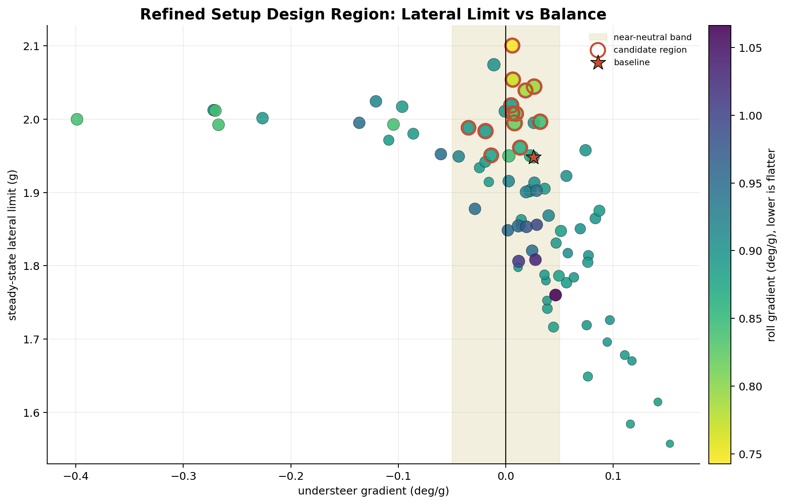


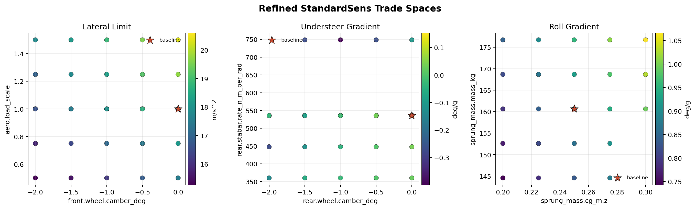

These rows are not final setup recommendations by themselves. They identify promising regions and interaction structure. Final setup must overlay build constraints, tire temperature, robustness, driver comments, and endurance repeatability.

## Design Decision Matrix

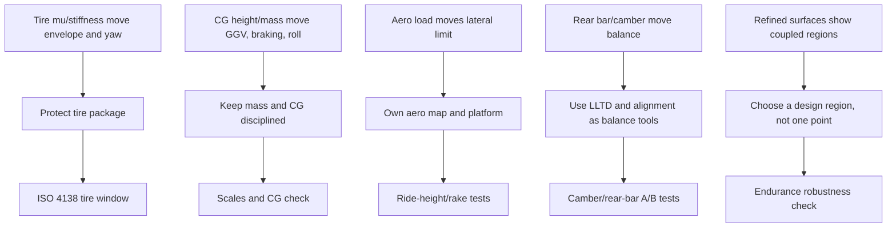

Detailed design decision matrix: `studies/DS-009-fsae-design-notebook/outputs/design_decision_matrix.csv`.

## Risk Register

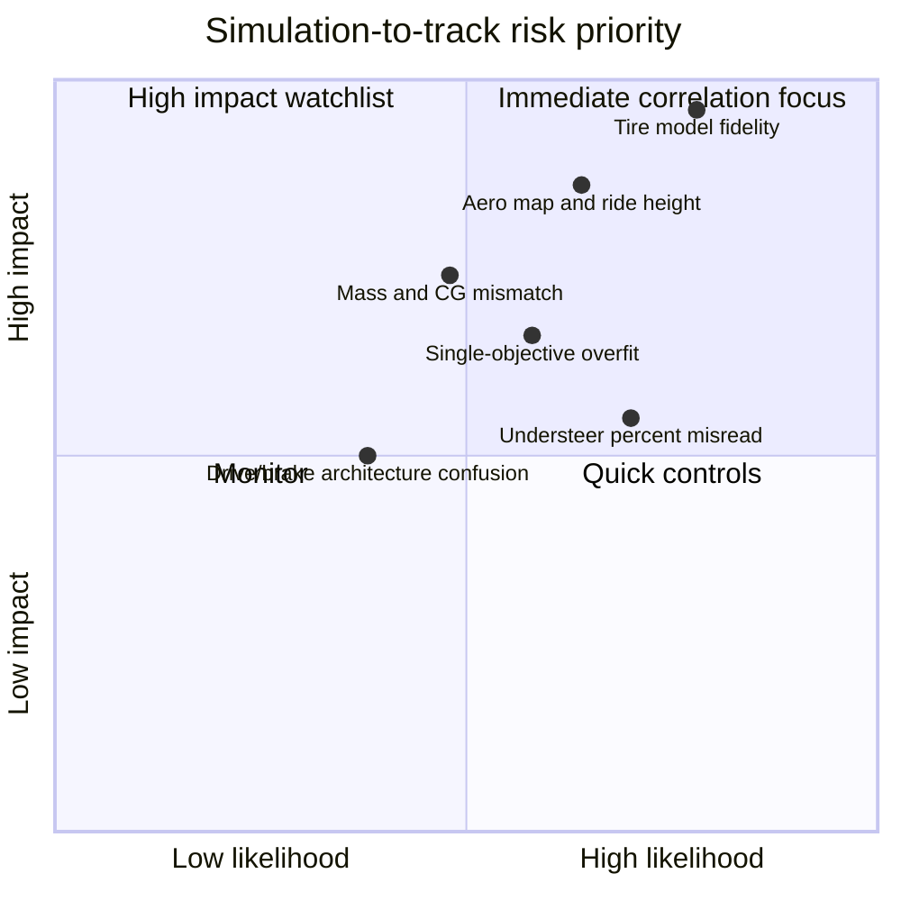

Detailed risk controls: `studies/DS-009-fsae-design-notebook/outputs/risk_register.csv`.

## Verification Matrix

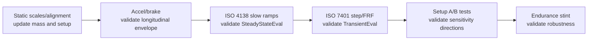

Detailed verification matrix: `studies/DS-009-fsae-design-notebook/outputs/validation_matrix.csv`.

## Final Vehicle-Dynamics Argument

The design is justified as follows:

1. The vehicle architecture is set around tire capability, low CG, low mass, aero load, and honest longitudinal limits.
2. The acceleration envelope confirms that the car has strong cornering, drive, and braking capability over the simulated 5-25 m/s range.
3. The YMD confirms high steer-generated yaw authority, while also showing that full dynamic response must be checked rather than assumed from local beta restoring trend alone.
4. FourPost confirms a front LLTD near 52% and a roll platform that can be tuned with springs and bars.
5. StandardSim confirms the baseline is near neutral in steady state with quantifiable steering and roll gradients.
6. StandardSens and Pearson/tornado views identify which inputs move each response, separating setup authority from architecture constraints.
7. Refined response surfaces turn top one-factor effects into two-factor trade spaces, which is the correct basis for a defensible design region.

This is a strong FSAE design notebook because it does not ask judges to trust a single plot. It shows traceability from configuration, to model, to metric, to sensitivity, to design decision, to validation plan.

## Track Correlation Plan

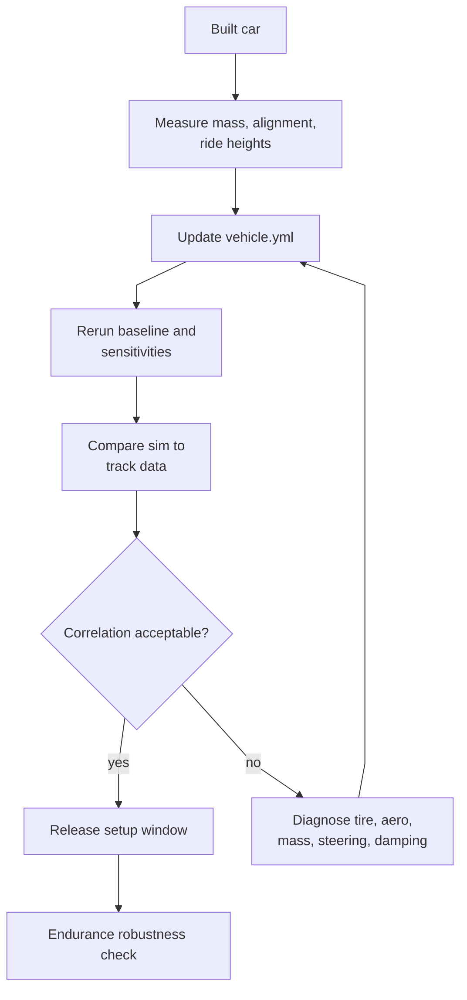

The physical correlation plan is anchored to two open-loop ISO-style tests. ISO 4138 slow ramp-steers are the direct steady-state match for `SteadyStateEval`; ISO 7401 handwheel-angle step tests and handwheel-angle FRFs are the direct transient match for `TransientEval`.

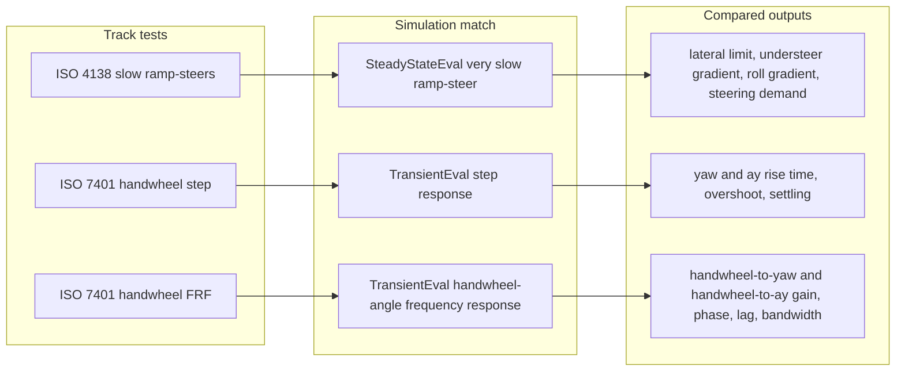

| Test | Primary measured outputs | Notebook claim checked |
| --- | --- | --- |
| Static scales and alignment | mass, corner weights, CG estimate, toe, camber, ride heights | The simulated baseline matches the built car. |
| Straight-line accel/brake | acceleration, deceleration, wheel speeds, brake pressure | Longitudinal GGV assumptions and rear-drive/braking limits are credible. |
| ISO 4138 slow ramp-steers | lateral g, steer angle, yaw rate, roll, speed, tire temps | SteadyStateEval lateral limit, understeer gradient, roll gradient, steering demand, and tire operating window correlate. |
| ISO 7401 handwheel-angle step | yaw gain, ay gain, rise time, overshoot, settling, lag | TransientEval step-response behavior and YMD authority are meaningful dynamically. |
| ISO 7401 handwheel-angle FRF | yaw/ay gain, phase, lag, bandwidth, fit error | TransientEval handwheel-angle frequency-response metrics are physically repeatable. |
| Setup A/B tests | response metric deltas from camber, rear bar, aero, CG/mass changes where practical | Tornado/Pearson directions are physically repeatable. |
| Endurance stint | thermal drift, degradation, driver confidence, consistency | The selected design region is robust, not just fast for one lap. |

## Regeneration Commands

Run from `BobSim`:

```bash
make ggv-envelope ymd-envelope four-post-eval steady-state-eval transient-eval
make sim-envelope-sensitivities sim-standard-sensitivities
make sim-refined-response-surfaces
python tools/generate_fsae_design_notebook.py
```

## Generated Files

- `studies/DS-009-fsae-design-notebook/outputs/evidence_index.csv`
- `studies/DS-009-fsae-design-notebook/outputs/baseline_vehicle.csv`
- `studies/DS-009-fsae-design-notebook/outputs/baseline_response.csv`
- `studies/DS-009-fsae-design-notebook/outputs/requirements_traceability.csv`
- `studies/DS-009-fsae-design-notebook/outputs/assumption_register.csv`
- `studies/DS-009-fsae-design-notebook/outputs/risk_register.csv`
- `studies/DS-009-fsae-design-notebook/outputs/validation_matrix.csv`
- `studies/DS-009-fsae-design-notebook/outputs/design_review_checklist.csv`
- `studies/DS-009-fsae-design-notebook/outputs/design_decision_matrix.csv`
- `studies/DS-009-fsae-design-notebook/outputs/envelope_sensitivity_takeaways.csv`
- `studies/DS-009-fsae-design-notebook/outputs/standard_sensitivity_takeaways.csv`
- `studies/DS-009-fsae-design-notebook/outputs/refined_surface_selected_parameters.csv`
- `studies/DS-009-fsae-design-notebook/outputs/refined_response_surface_takeaways.csv`
- `studies/DS-009-fsae-design-notebook/plots/baseline_capability_summary.png`
- `studies/DS-009-fsae-design-notebook/plots/baseline_platform_summary.png`
- `studies/DS-009-fsae-design-notebook/plots/design_lever_map.png`
- `studies/DS-009-fsae-design-notebook/plots/yaw_transient_summary.png`
- `studies/DS-009-fsae-design-notebook/plots/architecture_design_effects.png`
- `studies/DS-009-fsae-design-notebook/plots/envelope_sensitivity_top_drivers.png`
- `studies/DS-009-fsae-design-notebook/plots/standard_sensitivity_top_drivers.png`
- `studies/DS-009-fsae-design-notebook/plots/refined_trade_spaces.png`
- `studies/DS-009-fsae-design-notebook/plots/refined_design_region.png`
