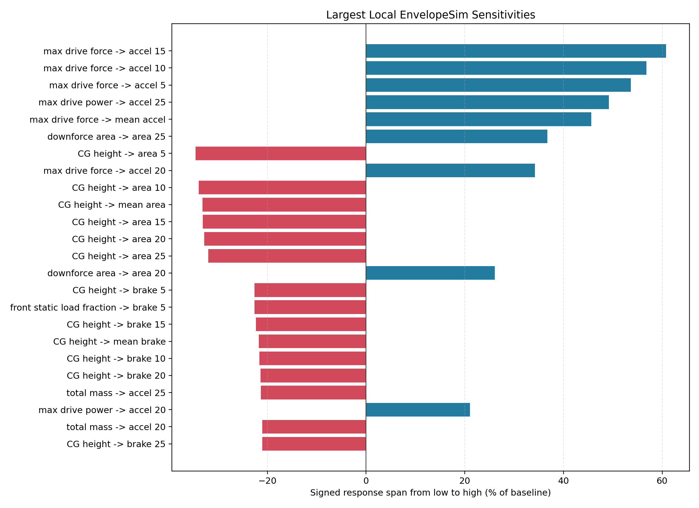
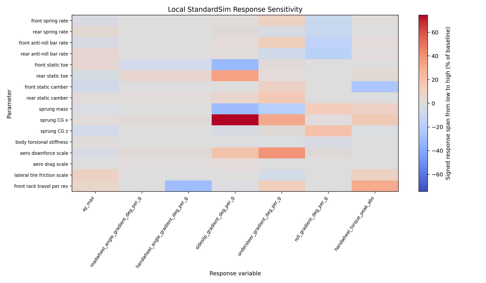
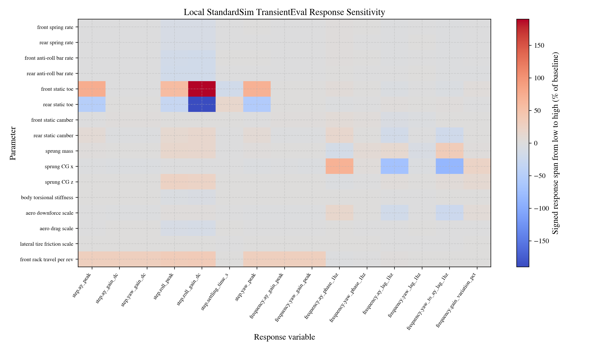
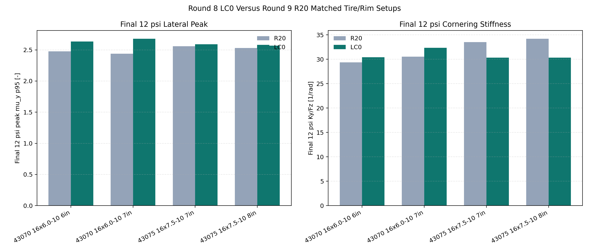

# Vehicle Dynamics Design Binder

Prepared: 2026-05-29

## Executive Summary

The vehicle dynamics design process was built around measurable vehicle response rather than isolated subsystem targets. Early-stage envelope tools were used to evaluate architecture-level choices such as tire capability, aero load, mass properties, CG height, longitudinal force limits, and lateral load transfer distribution. Full-vehicle simulations were then used to characterize steady-state balance, transient response, roll behavior, steering sensitivity, and setup authority.

This workflow informed the physical design of the tire package, suspension layout, steering system, roll platform, and setup range. Track testing and driver feedback are then used to correlate the model and refine setup decisions. The intent is not only to explain what the car did after testing, but to choose better setup directions before valuable track time is spent.

The current vehicle dynamics recommendation is to use the Hoosier 43075 16x7.5-10 R20 tire on a 7 inch rim. In the corrected integrated tire study, the 7 inch / 8 psi case ranked first overall, ranked second in EnvelopeSim capability, ranked third in the StandardSim stable handling window, and preserved the current zero-radius-delta 10 inch vehicle architecture. In-person running then showed significantly longer relaxation/drivability delay and visible sidewall deformation at 8 psi, so the interim operating target was increased to **11 psi cold / 12 psi hot** until ISO data closes the loop.

## Design Objective

The vehicle dynamics objective was to produce a car with high lateral and combined acceleration capability while remaining predictable, tunable, and confidence-inspiring for the driver. The primary design targets were:

- High lateral and combined acceleration capability.
- Predictable steady-state balance.
- Fast but controllable yaw response.
- Strong driver confidence on-center and near the limit.
- Practical setup adjustability for different events, surfaces, and drivers.
- A modeling workflow that could be correlated with track data instead of used only as a one-time design justification.

Vehicle dynamics was treated as a vehicle-level problem. Tire behavior, CG location, aero load, aero balance, suspension kinematics, steering geometry, roll stiffness distribution, damping, brake force, power delivery, and driver interface were evaluated based on their contribution to the full vehicle response.

The design loop was:

```text
vehicle goals -> vehicle inputs -> simulation -> setup decisions -> track data and driver feedback -> model correlation -> iteration
```

## Evidence Traceability

| Evidence | Role in design binder |
| --- | --- |
| [DS-001 EnvelopeSim Parameter Sensitivity](DS-001-envelopesim-parameter-sensitivity.md) | First-order capability envelope and architecture sensitivity. |
| [DS-002 StandardSim Steady-State Sensitivity](DS-002-standardsim-steady-state-sensitivity.md) | Steady-state balance, roll, steering effort, and setup sensitivity. |
| [DS-003 StandardSim Transient Sensitivity](DS-003-standardsim-transient-sensitivity.md) | Step and frequency response, yaw gain, lateral acceleration gain, phase, lag, and settling behavior. |
| [DS-004 Vehicle Design Synthesis](DS-004-vehicle-design-synthesis.md) | Integrated interpretation of architecture, steady-state, and transient results. |
| [DS-005 Tire Selection](DS-005-tire-selection.md) | Early Round 8 tire screen; useful as first-pass lateral envelope evidence with fit-range caveats. |
| [DS-006 Integrated Tire Design](DS-006-integrated-tire-design.md) | Full Round 9 tire comparison using EnvelopeSim, StandardSim, tire-fit diagnostics, temperature, and degradation evidence. |
| [DS-007 Tire Selection Decision](DS-007-tire-selection-decision.md) | Final tire selection decision and concise decision evidence. |
| [DS-008 Round 8 LC0 Analysis](DS-008-round8-lc0-analysis.md) | LC0 compound comparison, degradation behavior, pressure response, and screening caveats. |

## Baseline Vehicle Position

The current vehicle is a low-CG, aero-forward, rear-drive formula-style car. The baseline model used for the design studies is the as-built `vehicle.yml` and is summarized below.

| Parameter | Value |
| --- | ---: |
| Vehicle mass | 261.07 kg |
| CG height | 0.2796 m |
| Front static load fraction | 0.4835 |
| Wheelbase | 1.5494 m |
| Front / rear track | 1.2122 m / 1.2122 m |
| ClA / CdA | 2.3472 / 1.1726 m^2 |
| Front aero balance assumption | 0.5000 |
| Drive power / force cap | 80 kW / 3735 N |
| Brake force cap / front brake bias | 14000 N / 0.620 |
| Baseline front / rear static toe | 0 deg / 0 deg |
| Front / rear spring rate | 26.27 kN/m / 43.78 kN/m |
| Front / rear anti-roll bar rate | 258.94 N*m/rad / 535.36 N*m/rad |
| Front rack travel | 0.0889 m/rev |

The baseline response placed the car in a useful operating window before detailed setup work. EnvelopeSim predicted a mean lateral capability of 1.803 g and a 25 m/s lateral capability of 2.080 g in the DS-004 baseline. StandardSim predicted an understeer gradient of 0.394 deg/g, a roll gradient of 0.894 deg/g, and a peak handwheel torque of 18.79 N*m in the steady-state baseline. The transient baseline produced a yaw gain of 2.220 (rad/s)/rad and an ay lag of 0.0157 s at 1 Hz.

## Simulation Workflow

Two complementary simulation layers were used.

EnvelopeSim was used for early architecture evaluation. It provided first-principles estimates of combined acceleration capability, GGV area, lateral capability versus speed, power and brake force limits, tire capability, aero sensitivity, mass sensitivity, and CG sensitivity. This was the correct tool for fast design-space exploration because it gave clear answers about which architecture variables were first-order performance drivers.

StandardSim was used for full-vehicle response characterization. It evaluated standardized steady-state and transient maneuvers using the full vehicle model. SteadyStateEval was used to quantify understeer gradient, roll gradient, steering effort, sideslip trend, and lateral acceleration response. TransientEval was used to quantify step response, yaw gain, lateral acceleration gain, phase, lag, bandwidth-related behavior, and settling behavior.

This separation prevented one model from being used for every decision. Lower-order tools were used where they were most useful: fast architecture exploration. Higher-fidelity models were used once the vehicle configuration, tire files, and geometry were defined well enough to make response metrics meaningful.

## Architecture Findings

The architecture studies showed that the largest performance drivers were low mass, low CG height, tire capability, aero load, and usable longitudinal force. These were treated as primary design constraints rather than late-stage tuning items.

In DS-001, CG height was the most frequent top-ranked local driver across EnvelopeSim response variables. Downforce area increased 25 m/s lateral capability by 20.5% and 25 m/s GGV area by 36.8% across the local study range. CG height reduced mean lateral capability by 13.6% and mean GGV area by 33.1% across the local range. Power and drive-force limits dominated acceleration response, while CG height and brake distribution strongly affected braking response.

The design consequence is that packaging decisions are vehicle dynamics decisions. Driver position, accumulator or powertrain placement, upright and unsprung mass, aero platform, and brake-force capability all affect the usable performance envelope before the car reaches the setup pad.

## Tire Selection and Operating Window

Tire selection was based on the expected operating conditions of the vehicle rather than peak friction alone. Candidate tires were evaluated using tire data and vehicle-level operating predictions.

The selection criteria included:

- Peak lateral and longitudinal force.
- Load sensitivity.
- Degradation behavior.
- Cornering stiffness.
- Camber and pressure sensitivity.
- Combined-slip behavior.
- Expected vertical load range.
- Expected camber and slip-angle range during representative maneuvers.
- Saturation behavior near the limit.
- Vehicle architecture impact from tire radius and rim package.

The selected tire is the Hoosier 43075 16x7.5-10 R20 on a 7 inch rim. The 8 psi case produced the strongest integrated vehicle-level simulation result while preserving the current zero-radius-delta architecture, but it is no longer the final track-pressure recommendation by itself because in-person running showed excessive relaxation/drivability delay and visible sidewall deformation at that pressure. The current trackside target is **11 psi cold / 12 psi hot** pending ISO confirmation.

| Metric | Hoosier 43075 16x7.5-10 R20, 7 in / 8 psi simulation case |
| --- | ---: |
| Integrated rank | 1 |
| EnvelopeSim rank | 2 |
| StandardSim stable-window rank | 3 |
| Integrated score | 0.895 |
| EnvelopeSim score | 0.868 |
| StandardSim score | 0.947 |
| Mean EnvelopeSim lateral capability | 1.919 g |
| Understeer gradient | 0.390 deg/g |
| Roll gradient | 0.934 deg/g |
| Radius delta versus current reference | 0.0 mm |

Against the current reference tire, the selected package improved mean EnvelopeSim lateral capability by 6.9%, improved mean GGV area by 1.2%, reduced understeer gradient by 13.1%, reduced sideslip gradient by 90.1%, and reduced peak handwheel torque by 11.8%.

The tire selection was not made from an isolated peak-force plot. DS-006 treated tire outside diameter as a real architecture input: tire radius, rim geometry, vertical stiffness, vertical damping, and chassis layout height were updated in StandardSim, while EnvelopeSim adjusted CG height by the tire-radius delta. Larger-diameter candidates were therefore evaluated honestly as vehicle architecture alternatives rather than free tire swaps.

The main tire-fit caveats are longitudinal/combined-slip provenance and pressure-dependent relaxation response. The selected Hoosier 43075 uses scaled 18 inch Hoosier longitudinal and combined-slip terms in the Round 9 fit set. The 8 psi relaxation behavior proved too slow in person and came with visible sidewall deformation, so the final pressure window should be validated around the interim **11 psi cold / 12 psi hot** target rather than argued from the 8 psi score alone.

## Performance Envelope and Balance Strategy

The early design phase used EnvelopeSim to estimate the vehicle acceleration envelope and identify performance-limiting subsystems. The main outputs were:

- GGV envelope for combined acceleration, braking, and cornering capability.
- Lateral capability versus speed.
- Mean acceleration and braking capability.
- Mean GGV area.
- Sensitivity to tire, aero, mass, CG height, power, braking, and lateral load transfer assumptions.

These results showed that tire quality, low CG height, downforce, and longitudinal force capacity were the major architecture levers. Springs, anti-roll bars, toe, and rack travel remained important, but they were treated as balance, platform, and driver-interface tools rather than primary raw-grip creators.

Yaw and balance behavior were controlled through a combination of steady-state and transient response metrics. StandardSim understeer gradient, sideslip gradient, yaw gain, phase lag, and settling behavior were used to determine whether the car would be stable, responsive, and understandable to the driver. This avoided reducing the design to maximum lateral acceleration alone.

## Steady-State Balance

Steady-state balance was evaluated with StandardSim SteadyStateEval. The goal was to quantify the relationship between steering input, lateral acceleration, roll behavior, sideslip, and vehicle curvature.

The main metrics were:

- Understeer gradient.
- Roadwheel angle gradient.
- Handwheel angle gradient.
- Roll gradient.
- Sideslip gradient.
- Peak handwheel torque.
- Lateral acceleration response.

The baseline StandardSim response was in the desired mild-understeer range, with an understeer gradient of 0.394 deg/g and roll gradient of 0.894 deg/g. The selected tire package preserved this balance, producing 0.390 deg/g understeer gradient and 0.934 deg/g roll gradient in DS-006.

Understeer gradient was used as a concise balance metric, but it was not interpreted alone. It was read together with sideslip gradient, roll gradient, steering effort, tire-fit quality, and the stable-window QA gate. This made the steady-state analysis more useful to the driver because a numerically attractive response was not accepted if the maneuver quality or fit quality was poor.

The steady-state studies also defined practical setup levers. Tire friction scale dominated ay_max, aero downforce scale strongly affected understeer gradient, CG height affected roll gradient, rear toe affected roadwheel gradient, and rack travel affected handwheel gradient and steering effort.

## Transient Response and Driver Feel

Transient response was evaluated using StandardSim TransientEval. The goal was to connect driver feel to measurable response metrics.

The primary response quantities were:

- Yaw rate gain.
- Lateral acceleration gain.
- Yaw and lateral acceleration peak response.
- Rise and settling behavior.
- Phase at 1 Hz.
- Lag at 1 Hz.
- Gain variation across frequency.

The baseline transient response produced a step yaw gain of 2.220 (rad/s)/rad, peak yaw rate of 0.225 rad/s, step settling time of 1.309 s, yaw phase of -9.88 deg at 1 Hz, and yaw lag of 0.0275 s at 1 Hz.

The design goal was not simply to maximize response speed. A very aggressive yaw response can make the car difficult to control, especially near the limit. The target was a fast response with manageable overshoot, predictable phase lag, and stable lateral acceleration buildup.

DS-003 showed that rack travel is the primary driver-interface gain knob. Increasing front rack travel per revolution increased step ay gain by 29.9%, step yaw gain by 29.9%, and frequency yaw gain peak by 29.9% across the local study range. Static toe was also a high-authority transient lever, increasing step ay peak by 75.1% and step yaw peak by 70.2% across the broad sweep. Because toe is so powerful, the baseline keeps toe near zero and reserves small toe changes for trackside trim.

## Suspension Kinematics and Tire Control

Suspension geometry was designed around tire control, packaging, and setup repeatability. The hardpoints define camber behavior, toe behavior, motion ratios, roll-center behavior, and the packaging envelope available for the chassis, wheels, steering, dampers, and anti-roll bars.

The main kinematic design considerations were:

- Camber control through heave, roll, and steer.
- Toe behavior through ride and steer.
- Motion ratio behavior across wheel travel.
- Jounce and rebound behavior.
- Steering geometry and rack placement.
- Packaging constraints from chassis, wheels, suspension members, dampers, and anti-roll bars.
- Setup parameters that can be measured and repeated at the track.

The spring-rate sensitivity studies used FourPost motion-ratio evaluation so spring-rate variants preserved static spring length and sprung corner load. The extracted wheel-to-spring motion ratios were 1.0019 at the front and 1.2547 at the rear. This kept spring comparisons physically meaningful instead of allowing static ride position changes to contaminate the results.

The design intent is not to optimize one isolated kinematic metric. The geometry must keep the tire in a useful operating window while preserving reasonable packaging, manufacturability, and setup flexibility.

## Roll Platform and Adjustability

Roll stiffness distribution was treated as a major balance and platform-control tool. The vehicle model includes front and rear anti-roll bars, and DS-002/DS-003 showed that bars and springs strongly influence roll response while having a smaller direct effect on raw lateral acceleration.

| Lever | ay_max effect | Understeer effect | Roll gradient effect | Interpretation |
| --- | ---: | ---: | ---: | --- |
| Front spring rate | -2.50% | +10.30% | -9.82% | Strong platform lever, modest raw ay lever. |
| Rear spring rate | +3.59% | -2.94% | -10.18% | Strong platform lever, modest raw ay lever. |
| Front anti-roll bar rate | -3.38% | +11.71% | -16.00% | Strong roll and balance lever. |
| Rear anti-roll bar rate | +4.63% | -7.95% | -16.96% | Strong roll and balance lever. |

This supports using springs and bars to control aero platform, roll gradient, and balance rather than expecting them to create large raw-grip gains by themselves. The setup range should be broad enough to tune event balance, but narrow enough that each change has a predictable interpretation.

For endurance, the setup can be biased toward stability and driver confidence. For tighter autocross sections, the setup can be biased toward rotation. In both cases, the tuning path should be connected to measured changes in understeer gradient, roll gradient, steering effort, and driver feedback.

## Steering Design and Driver Interface

The steering system was evaluated as the driver-interface layer between vehicle capability and driver confidence. The key design quantities were:

- Roadwheel angle range.
- Rack travel and steering ratio.
- Handwheel angle gradient.
- Handwheel torque buildup.
- Static toe and dynamic toe effects.
- Caster/trail influence on effort and feedback.
- Driver effort and response predictability.

The current baseline rack travel is 0.0889 m/rev. DS-002 showed that rack travel changed handwheel angle gradient by -30.2% and peak handwheel torque by +30.8% across the local study range. DS-003 showed the same variable changed yaw and lateral acceleration gain by approximately 30%.

The design target is moderate, consistent feedback rather than maximum steering force or minimum effort. The driver should be able to feel tire-force buildup and vehicle balance without fighting the steering system. Steering changes are therefore treated as deliberate driver-command-authority changes, not hidden performance gains.

## Build Implementation

The build implementation focused on making the simulated setup space physically achievable on the car. The current `vehicle.yml` is the as-built reference for this package. Important implemented or model-defined features include:

- Hoosier 43075 16x7.5-10 R20 tire package with 7 inch rim; 8 psi retained as the simulation-screening reference, with the current trackside target set to 11 psi cold / 12 psi hot after in-person relaxation/drivability feedback and visible sidewall deformation.
- 8 inch rim retained as a wider-rim simulation alternate if the package is acceptable; its pressure still needs the same increased-pressure track correction.
- 7 inch rim at 10 psi retained as the nearest documented DS-006 higher-pressure comparison row with direct transient-temperature coverage.
- Front and rear anti-roll bars represented as explicit roll-platform setup levers.
- Suspension hardpoints defined in the full vehicle model from kinematic and packaging constraints.
- Motion ratios evaluated so spring and damper behavior are interpreted at the wheel.
- Steering rack travel included as a response and driver-interface design variable.
- Zero static toe retained as the baseline so toe can be used later as a small, measurable trim knob.
- Setup parameters selected so they can be measured, repeated, and tied back to simulation metrics.

Adjustability was included only where it produces useful, understandable setup authority. Adjustability that cannot be measured, repeated, or connected to vehicle response does not help the team tune the car.

## Validation and Refinement Plan

Validation is planned around comparing simulation predictions to controlled track tests and driver feedback. The ISO steady-state and transient tests are still pending; the known pre-ISO refinement is that 8 psi was too slow in relaxation/drivability response, showed visible sidewall deformation, and the target was increased to 11 psi cold / 12 psi hot.

The primary validation tests are:

- Tire pressure and temperature checks before and after runs.
- Steady-state ramp steer tests at multiple speeds.
- Transient steering response tests.
- Skidpad and autocross data review.
- Kinematic checks against measured suspension behavior.
- Setup sweeps for anti-roll bar, camber, toe, and pressure changes.
- Driver feedback collected immediately after runs using consistent response language.

For steady-state balance, the main comparison metrics are understeer gradient, steering angle versus lateral acceleration, roll gradient, sideslip trend, and tire utilization trends.

For transient response, the main comparison metrics are yaw rate gain, lateral acceleration gain, overshoot, rise time, settling time, bandwidth, and phase delay.

Track data and driver feedback are used together. Data identifies what the car did; driver feedback helps determine whether that response was useful, predictable, and confidence-inspiring. If simulation and testing disagree, the model is updated rather than ignored. The goal is improved understanding, not proving the first model correct.

## Design Understanding

The main outcome of the vehicle dynamics process was a clearer connection between design choices, setup changes, driver feedback, and measured vehicle response.

The current understanding is that vehicle balance and response are driven by the interaction of tire behavior, aero balance, mass properties, suspension kinematics, roll stiffness distribution, steering geometry, brake and drive limits, and driver input. No single subsystem determines the car's behavior independently. The pressure change after in-person running is a useful example: the best simulated 8 psi score did not automatically make the best track-feel setup because relaxation response and visible sidewall deformation mattered on the actual car; the interim target is now 11 psi cold / 12 psi hot.

The most important design conclusions are:

- Low mass, low CG height, tire capability, downforce, and usable longitudinal force define the vehicle's first-order performance envelope.
- Tire selection must include load range, pressure response, degradation, cornering stiffness, combined-slip behavior, and vehicle architecture impact.
- The selected Hoosier 43075 16x7.5-10 R20 package is the best current-architecture tire choice in the corrected integrated study, but the operating pressure should be the interim 11 psi cold / 12 psi hot target unless ISO data later says otherwise.
- Springs and anti-roll bars are important platform and balance tools, but they are not substitutes for tire, aero, and CG work.
- Rack travel is the main steering gain and driver-interface lever.
- Toe is powerful enough that it should be used carefully as a late-stage trim variable.
- Simulation is most useful when each tool is used for the decision scale it is suited for.

## Future Improvements

Future vehicle dynamics work should focus on:

- Deeper tire model correlation from track data.
- Direct validation of the 11 psi cold / 12 psi hot tire window that replaced the 8 psi in-person setup.
- More complete transient response validation from instrumented track tests.
- Improved damper characterization and cross-coupling measurement.
- Finer toe, camber, and pressure sweeps around the baseline setup.
- Coupled ride-height, aero-platform, spring, and anti-roll bar optimization.
- Faster setup recommendation tools for drive-day use.
- Tighter connection between nightly simulation reports and trackside decisions.
- Improved correlation between subjective driver comments and objective response metrics.

## Figure Evidence

The following generated figures are the recommended supporting visuals for the binder or oral presentation.

### Architecture Sensitivity



### Steady-State Sensitivity



### Transient Sensitivity



### Tire Selection Ranking


### Current-Package Tire Ranking


### Tire Trade Space


### Pressure Trends


### LC0 Compound Comparison


