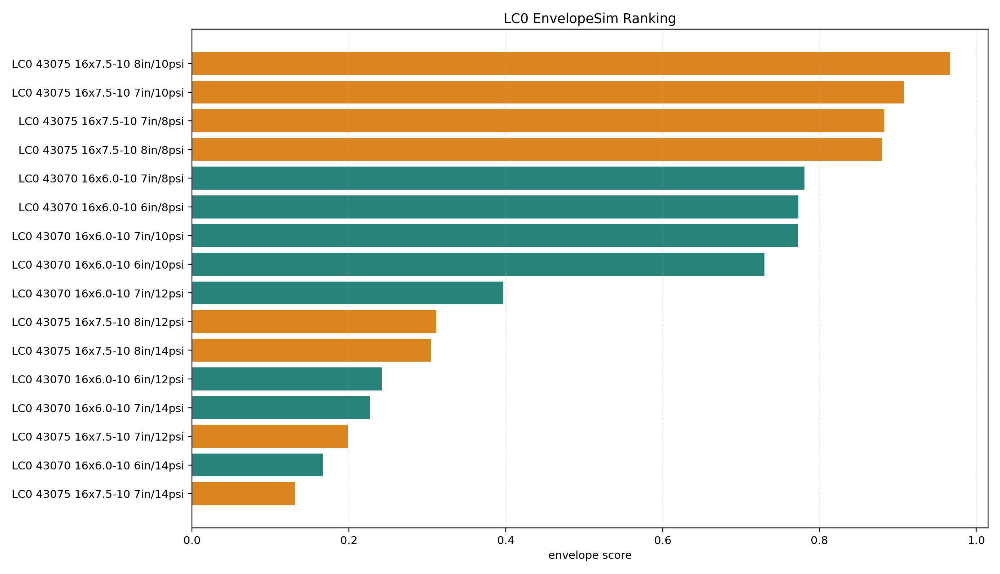
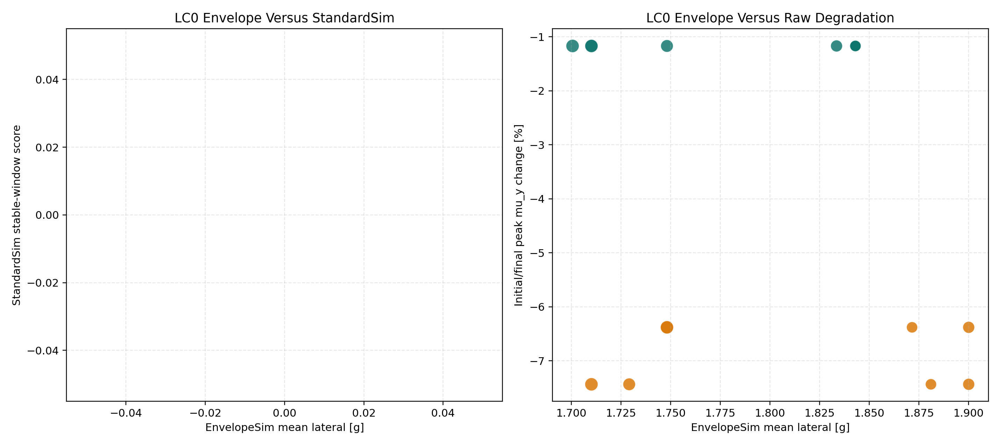
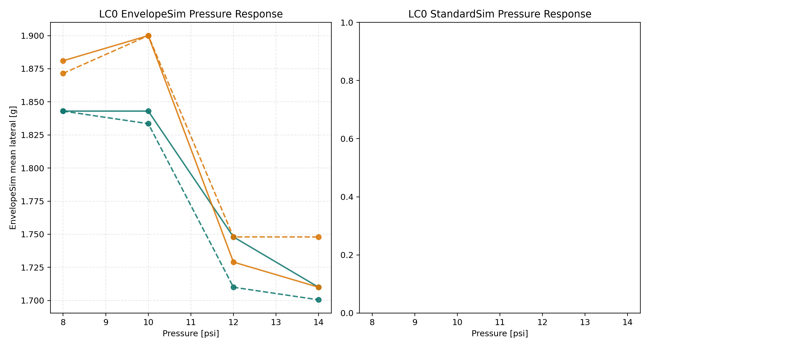
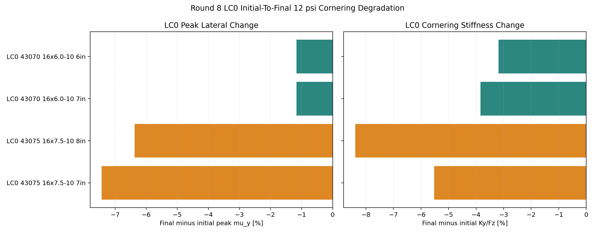
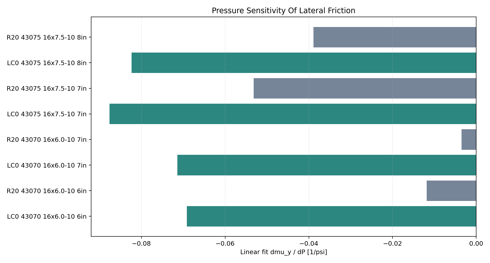
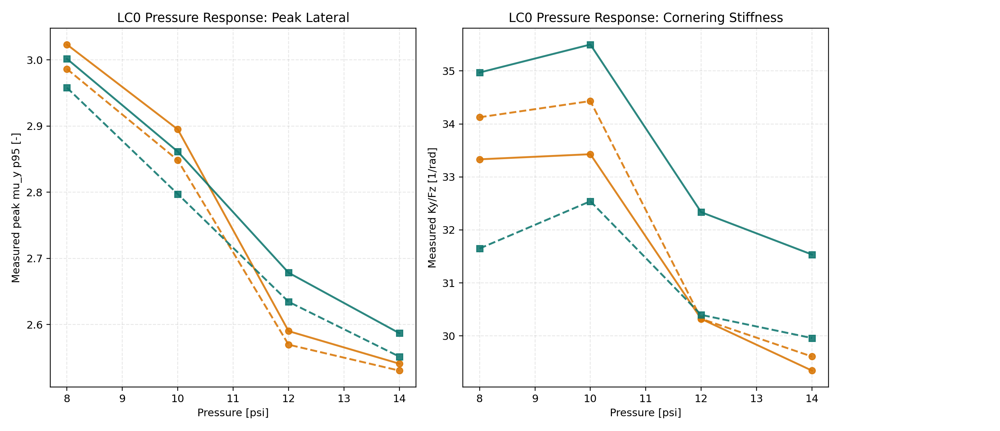
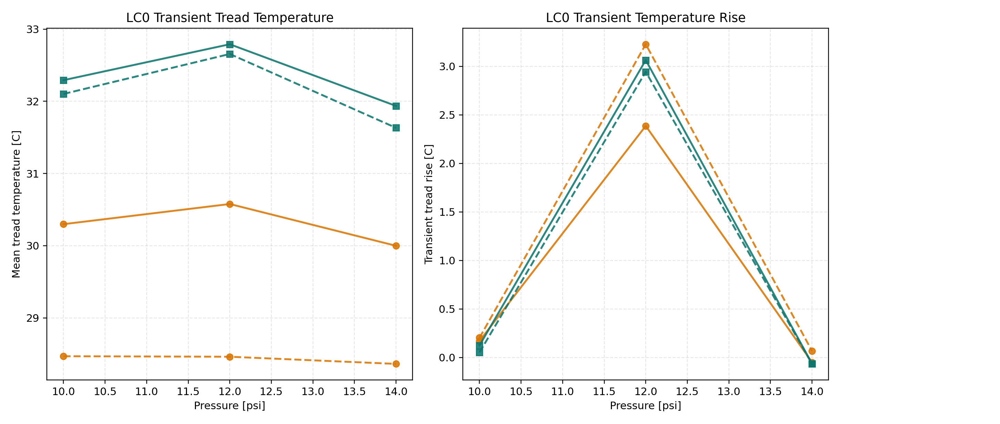

# DS-008 Round 8 LC0 Tire Analysis

Generated UTC: 2026-05-24T16:26:26+00:00

## Purpose

This study extracts the Round 8 10 inch tire cornering archive and RunGuide matrix to characterize the Hoosier LC0 compound. It mirrors the DS-006 tire-data evidence style: initial/final 12 psi degradation, pressure response, transient temperature, matched R20 comparison against the DS-006 Round 9 Hoosier R20 rows, and vehicle-level EnvelopeSim/StandardSim screening for the existing LC0 tire files.

The RunGuide text labels the compound as `LCO`; the existing tire-fit archives and this report use `LC0`.

## Source Of Results

| Result type | Source |
| --- | --- |
| Run matrix | `RunGuide_Round8.pdf` |
| Raw cornering channels | `RunData_Cornering_Matlab_SI_10inch_Round8.zip` |
| R20 comparison rows | `studies/DS-006-integrated-tire-design/outputs/integrated_results.csv` |
| Envelope limits | `BobSim/_2_EnvelopeSim/GGV/ggv_generation.py` via DS-006 helpers |
| Steady-state vehicle response | `BobSim/_3_StandardSim/SteadyStateEval/steady_state_eval_sim.py` via DS-006 helpers |
| LC0 vehicle tire files | `vehicles/current/tires/round_8_fabricated_longitudinal_um3` |
| Report generator | `studies/DS-008-round8-lc0-analysis/run.py` |

Vehicle-level results are screening evidence only. The Round 8 LC0 `.tir` files are PAC2002 `USE_MODE = 3` records with fabricated pure longitudinal terms and zeroed combined-slip longitudinal terms, so lateral/cornering conclusions carry more confidence than longitudinal or combined-load conclusions.

## Coverage

| Item | Value |
| --- | ---: |
| Round 8 LC0 setups | 4 |
| Matched Round 9 R20 comparison setups | 4 |
| Pressure-window rows | 20 |
| Transient-temperature rows | 12 |
| LC0 vehicle candidates | 16 |
| StandardSim errors | 0 |
| StandardSim successful rows | 17 |
| StandardSim QA-pass rows | 0 |
| StandardSim QA-fail rows | 17 |

## Executive Read

No integrated LC0 winner is selected because every StandardSim row failed the QA gate (`17` successful-but-QA-failed rows, all flagged by failed maneuver count). The vehicle-level screen is therefore EnvelopeSim plus raw tire-data evidence. The EnvelopeSim leader is **Hoosier LC0 43075 16x7.5-10 8in 10 psi** with envelope score `0.967`, mean lateral capability `1.900 g`, and raw 12 psi peak-mu degradation `-6.4%`.

Best LC0 raw cornering setup: **Hoosier 43070 16x6.0-10 LC0 7in**. It has final 12 psi peak mu `2.678`, final Ky/Fz `32.33 1/rad`, and peak-mu degradation `-1.2%`.

LC0 peak lateral capability is strongest on **Hoosier 43070 16x6.0-10 LC0 7in**, while small-slip stiffness is strongest on **Hoosier 43070 16x6.0-10 LC0 7in**. The main caution is the LC0 43075: its 12 psi peak-mu repeat falls `7.4%` or more depending on rim.

The clean takeaway: **LC0 43070 looks healthier than LC0 43075 in Round 8 raw cornering data**. The 43075 LC0 variants have higher initial promise but meaningfully degrade by the final 12 psi repeat; the 43070 LC0 variants are much more stable.

## LC0 Vehicle-Level Screening

EnvelopeSim and StandardSim are run with the same DS-006 architecture correction and stable `8.0 m/s^2` StandardSim scoring window. This section is included to answer the vehicle-design question, but it must be read with the LC0 UM3 tire-file caveat above.

StandardSim completed numerically for the LC0 cases, but no LC0 row passes the DS-006 QA gate. Each row reports one failed maneuver point in the sweep, so StandardSim response metrics are retained below as diagnostics and are not converted into an integrated score.

| Envelope rank | Candidate | dR | Envelope | Std | Integrated | Mean lat | US grad | Roll | Raw degr | Std QA | Long source |
| ---: | --- | ---: | ---: | ---: | ---: | ---: | ---: | ---: | ---: | --- | --- |
| 1 | Hoosier LC0 43075 16x7.5-10 8in 10 psi | 1.0 mm | 0.967 | n/a | n/a | 1.900 g | 0.441 | 0.894 | -6.4% | failed_maneuver | fabricated_longitudinal_no_combined |
| 2 | Hoosier LC0 43075 16x7.5-10 7in 10 psi | 2.5 mm | 0.907 | n/a | n/a | 1.900 g | 0.439 | 0.896 | -7.4% | failed_maneuver | fabricated_longitudinal_no_combined |
| 3 | Hoosier LC0 43075 16x7.5-10 7in 8 psi | 0.7 mm | 0.883 | n/a | n/a | 1.881 g | 0.434 | 0.893 | -7.4% | failed_maneuver | fabricated_longitudinal_no_combined |
| 4 | Hoosier LC0 43075 16x7.5-10 8in 8 psi | -0.5 mm | 0.880 | n/a | n/a | 1.871 g | 0.447 | 0.894 | -6.4% | failed_maneuver | fabricated_longitudinal_no_combined |
| 5 | Hoosier LC0 43070 16x6.0-10 7in 8 psi | -2.7 mm | 0.781 | n/a | n/a | 1.843 g | 0.444 | 0.887 | -1.2% | failed_maneuver | fabricated_longitudinal_no_combined |
| 6 | Hoosier LC0 43070 16x6.0-10 6in 8 psi | -2.3 mm | 0.773 | n/a | n/a | 1.843 g | 0.417 | 0.886 | -1.2% | failed_maneuver | fabricated_longitudinal_no_combined |
| 7 | Hoosier LC0 43070 16x6.0-10 7in 10 psi | -1.1 mm | 0.773 | n/a | n/a | 1.843 g | 0.421 | 0.888 | -1.2% | failed_maneuver | fabricated_longitudinal_no_combined |
| 8 | Hoosier LC0 43070 16x6.0-10 6in 10 psi | -0.6 mm | 0.730 | n/a | n/a | 1.833 g | 0.435 | 0.888 | -1.2% | failed_maneuver | fabricated_longitudinal_no_combined |
| 9 | Hoosier LC0 43070 16x6.0-10 7in 12 psi | -0.6 mm | 0.397 | n/a | n/a | 1.748 g | 0.552 | 0.888 | -1.2% | failed_maneuver | fabricated_longitudinal_no_combined |
| 10 | Hoosier LC0 43075 16x7.5-10 8in 12 psi | 1.5 mm | 0.311 | n/a | n/a | 1.748 g | 0.616 | 0.896 | -6.4% | failed_maneuver | fabricated_longitudinal_no_combined |
| 11 | Hoosier LC0 43075 16x7.5-10 8in 14 psi | 2.5 mm | 0.304 | n/a | n/a | 1.748 g | 0.613 | 0.896 | -6.4% | failed_maneuver | fabricated_longitudinal_no_combined |
| 12 | Hoosier LC0 43070 16x6.0-10 6in 12 psi | 0.0 mm | 0.242 | n/a | n/a | 1.710 g | 0.602 | 0.888 | -1.2% | failed_maneuver | fabricated_longitudinal_no_combined |
| 13 | Hoosier LC0 43070 16x6.0-10 7in 14 psi | 0.5 mm | 0.226 | n/a | n/a | 1.710 g | 0.578 | 0.890 | -1.2% | failed_maneuver | fabricated_longitudinal_no_combined |
| 14 | Hoosier LC0 43075 16x7.5-10 7in 12 psi | 3.0 mm | 0.199 | n/a | n/a | 1.729 g | 0.611 | 0.894 | -7.4% | failed_maneuver | fabricated_longitudinal_no_combined |
| 15 | Hoosier LC0 43070 16x6.0-10 6in 14 psi | 1.3 mm | 0.167 | n/a | n/a | 1.700 g | 0.607 | 0.890 | -1.2% | failed_maneuver | fabricated_longitudinal_no_combined |
| 16 | Hoosier LC0 43075 16x7.5-10 7in 14 psi | 4.2 mm | 0.131 | n/a | n/a | 1.710 g | 0.623 | 0.898 | -7.4% | failed_maneuver | fabricated_longitudinal_no_combined |

StandardSim diagnostic response metrics:

| Candidate | ay diag | US grad | Sideslip | Roll | HWT peak | Failed cases | QA flags |
| --- | ---: | ---: | ---: | ---: | ---: | ---: | --- |
| Hoosier LC0 43075 16x7.5-10 8in 10 psi | 1.597 g | 0.441 | 0.658 | 0.894 | 19.28 | 1 | failed_maneuver |
| Hoosier LC0 43075 16x7.5-10 7in 10 psi | 1.580 g | 0.439 | 0.599 | 0.896 | 19.14 | 1 | failed_maneuver |
| Hoosier LC0 43075 16x7.5-10 7in 8 psi | 1.568 g | 0.434 | 0.557 | 0.893 | 21.14 | 1 | failed_maneuver |
| Hoosier LC0 43075 16x7.5-10 8in 8 psi | 1.589 g | 0.447 | 0.630 | 0.894 | 20.92 | 1 | failed_maneuver |
| Hoosier LC0 43070 16x6.0-10 7in 8 psi | 1.582 g | 0.444 | 0.598 | 0.887 | 20.30 | 1 | failed_maneuver |
| Hoosier LC0 43070 16x6.0-10 6in 8 psi | 1.535 g | 0.417 | 0.289 | 0.886 | 20.28 | 1 | failed_maneuver |
| Hoosier LC0 43070 16x6.0-10 7in 10 psi | 1.594 g | 0.421 | 0.649 | 0.888 | 17.60 | 1 | failed_maneuver |
| Hoosier LC0 43070 16x6.0-10 6in 10 psi | 1.559 g | 0.435 | 0.466 | 0.888 | 18.19 | 1 | failed_maneuver |
| Hoosier LC0 43070 16x6.0-10 7in 12 psi | 1.537 g | 0.552 | 0.516 | 0.888 | 16.42 | 1 | failed_maneuver |
| Hoosier LC0 43075 16x7.5-10 8in 12 psi | 1.510 g | 0.616 | 0.439 | 0.896 | 16.23 | 1 | failed_maneuver |
| Hoosier LC0 43075 16x7.5-10 8in 14 psi | 1.506 g | 0.613 | 0.411 | 0.896 | 15.53 | 1 | failed_maneuver |
| Hoosier LC0 43070 16x6.0-10 6in 12 psi | 1.495 g | 0.602 | 0.366 | 0.888 | 15.05 | 1 | failed_maneuver |
| Hoosier LC0 43070 16x6.0-10 7in 14 psi | 1.519 g | 0.578 | 0.496 | 0.890 | 15.03 | 1 | failed_maneuver |
| Hoosier LC0 43075 16x7.5-10 7in 12 psi | 1.499 g | 0.611 | 0.435 | 0.894 | 15.60 | 1 | failed_maneuver |
| Hoosier LC0 43070 16x6.0-10 6in 14 psi | 1.494 g | 0.607 | 0.372 | 0.890 | 14.44 | 1 | failed_maneuver |
| Hoosier LC0 43075 16x7.5-10 7in 14 psi | 1.491 g | 0.623 | 0.402 | 0.898 | 15.32 | 1 | failed_maneuver |

Best LC0 setup versus current reference:

| Metric | Current reference | Best LC0 | Delta |
| --- | ---: | ---: | ---: |
| Envelope mean lateral | 1.795 g | 1.900 g | +5.8% |
| Envelope mean GGV area | 8.198 g^2 | 8.584 g^2 | +4.7% |
| Understeer gradient | 0.449 deg/g | 0.441 deg/g | -1.9% |
| Roll gradient | 0.890 deg/g | 0.894 deg/g | +0.6% |
| Peak handwheel torque | 18.143 Nm | 19.275 Nm | +6.2% |

## LC0 Initial/Final 12 psi Degradation

Degradation compares the initial 12 psi slip-angle sweep to the repeated final 12 psi sweep after the 10, 14, and 8 psi sequence. Metrics use the nominal 25 mph window (`34-47 km/h`), robust 95th-percentile measured `|FY/FZ|`, and a small-slip Ky/Fz linear fit.

| Rank | LC0 setup | Initial run | Final run | Peak mu_i | Peak mu_f | Peak delta | Ky_i | Ky_f | Ky delta | Tread delta |
| ---: | --- | ---: | ---: | ---: | ---: | ---: | ---: | ---: | ---: | ---: |
| 1 | Hoosier 43070 16x6.0-10 LC0 7in | 24 | 25 | 2.710 | 2.678 | -1.2% | 33.62 | 32.33 | -3.8% | -6.0 C |
| 2 | Hoosier 43070 16x6.0-10 LC0 6in | 21 | 22 | 2.665 | 2.634 | -1.2% | 31.40 | 30.40 | -3.2% | -5.7 C |
| 3 | Hoosier 43075 16x7.5-10 LC0 7in | 18 | 19 | 2.798 | 2.590 | -7.4% | 32.09 | 30.32 | -5.5% | -2.1 C |
| 4 | Hoosier 43075 16x7.5-10 LC0 8in | 15 | 16 | 2.744 | 2.569 | -6.4% | 33.10 | 30.32 | -8.4% | -0.1 C |

## LC0 Versus R20

R20 is pulled from the DS-006 Round 9 Hoosier R20 study rows, matched by model, tire size, and rim width. This is a design-relevant cross-round comparison, not a same-round compound control; use it to compare LC0 against the current R20 decision set.

| Matched setup | LC0 peak mu | R20 peak mu | LC0 delta | LC0 Ky | R20 Ky | LC0 Ky delta | LC0 degr | R20 degr | R20 int |
| --- | ---: | ---: | ---: | ---: | ---: | ---: | ---: | ---: | ---: |
| 43070 16x6.0-10 6in | 2.634 | 2.476 | +6.4% | 30.40 | 29.38 | +3.5% | -1.2% | -0.5% | 0.748 |
| 43070 16x6.0-10 7in | 2.678 | 2.438 | +9.9% | 32.33 | 30.54 | +5.9% | -1.2% | -1.0% | 0.708 |
| 43075 16x7.5-10 7in | 2.590 | 2.560 | +1.2% | 30.32 | 33.51 | -9.5% | -7.4% | +1.6% | 0.740 |
| 43075 16x7.5-10 8in | 2.569 | 2.530 | +1.6% | 30.32 | 34.20 | -11.3% | -6.4% | +0.6% | 0.725 |

Against matched R20, LC0 final 12 psi peak mu is `+1.2% to +9.9%` across the matched rows. The split is important: 43075 LC0 keeps similar peak mu but gives up `-11.3% to -9.5%` in Ky/Fz and has the stronger repeat-loss warning, while 43070 LC0 is the healthier R20 comparison with peak mu `+6.4% to +9.9%` and Ky/Fz `+3.5% to +5.9%` versus R20.

## Lateral Friction Pressure Sensitivity

The table reports $\partial \mu_y / \partial P$ as a linear-fit slope over the pressure series. LC0 uses observed raw `peak_mu_y_p95` from the Round 8 pressure windows, while R20 uses fitted `mu_y = abs(PDY1)` from the Round 9 UM14 tire files. The LC0 points mix run order (8 psi final, 10 psi initial, 12 psi final, 14 psi initial), so read those slopes as observed pressure-response evidence rather than a pure pressure-only causal derivative.

| Source | Setup | dmu/dP | %/psi @12 | 8->14 delta | R2 | Points |
| --- | --- | ---: | ---: | ---: | ---: | ---: |
| LC0 | 43070 16x6.0-10 6in | -0.0692 1/psi | -2.63% | -13.7% | 0.981 | 4 |
| R20 | 43070 16x6.0-10 6in | -0.0118 1/psi | -0.49% | -2.0% | 0.204 | 4 |
| LC0 | 43070 16x6.0-10 7in | -0.0714 1/psi | -2.67% | -13.8% | 0.985 | 4 |
| R20 | 43070 16x6.0-10 7in | -0.0035 1/psi | -0.15% | +0.0% | 0.076 | 4 |
| LC0 | 43075 16x7.5-10 7in | -0.0877 1/psi | -3.38% | -16.0% | 0.934 | 4 |
| R20 | 43075 16x7.5-10 7in | -0.0532 1/psi | -2.17% | -12.1% | 0.960 | 4 |
| LC0 | 43075 16x7.5-10 8in | -0.0824 1/psi | -3.21% | -15.3% | 0.933 | 4 |
| R20 | 43075 16x7.5-10 8in | -0.0389 1/psi | -1.60% | -8.8% | 0.929 | 4 |

In slope form, LC0 observed pressure sensitivity spans `-0.0877 to -0.0692 1/psi`; the matched R20 fitted `abs(PDY1)` sensitivity spans `-0.0532 to -0.0035 1/psi`.

## LC0 Pressure Response

The 8 psi point comes from the final-run pressure block; the 10 and 14 psi points come from the initial-run pressure block. Both initial and final 12 psi rows are retained in the CSV; the table below shows final 12 psi for consistency with degradation evidence.

| LC0 setup | Pressure | Run | Peak mu_y | Ky/Fz | Tread | Samples |
| --- | ---: | ---: | ---: | ---: | ---: | ---: |
| Hoosier 43070 16x6.0-10 LC0 6in | 8 | 22 | 2.958 | 31.65 | 56.9 C | 19982 |
| Hoosier 43070 16x6.0-10 LC0 6in | 10 | 21 | 2.797 | 32.54 | 59.2 C | 19980 |
| Hoosier 43070 16x6.0-10 LC0 6in | 12 | 22 | 2.634 | 30.40 | 54.4 C | 19964 |
| Hoosier 43070 16x6.0-10 LC0 6in | 14 | 21 | 2.551 | 29.96 | 57.7 C | 19913 |
| Hoosier 43070 16x6.0-10 LC0 7in | 8 | 25 | 3.002 | 34.97 | 59.1 C | 19985 |
| Hoosier 43070 16x6.0-10 LC0 7in | 10 | 24 | 2.861 | 35.50 | 60.9 C | 19983 |
| Hoosier 43070 16x6.0-10 LC0 7in | 12 | 25 | 2.678 | 32.33 | 55.9 C | 19993 |
| Hoosier 43070 16x6.0-10 LC0 7in | 14 | 24 | 2.587 | 31.53 | 59.0 C | 19931 |
| Hoosier 43075 16x7.5-10 LC0 7in | 8 | 19 | 3.023 | 33.33 | 59.4 C | 19965 |
| Hoosier 43075 16x7.5-10 LC0 7in | 10 | 18 | 2.895 | 33.43 | 59.7 C | 19988 |
| Hoosier 43075 16x7.5-10 LC0 7in | 12 | 19 | 2.590 | 30.32 | 57.5 C | 19978 |
| Hoosier 43075 16x7.5-10 LC0 7in | 14 | 18 | 2.541 | 29.34 | 58.2 C | 19943 |
| Hoosier 43075 16x7.5-10 LC0 8in | 8 | 16 | 2.986 | 34.13 | 59.7 C | 19971 |
| Hoosier 43075 16x7.5-10 LC0 8in | 10 | 15 | 2.848 | 34.43 | 58.0 C | 19964 |
| Hoosier 43075 16x7.5-10 LC0 8in | 12 | 16 | 2.569 | 30.32 | 58.2 C | 19963 |
| Hoosier 43075 16x7.5-10 LC0 8in | 14 | 15 | 2.530 | 29.61 | 57.3 C | 19921 |

## LC0 Transient Temperature

| LC0 setup | Pressure | Mean tread | Peak tread | Rise | I-O | Spread | Rim | Ambient |
| --- | ---: | ---: | ---: | ---: | ---: | ---: | ---: | ---: |
| Hoosier 43070 16x6.0-10 LC0 6in | 10 | 32.1 C | 32.9 C | 0.1 C | -2.2 C | 2.2 C | 31.0 C | 28.7 C |
| Hoosier 43070 16x6.0-10 LC0 6in | 12 | 32.7 C | 34.0 C | 2.9 C | -2.7 C | 2.7 C | 33.0 C | 28.7 C |
| Hoosier 43070 16x6.0-10 LC0 6in | 14 | 31.6 C | 32.5 C | -0.1 C | -1.9 C | 1.9 C | 29.9 C | 28.4 C |
| Hoosier 43070 16x6.0-10 LC0 7in | 10 | 32.3 C | 33.2 C | 0.1 C | -2.0 C | 2.0 C | 31.3 C | 28.5 C |
| Hoosier 43070 16x6.0-10 LC0 7in | 12 | 32.8 C | 34.7 C | 3.1 C | -2.3 C | 2.3 C | 33.3 C | 28.5 C |
| Hoosier 43070 16x6.0-10 LC0 7in | 14 | 31.9 C | 32.9 C | -0.1 C | -1.8 C | 1.8 C | 30.3 C | 28.5 C |
| Hoosier 43075 16x7.5-10 LC0 7in | 10 | 30.3 C | 31.2 C | 0.2 C | -2.8 C | 2.8 C | 29.3 C | 27.8 C |
| Hoosier 43075 16x7.5-10 LC0 7in | 12 | 30.6 C | 31.9 C | 2.4 C | -3.0 C | 3.3 C | 31.1 C | 27.7 C |
| Hoosier 43075 16x7.5-10 LC0 7in | 14 | 30.0 C | 30.8 C | -0.0 C | -2.6 C | 2.6 C | 28.4 C | 27.8 C |
| Hoosier 43075 16x7.5-10 LC0 8in | 10 | 28.5 C | 29.3 C | 0.2 C | -2.9 C | 2.9 C | 26.6 C | 26.8 C |
| Hoosier 43075 16x7.5-10 LC0 8in | 12 | 28.5 C | 30.2 C | 3.2 C | -3.0 C | 3.0 C | 28.4 C | 26.7 C |
| Hoosier 43075 16x7.5-10 LC0 8in | 14 | 28.4 C | 29.2 C | 0.1 C | -2.9 C | 3.0 C | 25.6 C | 26.9 C |

## Findings

- LC0 43075 shows the largest initial-to-final deterioration: peak mu falls `-6.4%` on the 8 in rim and `-7.4%` on the 7 in rim.
- LC0 43070 is much more stable: peak mu falls only `-1.2%` on both rim widths, with final 12 psi Ky/Fz equal to or better than the 43075 LC0 rows.
- LC0 pressure response is strongest at 8 psi in the final-run block for all LC0 setups, but that point is confounded with run order and should be treated as observed data, not a pressure-only causal result.
- Against matched R20, LC0 is higher on final 12 psi peak mu in these rows, but 43075 LC0 is lower in Ky/Fz and has worse repeat degradation than R20.
- Because Round 8 LC0 has no 10 inch drive/brake archive in this dataset, vehicle-level longitudinal/braking reads are lower-confidence than lateral and balance reads.

## Figure Gallery

### LC0 vehicle-level ranking

### LC0 vehicle trade space

### LC0 vehicle pressure response

### LC0 initial-to-final 12 psi degradation

### LC0 versus matched R20 final 12 psi behavior

### Lateral friction pressure sensitivity

### LC0 measured pressure response

### LC0 transient temperature evidence

## Generated Files

- `outputs/degradation_summary.csv`
- `outputs/pressure_window_summary.csv`
- `outputs/transient_temperature_summary.csv`
- `outputs/r20_comparison.csv`
- `outputs/pressure_mu_sensitivity.csv`
- `outputs/lc0_ranked_summary.csv`
- `outputs/vehicle_candidate_registry.csv`
- `outputs/vehicle_tire_characterization.csv`
- `outputs/vehicle_envelope_metrics.csv`
- `outputs/vehicle_standardsim_metrics.csv`
- `outputs/vehicle_standardsim_errors.csv`
- `outputs/vehicle_integrated_results.csv`
- `outputs/run_provenance.csv`
- `plots/lc0_vehicle_rank.png`
- `plots/lc0_vehicle_trade_space.png`
- `plots/lc0_vehicle_pressure_response.png`
- `plots/lc0_degradation.png`
- `plots/lc0_vs_r20_final12.png`
- `plots/mu_pressure_sensitivity.png`
- `plots/lc0_pressure_response.png`
- `plots/lc0_transient_temperature.png`

## Run Provenance

| Item | Value |
| --- | --- |
| Elapsed time | 0.0 s |
| Python | /home/rhorvath2002/Documents/Github/lhre-simulation/.venv/bin/python |
