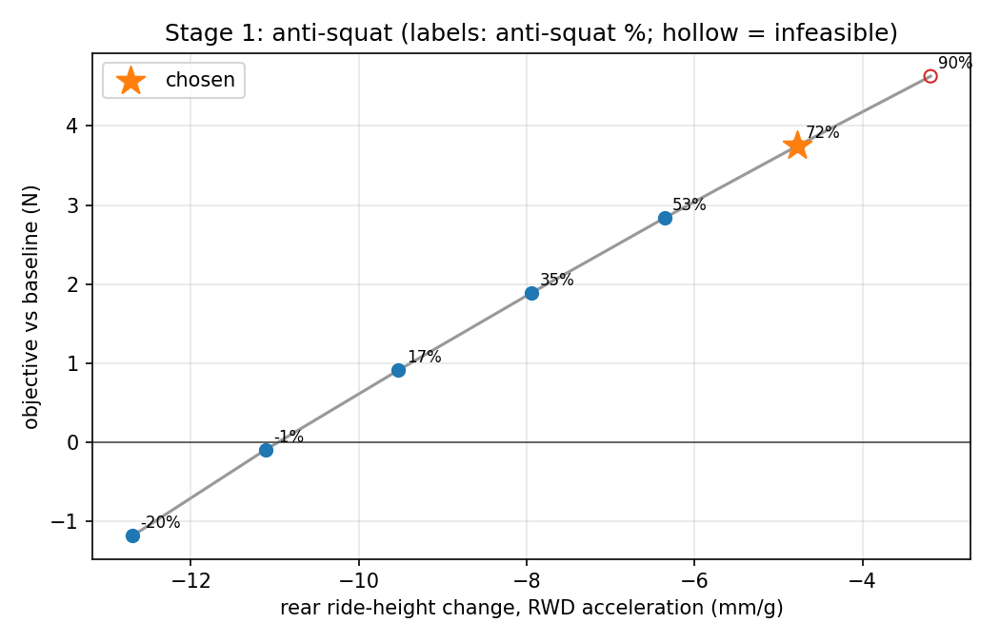
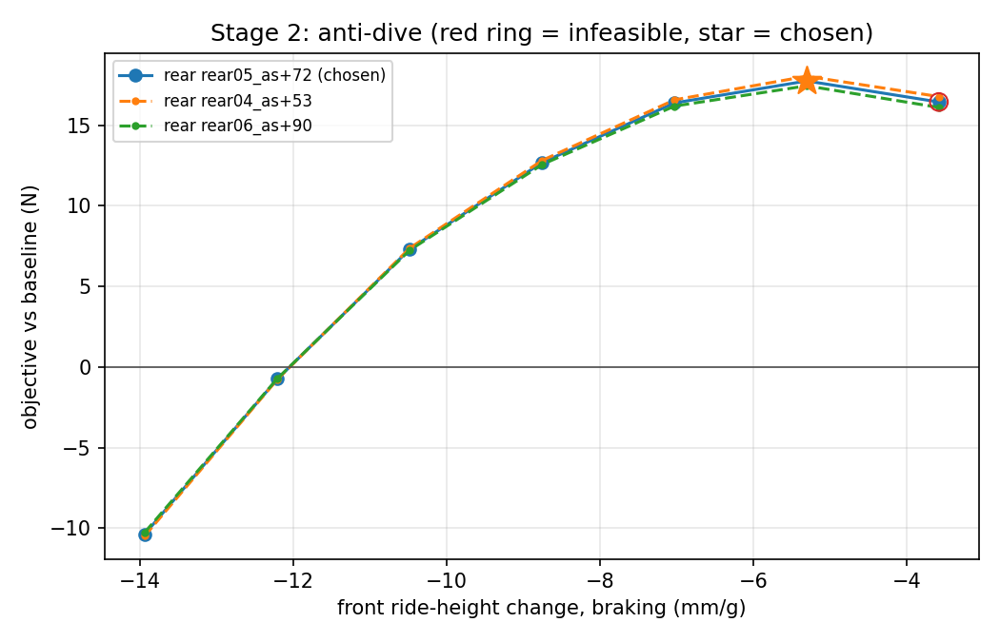
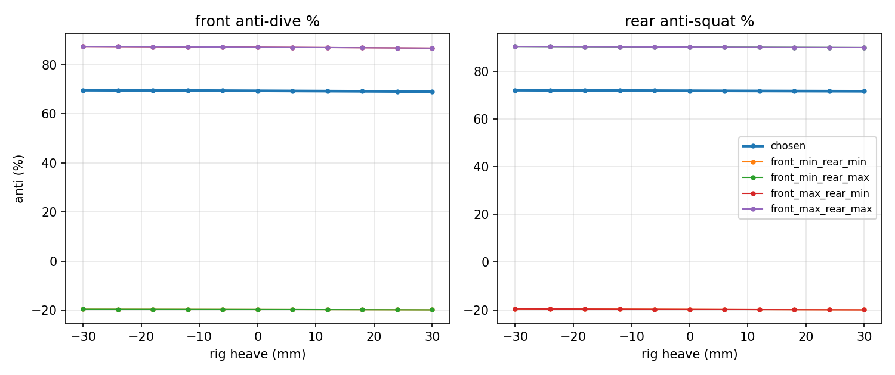
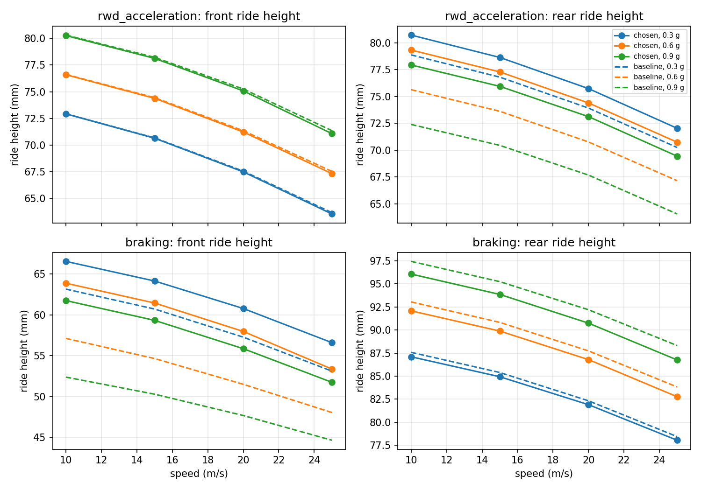

# DS-010 Anti-Dive / Anti-Squat Geometry: Results

Generated by `studies/DS-010-anti-geometry/run.py` on 2026-09-26 02:07 UTC from `vehicles/design/vehicle.yml` (BobSim c45940e, BobLib 849566d). Every number rests on the provisional assumptions listed at the end.

## Chosen geometry

| Axle | Variant | Anti % (target / rig) | dz/g, mm/g (target / rig) | c rig / IC | δ upper, lower (deg) | Max pickup shift (mm) |
| --- | --- | --- | --- | --- | --- | --- |
| Front (anti-dive, braking) | front05_ad+72 | 71.7 / 69.4 | -5.08 / -5.30 | 0.1491 / 0.1540 | -8.75, -8.75 | 25.3 |
| Rear (anti-squat, RWD) | rear05_as+72 | 71.7 / 71.8 | -4.79 / -4.77 | 0.1288 / 0.1286 | 7.37, 7.37 | 26.7 |

Braking anti-lift at the chosen rear is 11.4%. The side-view swing-arm length is held at the baseline value: front 1,157,792.2 m, rear -268.7 m.

### Hardpoint changes (left side; BobLib mirrors the right)

| Axle | Pickup | Baseline (mm) | Chosen (mm) | Change x, y, z (mm) |
| --- | --- | --- | --- | --- |
| front | upper_fore_i_m | 165.9, 270.0, 170.4 | 164.0, 270.0, 145.2 | -1.9, 0.0, -25.3 |
| front | upper_aft_i_m | -84.0, 270.0, 170.4 | -83.0, 270.0, 183.2 | 1.0, 0.0, 12.8 |
| front | lower_fore_i_m | 161.4, 218.7, 75.8 | 159.6, 218.7, 51.3 | -1.9, 0.0, -24.6 |
| front | lower_aft_i_m | -81.5, 218.7, 75.8 | -80.6, 218.7, 88.2 | 0.9, 0.0, 12.4 |
| front | rack_pickup_m | 50.0, 245.8, 121.6 | 50.0, 245.8, 126.6 | 0.0, 0.0, 5.0 |
| rear | upper_fore_i_m | -1,341.8, 323.5, 195.1 | -1,343.5, 323.5, 221.8 | -1.7, 0.0, 26.6 |
| rear | upper_aft_i_m | -1,545.6, 323.7, 195.1 | -1,545.7, 323.7, 195.6 | -0.0, 0.0, 0.5 |
| rear | lower_fore_i_m | -1,378.0, 268.7, 73.6 | -1,379.4, 268.7, 95.6 | -1.4, 0.0, 22.0 |
| rear | lower_aft_i_m | -1,575.7, 268.0, 73.6 | -1,575.4, 268.0, 70.3 | 0.2, 0.0, -3.4 |
| rear | rack_pickup_m | -1,309.4, 323.5, 195.1 | -1,309.4, 323.5, 221.7 | 0.0, 0.0, 26.6 |

## Objective

Bin-weighted expected longitudinal capacity E[Σ μx Fz] over the tires carrying Fx (N).

| Maneuver | Baseline | Chosen (rig) | Gain | Chosen, stage prediction |
| --- | --- | --- | --- | --- |
| RWD acceleration | 4,276.09 | 4,279.84 | 3.75 | 4,279.84 |
| Braking | 7,391.55 | 7,409.30 | 17.75 | 7,409.30 |

## Stage 1: anti-squat sweep

| Variant | Target AS % | Rig AS % | dz_r/g (mm/g) | Δ objective (N) | Feasible | Chosen |
| --- | --- | --- | --- | --- | --- | --- |
| rear00_as-20 | -20.0 | -19.8 | -12.70 | -1.18 | True | False |
| rear01_as-2 | -1.7 | -1.5 | -11.11 | -0.09 | True | False |
| rear02_as+17 | 16.7 | 16.9 | -9.53 | 0.91 | True | False |
| rear03_as+35 | 35.0 | 35.2 | -7.94 | 1.89 | True | False |
| rear04_as+53 | 53.3 | 53.5 | -6.36 | 2.84 | True | False |
| rear05_as+72 | 71.7 | 71.8 | -4.77 | 3.75 | True | True |
| rear06_as+90 | 90.0 | 90.1 | -3.19 | 4.63 | False | False |

## Stage 2: anti-dive sweep (at the chosen rear)

| Variant | Target AD % | Rig AD % | dz_f/g (mm/g) | Δ objective (N) | Δ objective, rear +1 step (N) | Δ objective, rear -1 step (N) | Feasible | Chosen |
| --- | --- | --- | --- | --- | --- | --- | --- | --- |
| front00_ad-20 | -20.0 | -19.6 | -13.94 | -10.36 | -10.25 | -10.47 | True | False |
| front01_ad-2 | -1.7 | -1.8 | -12.21 | -0.74 | -0.71 | -0.77 | True | False |
| front02_ad+17 | 16.7 | 16.0 | -10.48 | 7.32 | 7.26 | 7.39 | True | False |
| front03_ad+35 | 35.0 | 33.8 | -8.75 | 12.70 | 12.57 | 12.82 | True | False |
| front04_ad+53 | 53.3 | 51.6 | -7.03 | 16.39 | 16.19 | 16.58 | True | False |
| front05_ad+72 | 71.7 | 69.4 | -5.30 | 17.75 | 17.45 | 18.04 | True | True |
| front06_ad+90 | 90.0 | 87.2 | -3.58 | 16.44 | 16.11 | 16.78 | False | False |

## Validation

Rig runs of the chosen car and the sweep corners. Predicted values combine the stage-1 rear and stage-2 front rig results; achieved values come from the car's own rig run.

| Car | c front pred / rig / IC | c rear pred / rig / IC | Braking obj. pred / rig (N) | Accel obj. pred / rig (N) | Feasible |
| --- | --- | --- | --- | --- | --- |
| chosen | 0.1491 / 0.1491 / 0.1540 | 0.1288 / 0.1288 / 0.1286 | 7,409.30 / 7,409.30 | 4,279.84 / 4,279.84 | True |
| front_min_rear_min | -0.0421 / -0.0421 / -0.0430 | -0.0365 / -0.0365 / -0.0369 | 7,380.49 / 7,380.49 | 4,274.91 / 4,274.91 | True |
| front_min_rear_max | -0.0421 / -0.0421 / -0.0430 | 0.1619 / 0.1619 / 0.1617 | 7,381.30 / 7,381.30 | 4,280.72 / 4,280.72 | False |
| front_max_rear_min | 0.1873 / 0.1873 / 0.1934 | -0.0365 / -0.0365 / -0.0369 | 7,409.50 / 7,409.50 | 4,274.91 / 4,274.91 | False |
| front_max_rear_max | 0.1873 / 0.1873 / 0.1934 | 0.1619 / 0.1619 / 0.1617 | 7,407.66 / 7,407.66 | 4,280.72 / 4,280.72 | False |

### Constraint margins, chosen car (positive = inside the limit)

| Axle | Pickup shift (mm) | Toe gain (deg/m) | Caster change (deg) | Anti range (%) |
| --- | --- | --- | --- | --- |
| front | 4.67 | 3.89 | 1.96 | 30.33 |
| rear | 3.31 | 3.97 | inf | 27.94 |

### Springs

| Axle | Ride frequency (Hz) | Wheel rate (N/m) | Motion ratio | Spring rate (N/m) | Vehicle YAML spring (N/m) |
| --- | --- | --- | --- | --- | --- |
| front | 3.00 | 23,809 | 1.1358 | 30,712 | 26,269 |
| rear | 3.00 | 26,708 | 1.8272 | 89,170 | 43,782 |

## Provisional assumptions

- **Aero map.** `AEROMAP_VALIDATION.md` says not to select anti geometry from this map's balance. The calibrated CoP is a provisional prior, so these results depend on it until Aero confirms the map.
- **Static ride height.** 71.12 mm front, 83.82 mm rear: the aero grid anchor, not an asserted static ride height (`AEROMAP_COP_CALIBRATION.md`).
- **Rear vertical datum.** Unresolved (`vehicle.datum.json`); it affects h, IC heights and R/d.
- **Scenario weights.** rwd_acceleration: uniform, braking: uniform. Nothing in the repo gives lap-time fractions.
- **σFx.** 10% of the mean Fx per wheel, a placeholder for the longitudinal force variation. σFz = |c_eff| σFx stands in for the rigid-link load path only.
- **Regen share of rear braking.** 0.00; the vehicle YAML doesn't define it.
- **Ride frequency.** 3.00 Hz front and 3.00 Hz rear, as wheel rate in series with the tire. It replaces the vehicle's placeholder springs; `outputs/chosen_vehicle.yml` carries the implied rates.
- **Constraint limits.** Placeholders from study.yml. Kickback isn't checked; the rig applies no steer.
- **Quasi-static model.** No damper or frequency content.
- **Loaded radius.** `wheel.radius_m`, ignoring static tire deflection (about 6 mm).
- **Drag.** a_x is the total longitudinal acceleration; drag's line of action is ignored in ΔW.

## Outputs

- [`outputs/run_provenance.csv`](outputs/run_provenance.csv)
- [`outputs/variants.csv`](outputs/variants.csv)
- [`outputs/fourpost_metrics.csv`](outputs/fourpost_metrics.csv)
- [`outputs/bin_scores.csv`](outputs/bin_scores.csv)
- [`outputs/anti_squat_summary.csv`](outputs/anti_squat_summary.csv)
- [`outputs/anti_dive_summary.csv`](outputs/anti_dive_summary.csv)
- [`outputs/validation.csv`](outputs/validation.csv)
- [`outputs/chosen_vehicle.yml`](outputs/chosen_vehicle.yml)

