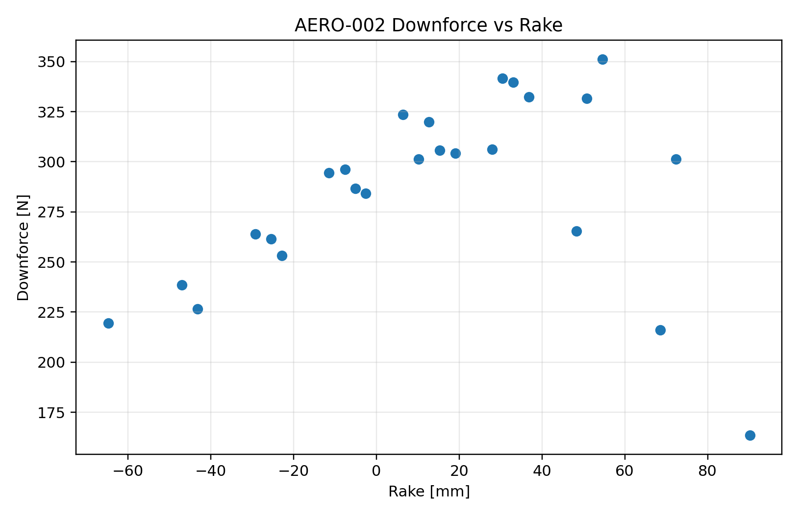

# AERO-002 Results

## Finding

**PASS:** the aero map is platform-sensitive enough that ride height and rake must be part of the aero design argument.

## Key Metrics

- Downforce span across map: `187.8 N`
- Drag span across map: `25.6 N`
- Rake range in map: `-64.8` to `90.2 mm`
- Equivalent vertical-load x range: `-3.395` to `-1.553 m`

## Design Implication

The aero report must discuss suspension platform control. A single downforce number is not a sufficient design justification.
