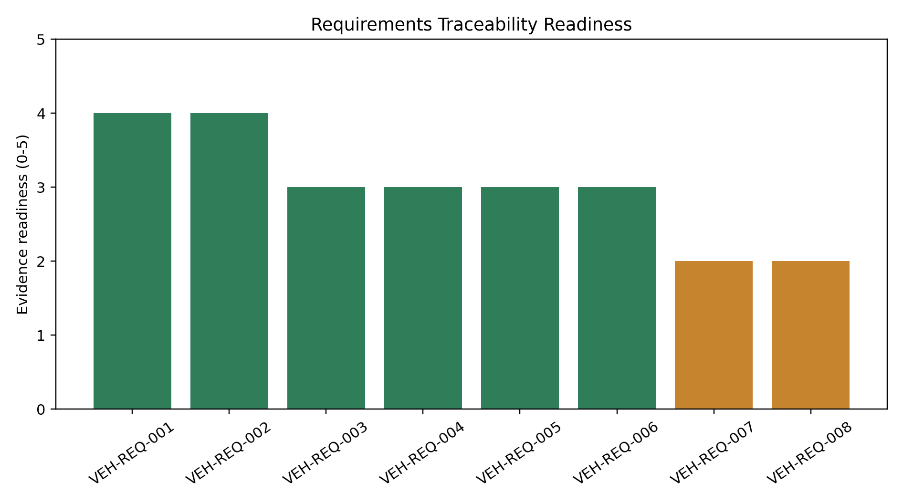

# DE-002 Results

## Finding

**PASS:** the design package now has a traceable requirements cascade from team goals to subsystem evidence and validation closure.

## Summary

- Requirements traced: `8`
- Model-evidenced requirements: `6`
- Interface-defined requirements needing owner closure: `2`
- Mean evidence readiness: `3.0/5`

## Design Implication

The vehicle can be presented as a requirements-driven system: source vehicle, envelope, tire behavior, aero platform, chassis preservation, powertrain delivery, and DAQ closure each have explicit evidence and validation ownership.
