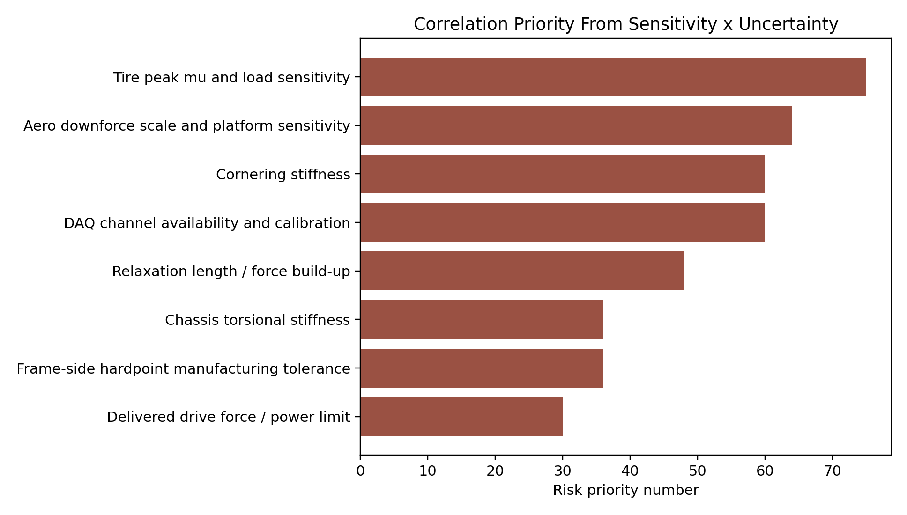

# DE-005 Results

## Finding

**PASS:** the package now ranks the assumptions most likely to change the design conclusion and assigns each one to a correlation action.

## Summary

- Risk variables ranked: `11`
- Highest current priority: `Tire peak mu and load sensitivity` with RPN `75`
- Highest-priority cluster: tire mu/load sensitivity, aero scale/platform, DAQ availability, cornering stiffness, relaxation response

## Design Implication

The team should correlate the tire and DAQ spine first, then close aero and chassis stiffness. Those variables have enough sensitivity and uncertainty to move the vehicle-level conclusions.
