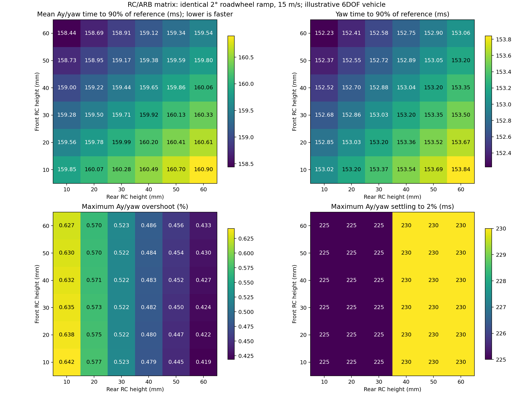

# Parameterized BobSim suspension research

This study publishes the hardpoint-free suspension fork, the initial five
research runs, and the independent RC/ARB matrix from 2026-09-29. The implementation is the repository's
[`BobSimParametric`](../../BobSimParametric) submodule, pinned to the
[team-owned BobSim fork](https://github.com/LonghornRacingElectric/BobSim-Parametric).
The original `BobSim` submodule remains available for existing studies.

## Start here

```bash
git clone --branch codex/parameterized-bobsim https://github.com/LonghornRacingElectric/lhre-simulation.git
cd lhre-simulation
git submodule update --init --recursive BobSimParametric
cd BobSimParametric
docker compose build bobsim
docker compose run --rm -T bobsim make parametric-test
docker compose run --rm -T bobsim make parametric-rc-coupled
docker compose run --rm -T bobsim make parametric-rc-matrix
docker compose run --rm -T bobsim make parametric-rc-matrix-validate
```

Edit [`parametric_vehicle.yml`](../../BobSimParametric/parametric_vehicle.yml)
to specify mass/CG/inertia, front/rear roll centers, camber gains, spring/wheel
motion ratios, springs, dampers and ARBs without hardpoints. The
[model guide](../../BobSimParametric/docs/parametric-suspension.md) defines the
units, sign conventions, force paths, assumptions and general parameter grids.
Run commands from inside `BobSimParametric`; results go to its ignored
`_3_StandardSim/generated_results/` directory.

## Independent 10-60 mm RC matrix with balanced ARBs

Front/rear RC heights were swept independently at 10 mm increments. Both ARB
rates were solved to retain **46.737693% front LLTD at 15 m/s and Ay = 8 m/s2**.
The original 2700 Nm/rad total ARB stiffness could not reach that target at the
extreme RC pairs without negative rates. A common **5000 Nm/rad total** was
therefore used for every matrix cell, including the 20/30 mm reference. The
original 1500/1200 Nm/rad setup is also retained as a separate comparison.
All rates below are effective axle roll stiffness, not torsion-bar shaft rates.

The matrix below is the mean time in **ms** from steer onset to reach 90% of
the common reference's final Ay and yaw rate; lower is faster. The input is a
2-degree roadwheel ramp lasting 0.15 s at 15 m/s. All 36 cells passed solver,
tire-domain, travel, speed and settling checks, plus the ranking gates of <=5%
overshoot, <=1 s settling within 2%, and final Ay/yaw within 1% of the reference.

| Front RC / Rear RC mm | 10 | 20 | 30 | 40 | 50 | 60 |
| ---: | ---: | ---: | ---: | ---: | ---: | ---: |
| 10 | 159.85 | 160.07 | 160.28 | 160.49 | 160.70 | 160.90 |
| 20 | 159.56 | 159.78 | 159.99 | 160.20 | 160.41 | 160.61 |
| 30 | 159.28 | 159.50 | 159.71 | 159.92 | 160.13 | 160.33 |
| 40 | 159.00 | 159.22 | 159.44 | 159.65 | 159.86 | 160.06 |
| 50 | 158.73 | 158.95 | 159.17 | 159.38 | 159.59 | 159.80 |
| 60 | **158.44** | 158.69 | 158.91 | 159.12 | 159.34 | 159.54 |

The fastest grid point is **front 60 / rear 10 mm**, requiring **133.58 front /
4866.42 rear Nm/rad**. Its refined mean t90 is 158.376 ms versus 159.942 ms for
the 20/30 reference: only **1.566 ms / 0.98% faster**. It has 0.627% worst
overshoot versus 0.522% for the reference. The 60/20 runner-up uses 530.72 /
4469.28 Nm/rad and has refined t90 158.607 ms with 0.570% overshoot. The 60/60
cell minimizes steady roll, while 10/60 minimizes overshoot but is slowest.
This is a tradeoff and a boundary trend within this grid, not a universal optimum.

All 18 refinement/speed-check runs were numerically valid. At 20 m/s, 60/10
remained fastest in the shortlist, improving mean t90 by 1.401 ms / 0.67% over
the reference. At 10 m/s, all six checked setups, including the original, had
**19-20% Ay overshoot and failed the 5% performance gate**. Thus no shortlisted
setup qualified across all three speeds. Numerical agreement does not resolve
that physical-model/input question; tire relaxation is absent.

The finer 2.5 ms / rtol 1e-9 runs changed common-time Ay by at most 7.06e-7 m/s2,
yaw rate by 5.83e-8 rad/s and tire loads by 3.53e-5 N; mean-t90 interpolation
differences stayed below 0.079 ms. The small trend is numerically resolved in
this illustrative model, but does not justify a car hardware recommendation.



[Front/rear ARB matrices and body roll](outputs/rc_matrix/setup_matrix.png) ·
[Full setup and response table](outputs/rc_matrix/summary.csv) ·
[Response-time matrix CSV](outputs/rc_matrix/matrix_turnin_mean_t90_ms.csv) ·
[Turn-in traces](outputs/rc_matrix/turn_in_comparison.png) ·
[Speed checks](outputs/rc_matrix/validation_summary.csv) ·
[Convergence](outputs/rc_matrix/validation.json)

## Paired roll-center result

Only front/rear nominal RC inputs varied. Rear height was solved to hold front
total LLTD at **46.737693% at 8 m/s2 Ay and 15 m/s**. LLTD uses direct simulated
normal loads: `(FR-FL)/[(FR-FL)+(RR-RL)]`. Equal height increases would not
preserve it: adding 100 mm at both ends changes front LLTD to 45.903991%.

| Front RC (mm) | Rear RC (mm) | Roll at 8 m/s2 (deg) |
| ---: | ---: | ---: |
| 20 | 30.000 | 0.84166 |
| 45 | 52.626 | 0.76753 |
| 70 | 75.253 | 0.69386 |
| 95 | 97.879 | 0.62065 |
| 120 | 120.505 | 0.54789 |

Endpoint steady roll falls 34.9%; normal-load changes stay below 1 N per tire at
matched Ay. With an identical 2-degree roadwheel input rising over 0.15 s,
final Ay changes from 5.171664 to 5.171549 m/s2. Turn-in differences reach
0.08104 m/s2 Ay and 12.09 N at an individual tire. Transient LLTD is not
constrained: at t = 1.040 s it is 50.88% baseline versus 59.64% highest RC.
Across the separate 2-10 m/s2 steady checks, maximum LLTD drift relative to
baseline at the same Ay is 0.106950 percentage points.


[Four tire loads](outputs/coupled_rc/tire_loads.png) ·
[Ay, roll and LLTD](outputs/coupled_rc/coupled_response.png) ·
[Summary CSV](outputs/coupled_rc/summary.csv) ·
[LLTD versus Ay](outputs/coupled_rc/lltd_vs_ay.csv) ·
[Convergence evidence](outputs/coupled_rc/convergence.json)

## Archived runs

All scientific output files from these runs are included unchanged; compiled
build products and Python caches are excluded. The 699 archived files are
individually hashed in [`artifact-index.json`](artifact-index.json).

| Directory under `outputs/` | Contents |
| --- | --- |
| `parametric` | Initial five-case RC pilot; baseline and separate front/rear +/-20 mm changes |
| `parametric_refined` | Same pilot with finer time steps and integration tolerances |
| `parametric_camber_mr` | Front camber-gain -10/-30 deg/m by spring/wheel MR 0.7/0.9, plus baseline |
| `coupled_rc` | Five paired heights; 25 matched-Ay points, five transients, equal-increment check, plots and audit |
| `coupled_rc_refined` | Baseline and highest paired RC repeated with 2.5 ms steps and rtol 1e-9 |
| `rc_matrix` | 36 independent RC pairs with balanced ARBs, original reference, 18 refinement/speed checks, complete traces and matrix plots |

Each archive retains input snapshots, tire data, CSVs and original manifests.
The paired run retains per-case traces under `pair_*/results/`. Published files
are a frozen evidence snapshot; later reruns should use a new output directory.
Original manifest paths refer to their runtime locations inside BobSim. To
repeat the saved convergence post-processing, copy the archived `outputs/`
contents into the checkout's `_3_StandardSim/generated_results/`, then run:

```bash
docker compose run --rm -T bobsim python -m _3_StandardSim.generated_results.coupled_rc.audit
```

## Validation and limits

All 25 paired steady points and five transients passed solver, travel,
tire-load-domain, settling and speed checks. Endpoint refinement changes at
common timestamps were at most 4.95e-7 m/s2 Ay and 2.47e-5 N per tire. Docker
lint and mypy passed, and the current repository tests passed **400 with 6 skipped**.
The dedicated parameterized suite contains 19 passing tests. Before adding the
matrix, publication verification repeated the then-current 15 tests successfully
after cloning the fork and its pinned BobLib dependency from GitHub. Every archived file was
checked against its source SHA-256, and every staged Git blob preserved the
original evidence bytes.

Full original Modelica baseline regeneration was repeated after the matrix work
and again had **15 passes and 2 failures**:

- Ramp-steer `steer_excess_fit_nrmse`: 0.18652926851924925 versus
  0.0876623086560855; allowed absolute tolerance 0.08.
- Steady-state `n_cases`: 22 versus 40; tolerance zero.

Baselines were not changed. This publication preserves those limitations and
does not establish clean full BobLib regression acceptance. The vehicle is an
**illustrative 280 kg input, not correlated to the LHRe car**. The reduced model
has no wheel-hop dynamics, tire relaxation, compliance or full hardpoint
geometry, and uses BobSim's reduced MF-derived tire law. These are direct
simulation outputs, not telemetry, maximum-grip measurements or an optimum.
Independent suspension functions need not describe a buildable linkage.

## Source provenance

- Upstream source: `BobDyn/BobSim`; local research base `7400029`.
- Parameterized model implementation: `d320a47`.
- Paired RC sweep and study documentation: `7be8488`.
- Published fork entry-point documentation: `9065c03` (no physics change).
- Independent RC matrix, ARB balancing, speed/refinement checks: `3a67702`.
- BobLib dependency: `99202646007ac896f0e586bb9b5f4fcd62986cd1`, unchanged.

The `BobSimParametric` gitlink pins the exact published implementation. Source
hashes in each original run manifest preserve the code used for that run. This repository owns the archived
study evidence; runtime-generated files remain ignored in the BobSim fork.
