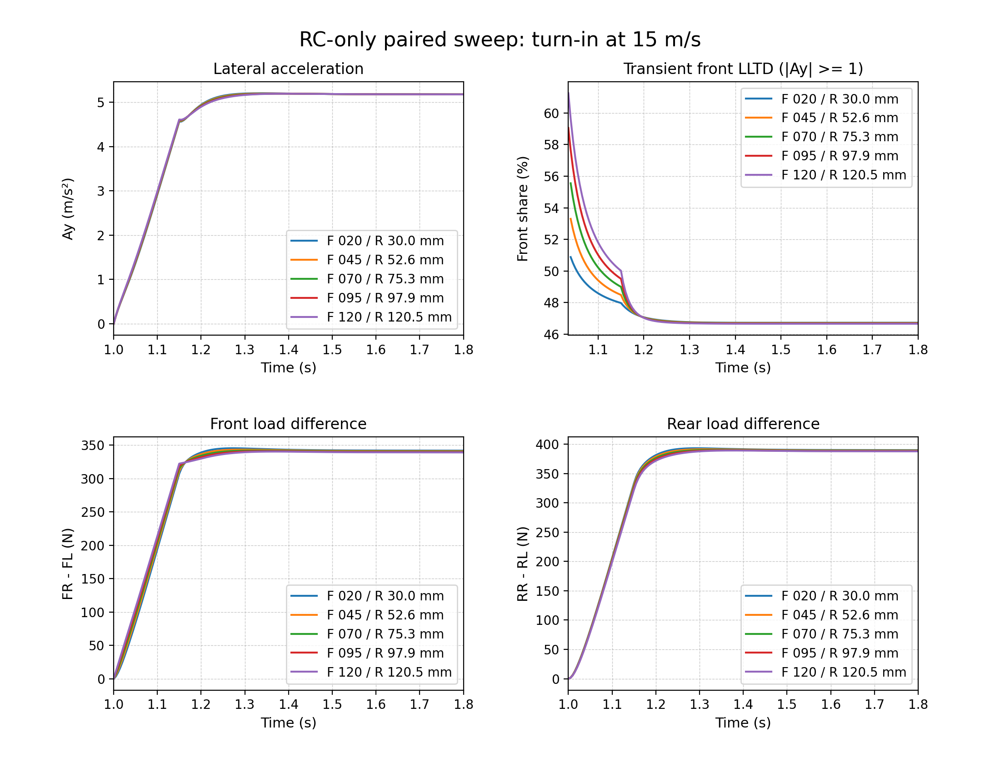

# Parameterized BobSim suspension research

This study publishes the hardpoint-free suspension fork and all five research
runs from 2026-09-29. The implementation is the repository's
[`BobSimParametric`](../../BobSimParametric) submodule, pinned to the
[team-owned BobSim fork](https://github.com/LonghornRacingElectric/BobSim-Parametric).
The original `BobSim` submodule remains available for existing studies.

## Start here

```bash
git clone --branch codex/parameterized-bobsim https://github.com/LonghornRacingElectric/lhre-simulation.git
cd lhre-simulation
git submodule update --init --recursive BobSimParametric
cd BobSimParametric
docker compose build bobsim
docker compose run --rm -T bobsim make parametric-test
docker compose run --rm -T bobsim make parametric-rc-coupled
```

Edit [`parametric_vehicle.yml`](../../BobSimParametric/parametric_vehicle.yml)
to specify mass/CG/inertia, front/rear roll centers, camber gains, spring/wheel
motion ratios, springs, dampers and ARBs without hardpoints. The
[model guide](../../BobSimParametric/docs/parametric-suspension.md) defines the
units, sign conventions, force paths, assumptions and general parameter grids.
Run commands from inside `BobSimParametric`; results go to its ignored
`_3_StandardSim/generated_results/` directory.

## Paired roll-center result

Only front/rear nominal RC inputs varied. Rear height was solved to hold front
total LLTD at **46.737693% at 8 m/s2 Ay and 15 m/s**. LLTD uses direct simulated
normal loads: `(FR-FL)/[(FR-FL)+(RR-RL)]`. Equal height increases would not
preserve it: adding 100 mm at both ends changes front LLTD to 45.903991%.

| Front RC (mm) | Rear RC (mm) | Roll at 8 m/s2 (deg) |
| ---: | ---: | ---: |
| 20 | 30.000 | 0.84166 |
| 45 | 52.626 | 0.76753 |
| 70 | 75.253 | 0.69386 |
| 95 | 97.879 | 0.62065 |
| 120 | 120.505 | 0.54789 |

Endpoint steady roll falls 34.9%; normal-load changes stay below 1 N per tire at
matched Ay. With an identical 2-degree roadwheel input rising over 0.15 s,
final Ay changes from 5.171664 to 5.171549 m/s2. Turn-in differences reach
0.08104 m/s2 Ay and 12.09 N at an individual tire. Transient LLTD is not
constrained: at t = 1.040 s it is 50.88% baseline versus 59.64% highest RC.
Across the separate 2-10 m/s2 steady checks, maximum LLTD drift relative to
baseline at the same Ay is 0.106950 percentage points.



[Four tire loads](outputs/coupled_rc/tire_loads.png) ·
[Ay, roll and LLTD](outputs/coupled_rc/coupled_response.png) ·
[Summary CSV](outputs/coupled_rc/summary.csv) ·
[LLTD versus Ay](outputs/coupled_rc/lltd_vs_ay.csv) ·
[Convergence evidence](outputs/coupled_rc/convergence.json)

## Archived runs

All scientific output files from these runs are included unchanged; compiled
build products and Python caches are excluded. The 131 archived files are
individually hashed in [`artifact-index.json`](artifact-index.json).

| Directory under `outputs/` | Contents |
| --- | --- |
| `parametric` | Initial five-case RC pilot; baseline and separate front/rear +/-20 mm changes |
| `parametric_refined` | Same pilot with finer time steps and integration tolerances |
| `parametric_camber_mr` | Front camber-gain -10/-30 deg/m by spring/wheel MR 0.7/0.9, plus baseline |
| `coupled_rc` | Five paired heights; 25 matched-Ay points, five transients, equal-increment check, plots and audit |
| `coupled_rc_refined` | Baseline and highest paired RC repeated with 2.5 ms steps and rtol 1e-9 |

Each archive retains input snapshots, tire data, CSVs and original manifests.
The paired run retains per-case traces under `pair_*/results/`. Published files
are a frozen evidence snapshot; later reruns should use a new output directory.
Original manifest paths refer to their runtime locations inside BobSim. To
repeat the saved convergence post-processing, copy the archived `outputs/`
contents into the checkout's `_3_StandardSim/generated_results/`, then run:

```bash
docker compose run --rm -T bobsim python -m _3_StandardSim.generated_results.coupled_rc.audit
```

## Validation and limits

All 25 paired steady points and five transients passed solver, travel,
tire-load-domain, settling and speed checks. Endpoint refinement changes at
common timestamps were at most 4.95e-7 m/s2 Ay and 2.47e-5 N per tire. Docker
lint and mypy passed, and the repository tests passed **396 with 6 skipped**.
The dedicated parameterized suite contains 15 passing tests.
Publication verification repeated those 15 tests successfully after cloning the
fork and its pinned BobLib dependency from GitHub. Every archived file was
checked against its source SHA-256, and every staged Git blob preserved the
original evidence bytes.

Full original Modelica baseline regeneration had **15 passes and 2 failures**:

- Ramp-steer `steer_excess_fit_nrmse`: 0.18652926851924925 versus
  0.0876623086560855; allowed absolute tolerance 0.08.
- Steady-state `n_cases`: 22 versus 40; tolerance zero.

Baselines were not changed. This publication preserves those limitations and
does not establish clean full BobLib regression acceptance. The vehicle is an
**illustrative 280 kg input, not correlated to the LHRe car**. The reduced model
has no wheel-hop dynamics, tire relaxation, compliance or full hardpoint
geometry, and uses BobSim's reduced MF-derived tire law. These are direct
simulation outputs, not telemetry, maximum-grip measurements or an optimum.
Independent suspension functions need not describe a buildable linkage.

## Source provenance

- Upstream source: `BobDyn/BobSim`; local research base `7400029`.
- Parameterized model implementation: `d320a47`.
- Paired RC sweep and study documentation: `7be8488`.
- Published fork entry-point documentation: `9065c03` (no physics change).
- BobLib dependency: `99202646007ac896f0e586bb9b5f4fcd62986cd1`, unchanged.

The `BobSimParametric` gitlink pins the exact published implementation. Source
hashes in each original run manifest preserve the code used for that run; the
publication commit adds only the fork README. This repository owns the archived
study evidence; runtime-generated files remain ignored in the BobSim fork.
