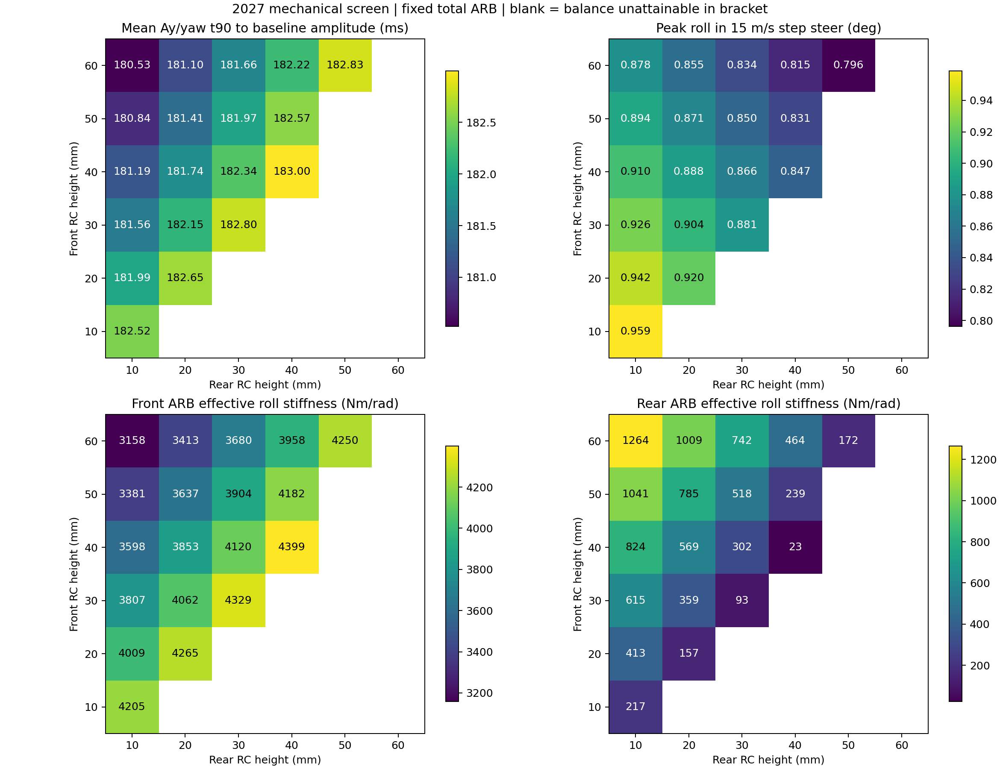
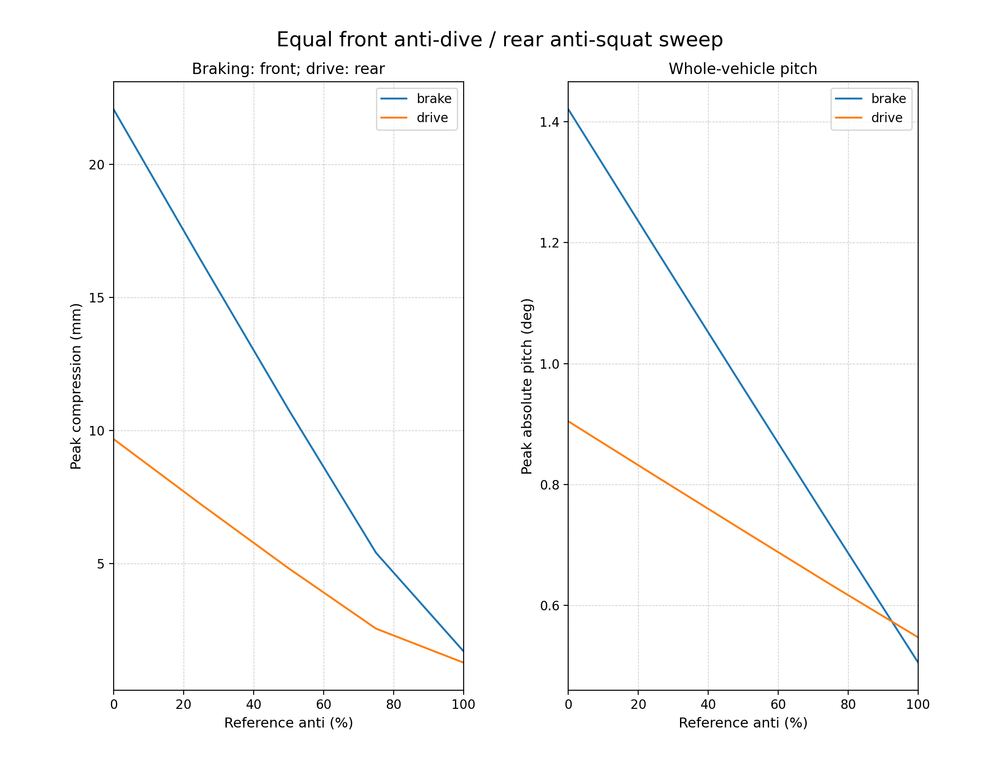
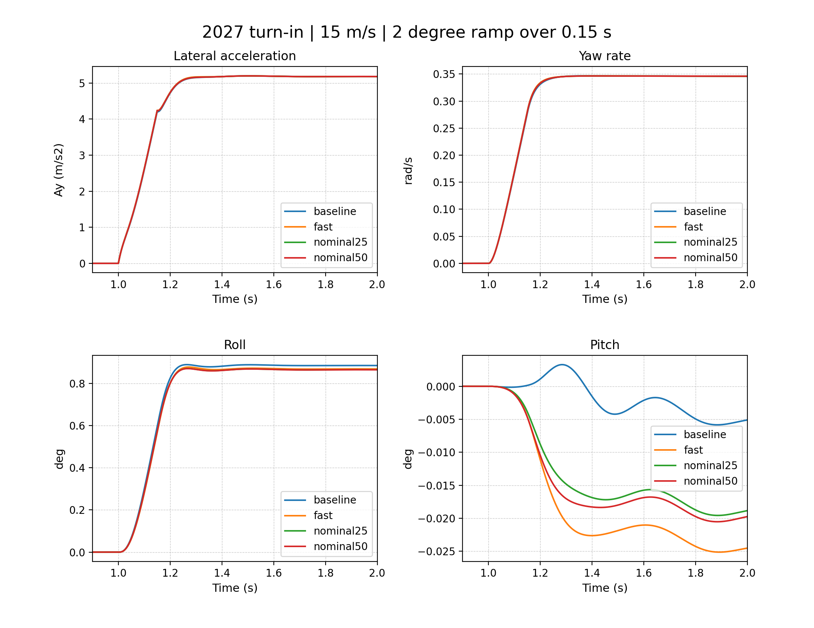

# 2027 parameterized anti targets

**Status: conditional model-test settings. No hardware target is released.**

The 2027 workbook block supplies mass, CG, track, RC and effective rates. Provisional hardpoints
are not used for suspension kinematics. This is rigid 6DOF, massless uprights, instantaneous
reduced tire forces and flat road. Aero is withheld.

## Recommended next model-test window

- Front RC: **50-60 mm**; rear RC: **10-20 mm**. Start at **50/20 mm** and retain the
  original **25.4/29.972 mm** control.
- Front anti-dive / rear anti-squat: test **25% and 50%**; retain **0%** controls.
  These are platform-response steps, not a demonstrated grip optimum.
- Keep wheel rates **11.038/16.274 N/mm**, inferred spring/wheel MR **0.6482/0.6097**,
  damping and alignment fixed.
- Tune ARBs to the source reference LLTD with **4421.95 Nm/rad total** fixed.
  Hardware adjustability is unverified.
- Percentages use total-car nominal load transfer, h=292.1 mm, L=1549.4 mm,
  84% front braking and rear drive. One translating-upright path applies in both force
  directions: rear brake anti-lift = AS * 0.16. Caliper/halfshaft/rotor paths are unvalidated.

This RC rectangle is a compact near-fast subset; the full 1% response band is in targets.json.
The fastest point lies on the grid boundary; no local/global optimum is established.
Zero anti already meets modeled travel limits, so these cases do not require nonzero anti.
The proposed 25-50% anti experiments trade roughly 25-50% less axle compression against
penalties the current model cannot yet quantify.

## Refined comparison at 15 m/s

Steering: 2 degree roadwheel ramp over 0.15 s. Braking/drive: separate -8/+5 m/s2
commanded-force pulses with release. t90 uses one common baseline final amplitude.
These are simulator outputs, not measured car behavior.

| Setup | Ay/yaw t90 (ms) | Front brake bump (mm) | Rear drive bump (mm) | Brake pitch (deg) | Drive pitch (deg) |
|---|---:|---:|---:|---:|---:|
| baseline | 182.864 | 22.071 | 9.684 | 1.421 | 0.905 |
| fast | 180.330 | 21.862 | 9.706 | 1.415 | 0.902 |
| nominal25 | 181.263 | 16.290 | 7.238 | 1.187 | 0.812 |
| nominal50 | 181.254 | 10.730 | 4.836 | 0.958 | 0.722 |

Run counts: {'pilot': {'count': 7, 'domain_valid': 7}, 'roll': {'count': 36, 'domain_valid': 19}, 'longitudinal': {'count': 100, 'domain_valid': 100}, 'validation': {'count': 46, 'domain_valid': 46}, 'refinement': {'count': 28, 'domain_valid': 28}}.

Maximum 2.5-to-1.25 ms grid t90 change: 0.0137 ms.








## Acceptance and limitations

Every checked 10 m/s setup, including baseline, fails the proposed 5% Ay overshoot gate
(about 15-16%). The 15 and 20 m/s candidates pass that response gate. Domain-valid does
not mean all requirements pass. Provisional +/-30 mm travel is not ground/wing clearance.

The source aero map gives front-load fractions of -119.1% to -0.264% under BobSim's
free-moment convention. No aero optimization is attempted. Current-package aero,
physical height datums and clearance limits are required to release platform targets.
Workbook longitudinal anti and camber/toe migration are unidentified. Zero anti is a
study reference, not measured geometry. Camber-gain sensitivity is not geometry validation.
Chassis torsion, tire relaxation, wheel hop, compliance and rough-road grip remain open.

The prior QSS helper allowed fictitious vertical velocity at nonzero pitch/roll.
This study uses a level-road trim adapter and checks zero world height, roll/pitch rates
and damper velocities. The underlying small-angle force model is unchanged. Its body-z
tire forces and finite-pose approximations limit conclusions beyond this screen.

## Reproduction

```sh
make parametric-2027-targets PARAMETRIC_ARGS='--phase pilot'
make parametric-2027-targets PARAMETRIC_ARGS='--phase roll'
make parametric-2027-targets PARAMETRIC_ARGS='--phase longitudinal'
make parametric-2027-targets PARAMETRIC_ARGS='--phase validation'
make parametric-2027-targets PARAMETRIC_ARGS='--phase refinement'
make parametric-2027-report
make parametric-2027-test
```

Make runs through Docker. Each phase retains executable inputs, traces, failure reasons
and source snapshots/hashes. vehicle.yml is the projected baseline; candidate_nominal25.yml
and candidate_nominal50.yml are editable hardpoint-free MODEL TEST inputs.
