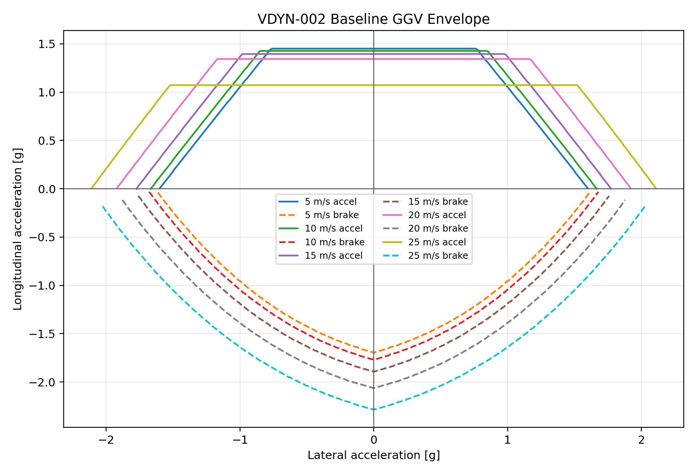
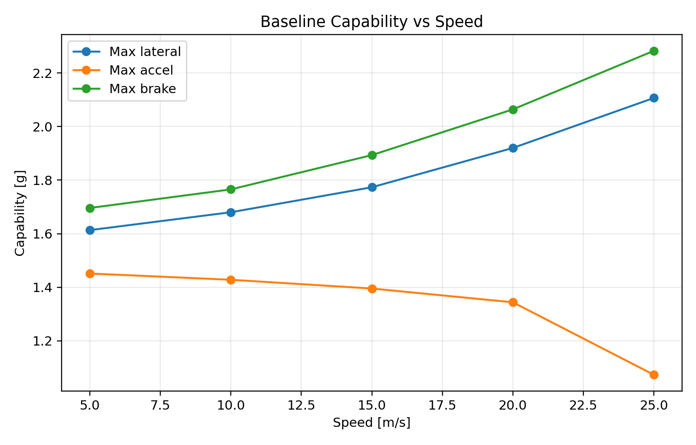

# VDYN-002 Results

## Decision Question

Does the audited baseline vehicle have enough lateral, acceleration, and braking envelope to justify setup development instead of architecture redesign?

## Finding

**PASS:** the baseline envelope is coherent enough to proceed to setup and response studies.

This study is a baseline capability gate only. It does not claim an optimized tire, aero, damping, ARB, or alignment setup.

## Baseline Inputs

- Baseline aero map point: front RH `0.03556 m`, rear RH `0.04191 m`
- Baseline downforce/drag at 15 m/s: `323.5 N` / `161.6 N`
- Assumed front LLTD: `48.96 %`
- Assumed front aero balance: `50.0 %`
- Drive power / force cap: `80.0 kW` / `3735 N`
- Brake force cap: `14000 N`

## Representative 15 m/s Metrics

- Max lateral: `1.773 g`
- Max acceleration: `1.395 g`
- Max braking: `1.893 g`

## Tire Load Range Check

- Checked representative zero-ay acceleration, zero-ay braking, and max-lateral load cases at each speed: `15/15` are inside the tire file vertical-load range.

## Design Implication

If this baseline holds after correlation, the next question is not whether the architecture can produce a usable envelope. The next question is which setup and tire operating-window choices make that envelope accessible and confidence-inspiring for the driver.

## Correlation Closure

Compare logged GG traces from skidpad, brake, acceleration, and early endurance running against this envelope. If measured performance falls short, update tire, mass, aero, brake, or power assumptions before promoting setup sensitivity results.
