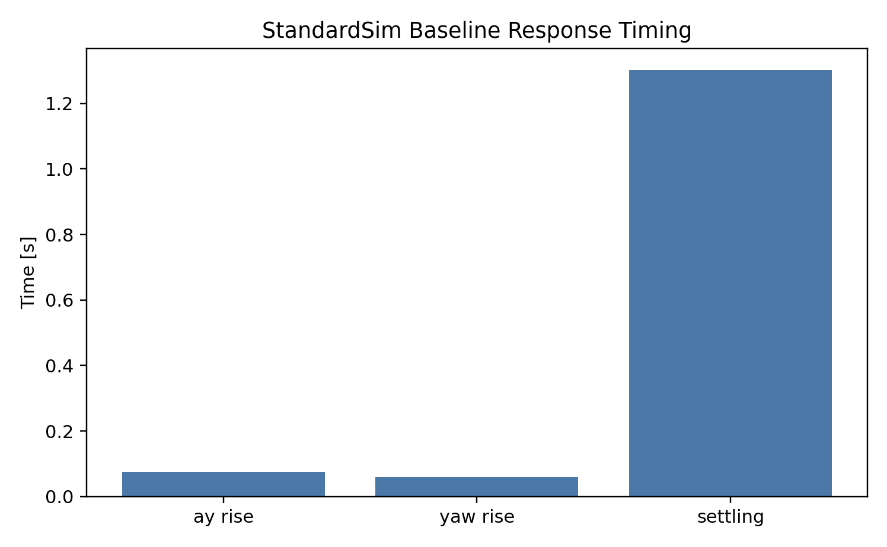

# VDYN-003 Results

## Finding

**PASS:** StandardSim baseline metrics are present and support the claim that the car is mild, quick, and tunable enough to proceed to setup studies.

## Key Metrics

- Understeer gradient: `0.382 deg/g`
- Roll gradient: `1.441 deg/g`
- Ay rise time: `0.075 s`
- Yaw rise time: `0.059 s`
- Ay overshoot: `21.6 %`
- Yaw overshoot: `18.6 %`
- Front LLTD: `52.06 %`
- Front/rear motion ratio: `1.002` / `1.255`
- Roll toe gain: `0.00128 rad/rad`

## Design Implication

The full model does not point to an architecture reset. It points to setup work: overshoot, damping, tire response, and ARB mapping.
