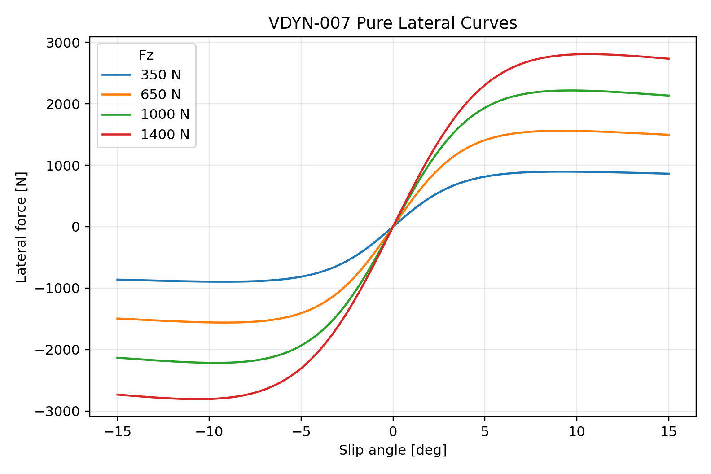
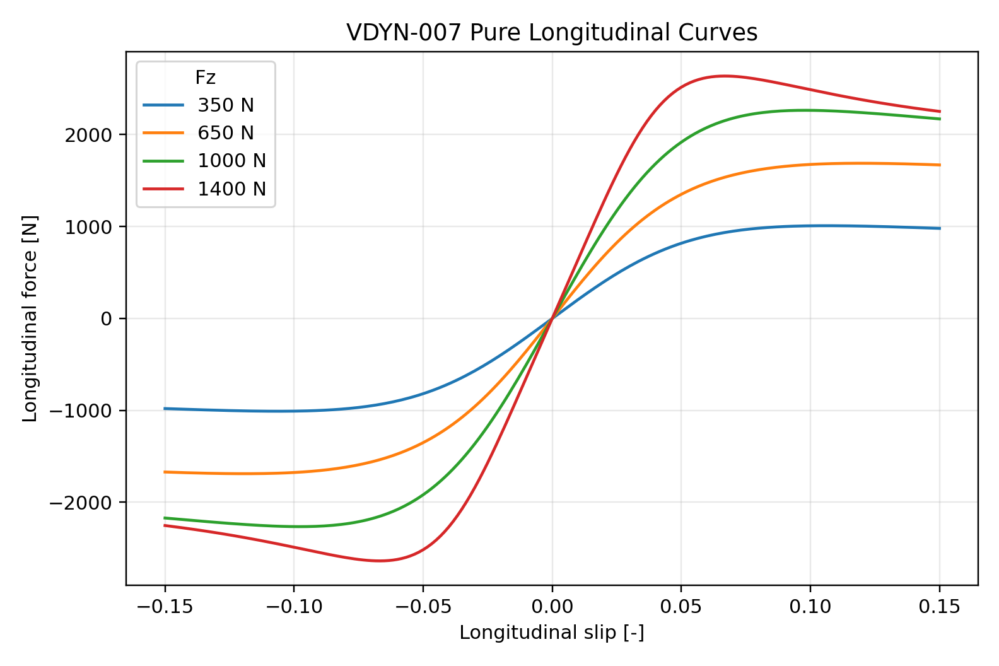

# VDYN-007 Results

## Finding

**PASS:** pure-slip screening curves were generated at representative tire loads.

These curves are tire-file screening artifacts, not track-correlated final tire behavior.

## Representative Loads

- `350 N`, `650 N`, `1000 N`, `1400 N`

## Design Implication

The tire should be discussed as a curve shape and stiffness source, not only as a peak coefficient. Driver response happens before the tire reaches peak force.
