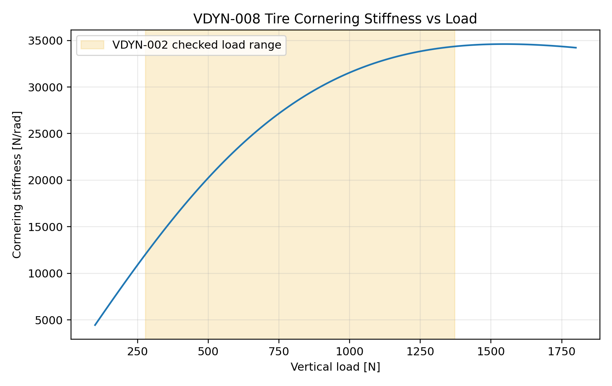

# VDYN-008 Results

## Finding

**PASS:** cornering stiffness is now a first-class tire design and validation metric.

## Key Metrics

- VDYN-002 representative tire-load range: `278.4` to `1370.9 N`
- Nominal-load cornering stiffness: `24512 N/rad`
- Low/high observed-load cornering stiffness: `11772` / `34354 N/rad`
- StandardSim baseline ay/yaw DC gain: `33.73 (m/s^2)/rad` / `2.228 (rad/s)/rad`
- StandardSim baseline ay overshoot: `21.6 %`

## Design Implication

Cornering stiffness should be correlated with steering response, yaw gain, ay gain, and tire pressure/temperature. It is a response metric, not merely a tire datasheet number.
