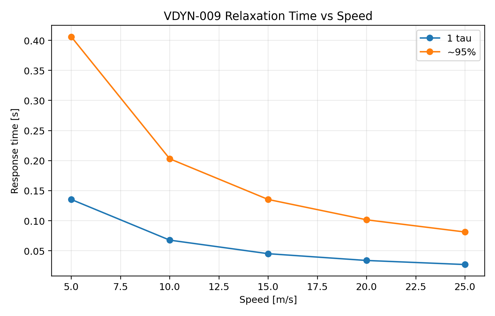

# VDYN-009 Results

## Finding

**PASS:** the fitted lateral relaxation length is now expressed as a transient response scale for correlation.

## Key Metrics

- PTY1 / PTY2: `3.330134` / `3.587160`
- Nominal relaxation length scale `PTY1 * R0`: `0.677 m`
- 15 m/s relaxation time constant: `0.045 s`
- 15 m/s approximate 95% force-build time: `0.135 s`
- StandardSim ay/yaw rise time for comparison: `0.075` / `0.059 s`

## Design Implication

Relaxation length should be correlated with step steer and sine steer phase/lag. It is the bridge between tire data and transient driver confidence.
