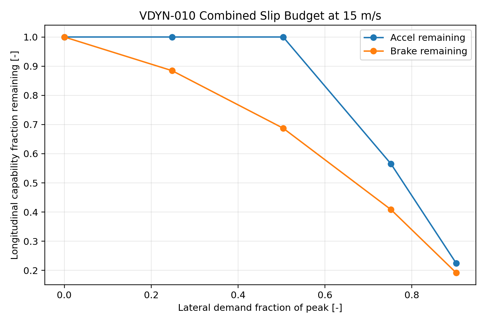

# VDYN-010 Results

## Finding

**PASS:** the baseline GGV envelope has been converted into a combined-slip budget for driver-facing explanation.

## Key Metrics

- At `90%` of peak lateral demand, available acceleration is `22%` of zero-ay acceleration.
- At `90%` of peak lateral demand, available braking is `19%` of zero-ay braking.

## Design Implication

Power, brake, and cornering claims must be discussed as tire-budget tradeoffs. The contact patch is the shared currency.
