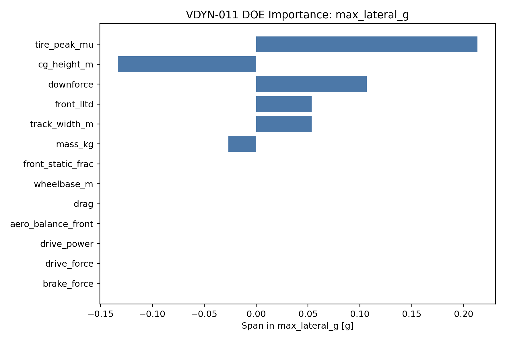
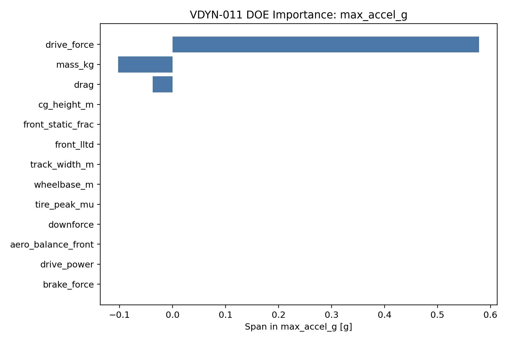
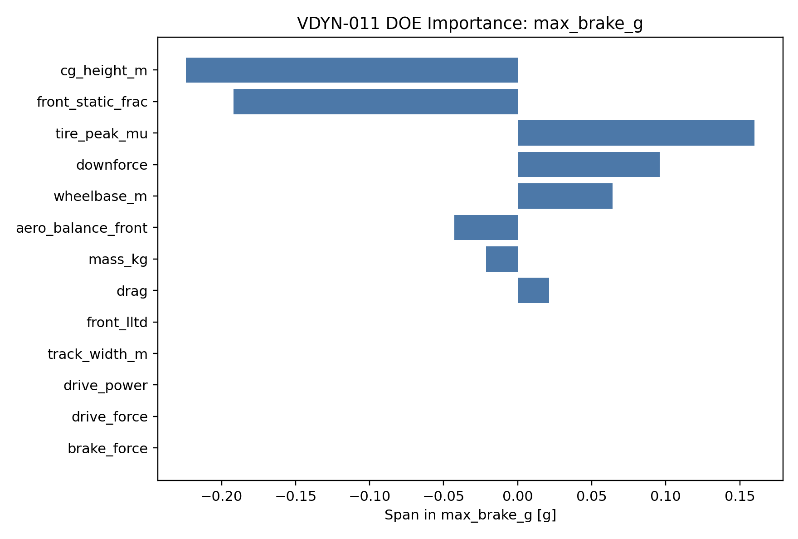

# VDYN-011 Results

## Finding

**PASS:** the EnvelopeSim DOE ranks the current high-leverage vehicle-level variables.

## Top Sensitivities

- Lateral envelope top span: `tire_peak_mu` at `+0.213 g`
- Acceleration envelope top span: `drive_force` at `+0.579 g`
- Braking envelope top span: `cg_height_m` at `-0.224 g`

## Design Implication

Validation and design effort should follow this ranking: the highest-span variables deserve the most careful correlation before final setup decisions.
