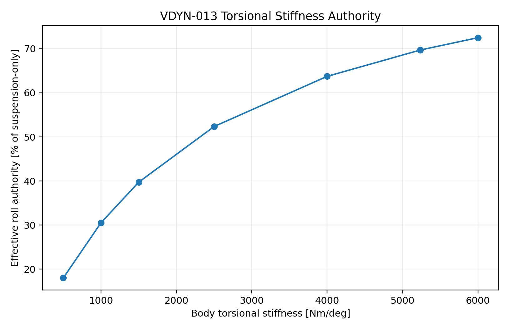

# VDYN-013 Results

## Finding

**PASS:** torsional stiffness has been translated into setup-authority language.

## Key Metrics

- Suspension elastic roll stiffness total: `130405 N*m/rad`
- Vehicle YAML body torsional stiffness: `300000 N*m/rad` (`5236 Nm/deg`)
- The plot axis is converted to `Nm/deg`; the source input remains `N*m/rad`.
- Current effective roll authority: `69.7 %` of suspension-only roll stiffness
- At `1500 Nm/deg`, effective roll authority would be `39.7 %`

## Design Implication

Torsional stiffness should be validated because it determines whether spring and ARB changes actually reach the contact patches as modeled.
