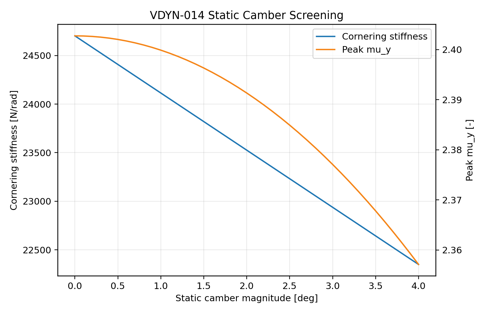

# VDYN-014 Results

## Finding

**PASS:** static alignment has been screened as tire-response variables before full StandardSim alignment sweeps.

## Key Metrics

- Cornering stiffness at 0 deg camber: `24703 N/rad`
- Cornering stiffness at 4 deg camber magnitude: `22349 N/rad`
- Peak mu_y at 0/4 deg camber: `2.403` / `2.357`
- Approx front-pair lateral preload for 2 deg total toe: `862 N`

## Design Implication

Static alignment should be correlated through tire temperatures, steering response, yaw/ay gain, and scrub/drag observations. A full StandardSim alignment DOE remains a required follow-up.
