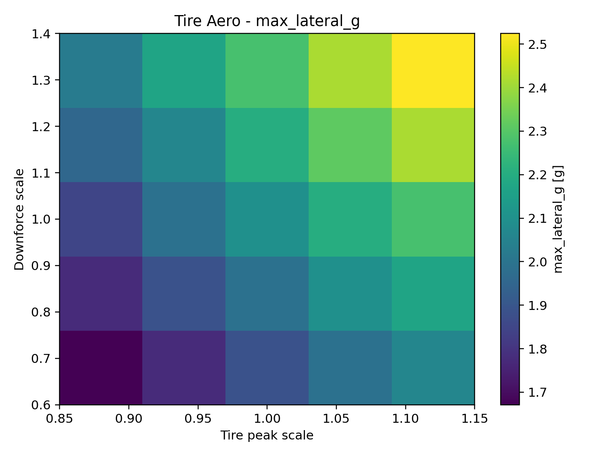
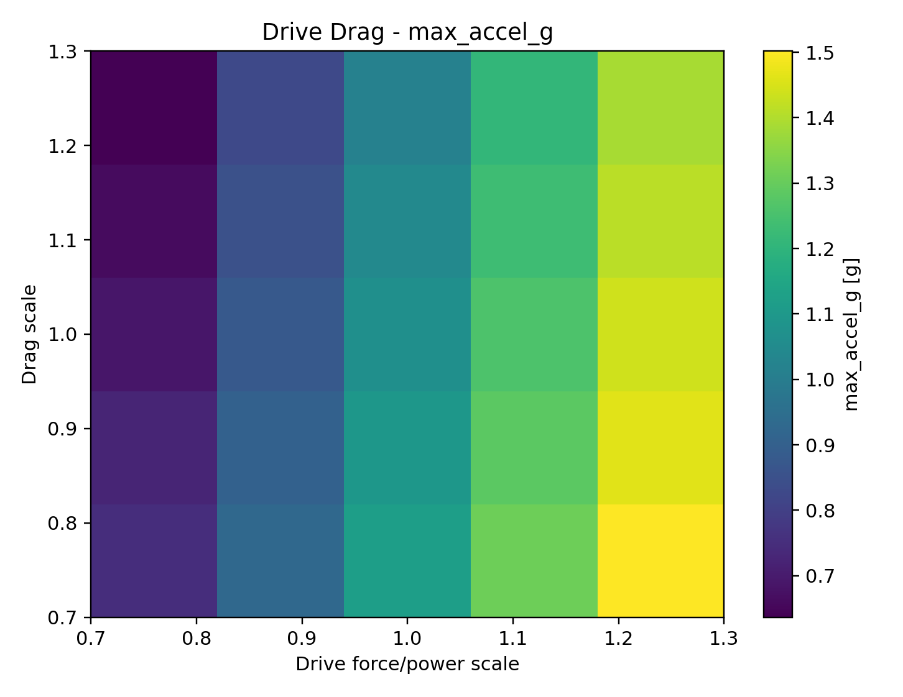
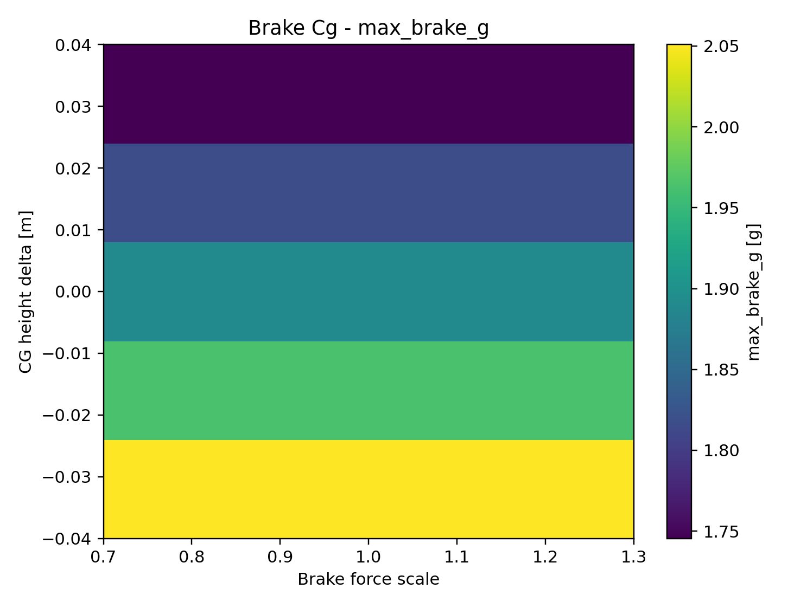
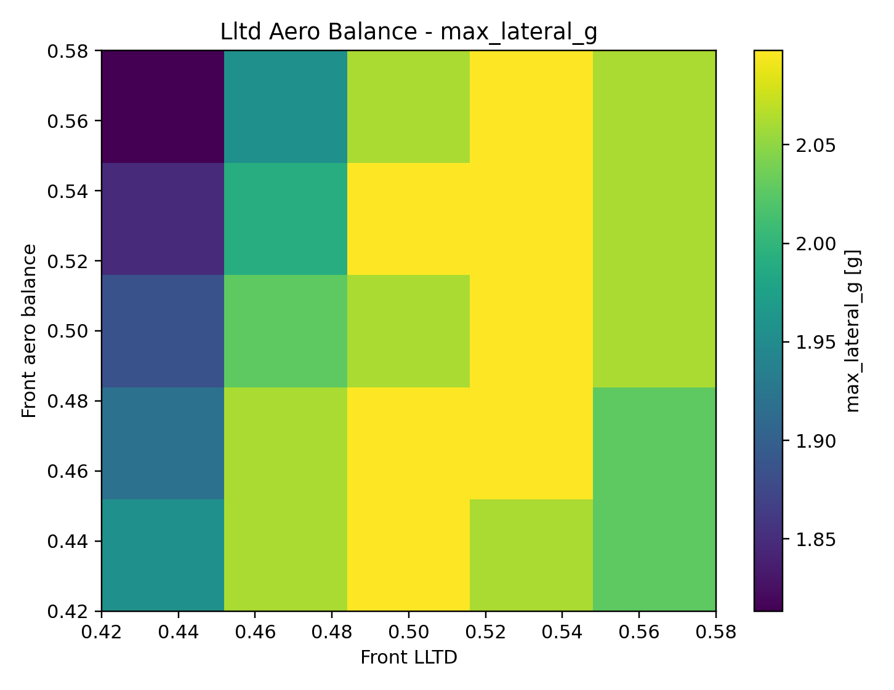

# VDYN-015 Results

## Finding

**PASS:** paired EnvelopeSim sweeps reveal the interaction surfaces that matter after the one-factor DOE.

## Summary

- DOE cases evaluated: `100`
- Largest paired span: `drive_drag` on `max_accel_g` at `0.865 g`
- Tire-aero lateral span: `0.853 g`
- Drive-drag acceleration span: `0.865 g`
- Brake-CG braking span: `0.305 g`
- LLTD-aero-balance lateral span: `0.284 g`

## Design Implication

The next correlation work should be paired, not scalar: tire with aero load, drive force with drag, brake capacity with CG height, and LLTD with aero balance.
