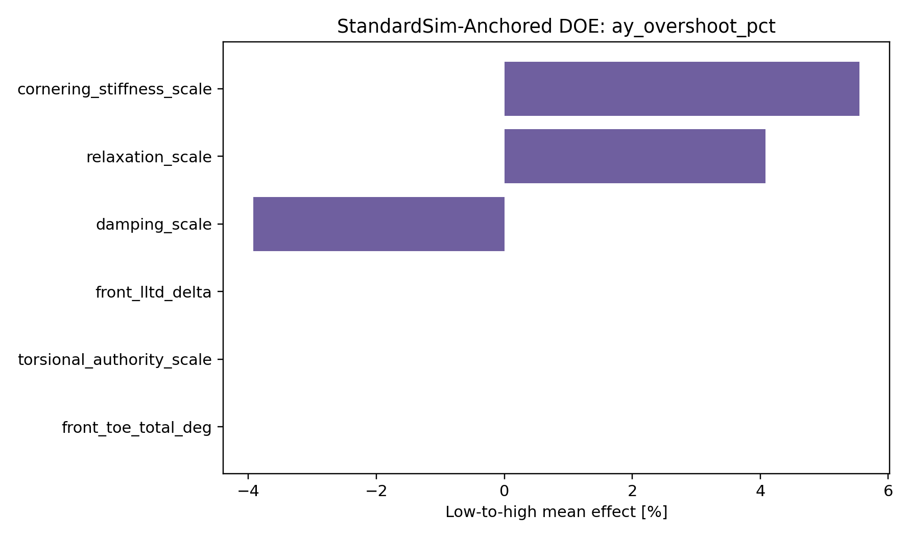
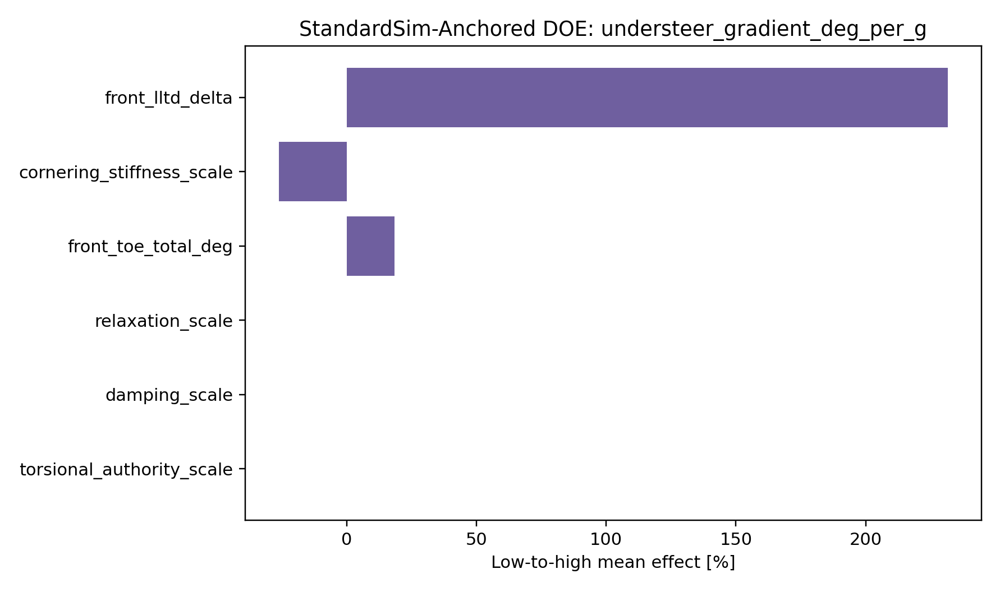
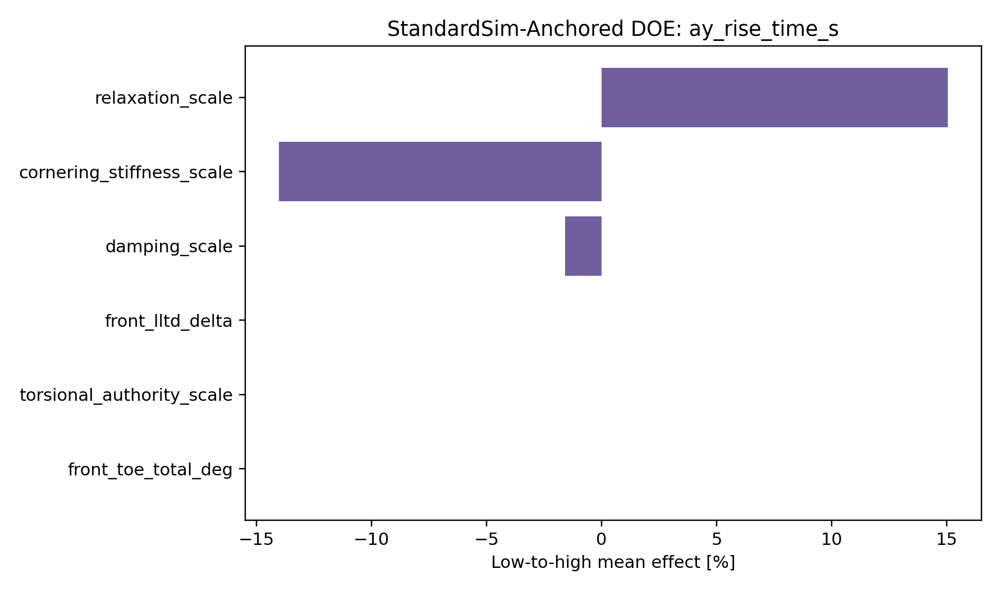
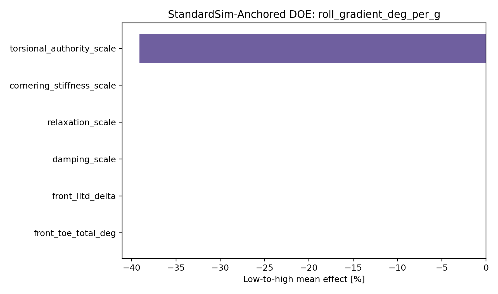
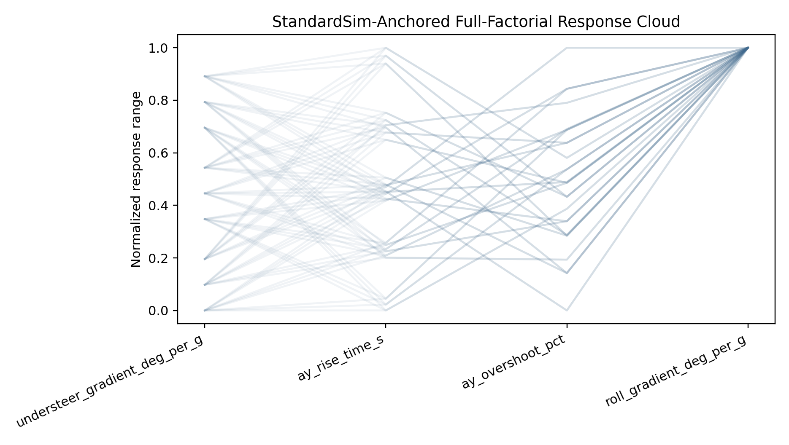

# VDYN-016 Results

## Finding

**PASS:** the StandardSim baseline metrics have been expanded into a surrogate response-surface DOE that ranks the setup and tire variables drivers will feel.

This is not a StandardSim variant campaign. It uses one admitted StandardSim baseline summary, then evaluates a local surrogate response surface. A future StandardSim DOE must compile and run each changed vehicle configuration.

## Run Provenance

- Engine: `standardsim_baseline_anchored_surrogate`
- Compiled StandardSim variants: `0`
- Surrogate cases evaluated: `729`
- Runtime: `1.15 s`

## Summary

- Full-factorial response cases: `729`
- Strongest ay-overshoot factor: `cornering_stiffness_scale` at `+5.5 %`
- Strongest understeer factor: `front_lltd_delta` at `+0.448 deg/g`
- Strongest ay-rise factor: `relaxation_scale` at `+15.1 %`
- Strongest roll-gradient factor: `torsional_authority_scale` at `-39.1 %`

## Design Implication

StandardSim correlation should focus on the driver-facing response chain: cornering stiffness and relaxation for gain/timing, damping for overshoot/settling, LLTD for balance, torsional authority for roll response, and toe for response-vs-drag tradeoff.
